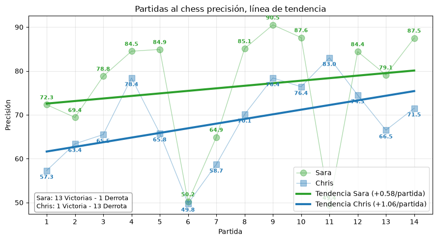
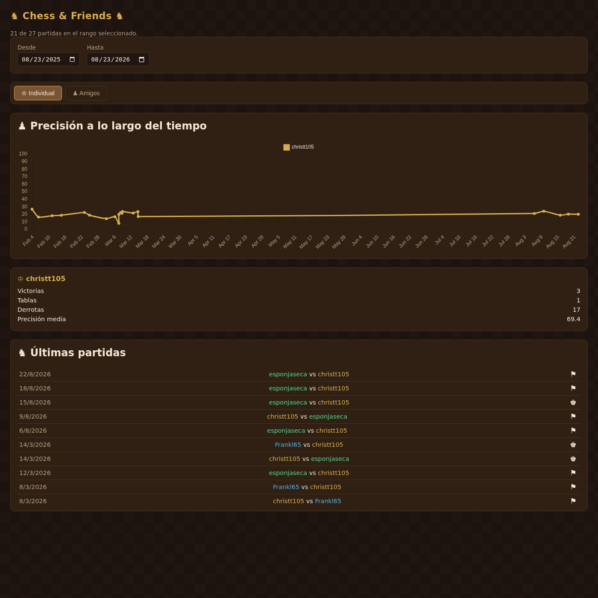
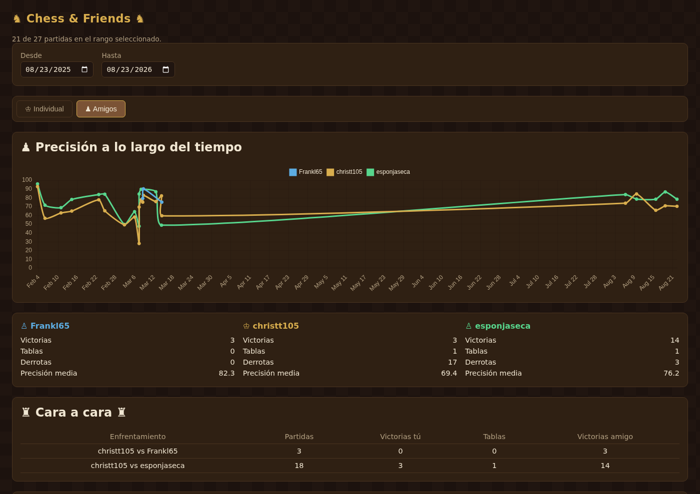

Hola de nuevo.

Mis hermanos son unos frikis del ajedrez, la mayoría de veces que los veo están jugando partidas o viendo vídeos. Yo juego muy de vez en cuando, siempre me ha gustado, pero eso, un aficionado que juega alguna partida ocasional. De vez en cuando mis hermanos me retan a una partida y siempre acaba igual, paliza.

El otro día mi hermana me mandó por Discord, sin venir mucho a cuento, una gráfica de precisión de nuestras últimas partidas que se había sacado no sé muy bien de dónde. La verdad que la gráfica es lamentable, fue peor que perder la partida en sí. Pero me dio una idea: en vez de una gráfica suelta, ¿por qué no algo más vivo, que se fuera actualizando solo?

## Manos a la obra

Chess.com tiene una API pública sin necesidad de clave ni de nada raro: por cada jugador puedes pedir el archivo de partidas de un mes concreto y te devuelve, entre otras cosas, la precisión de cada bando cuando está disponible (desde ~2023 chess.com la calcula para casi todas las partidas). Con eso de base, el plan era una web sencilla que fuera a buscar las partidas entre nosotros y las pintara en un par de gráficas.

Se lo planteé a Claude tal cual, con lo que quería y poco más, y a partir de ahí fue cuestión de ir iterando: un script en Node que pega a la API y guarda un `games.json`, una web estática que lo lee y lo pinta con Chart.js, y ya puestos, que le diera un aire de tablero de ajedrez en vez de la típica web genérica. Fuimos afinando cosas por el camino: cachear los meses ya cerrados para no repetir peticiones de más, un icono distinto según cómo acabó cada partida (jaque mate, rendición, tiempo, tablas), y una GitHub Action que se ejecuta cada noche para refrescar los datos solita, así que la web nunca necesita que yo la toque para estar al día.



## La web

Tiene dos vistas. La individual, con mi evolución de precisión y mis números en solitario:

Y la de "Amigos", que compara a todos los que jugamos entre nosotros y añade una tabla de cara a cara:

Nada muy complicado por dentro (un HTML, un script de fetch y otro de dashboard, sin build ni frameworks), pero para lo que necesitaba es justo lo que quería: cero mantenimiento y con pinta de proyecto de verdad.

## Las palizas, en números

La verdad que es lamentable, y debería incluso darme vergüenza publicar esto. Pero bueno, qué más da, simplemente es un juego. Ya lo sospechaba, pero verlo en una tabla ordenadita es otro nivel de humillación.

## Despedida

Un proyecto de una mañana mientras hacía tareas domésticas, para reírme un poco de mí mismo (mientras escribo esto ya escucho reírse a los cabrones de mis hermanos). Lo he dejado público, cualquiera puede clonar el repo y modificar el archivo de datos para generar su página web.

Hasta la próxima.


