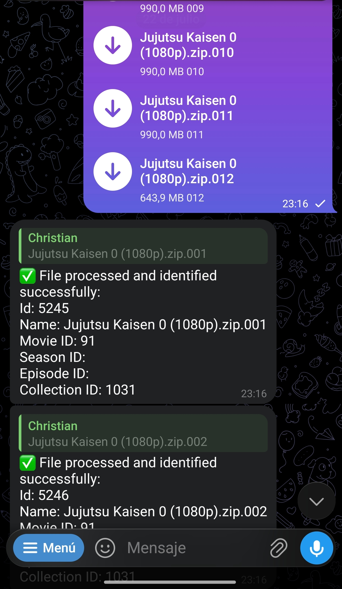
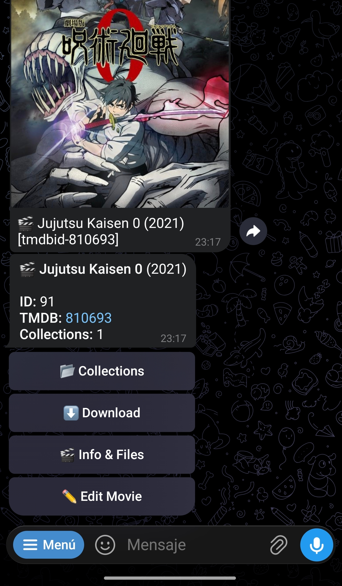
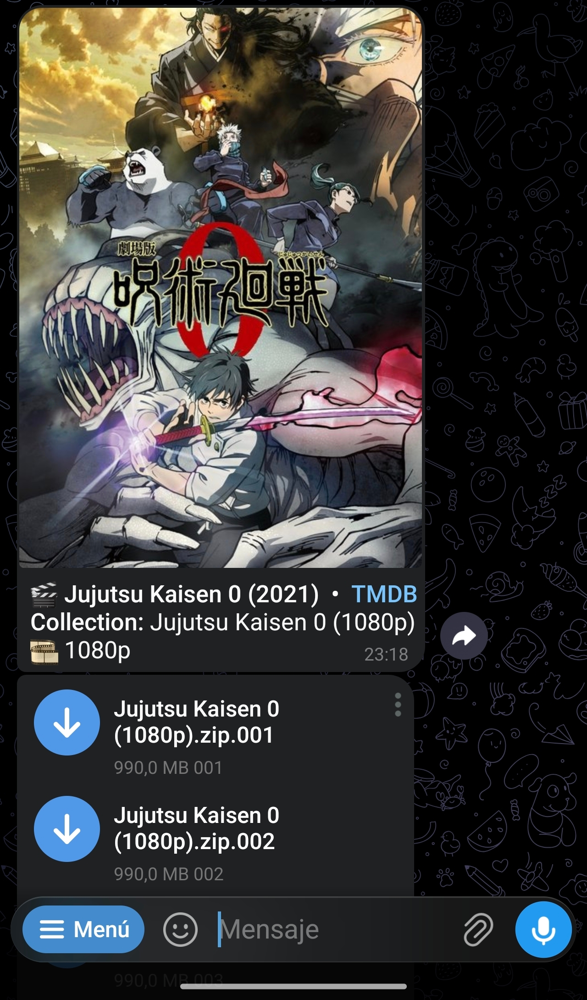
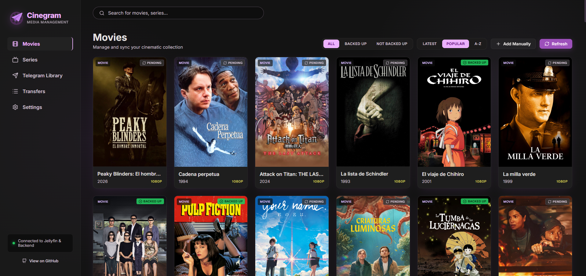
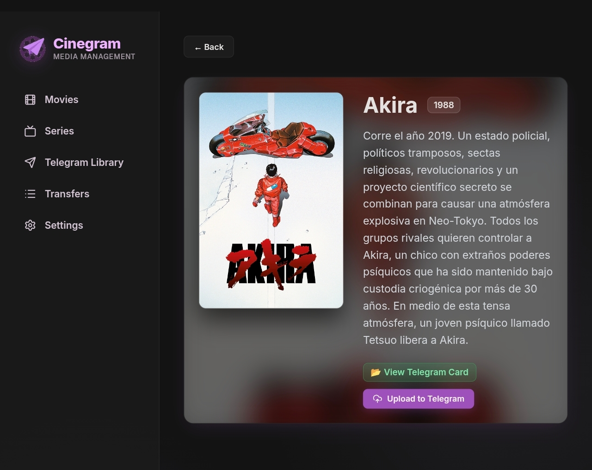
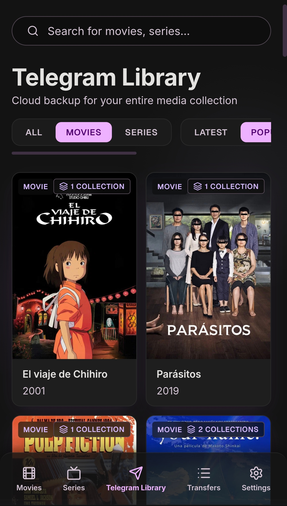
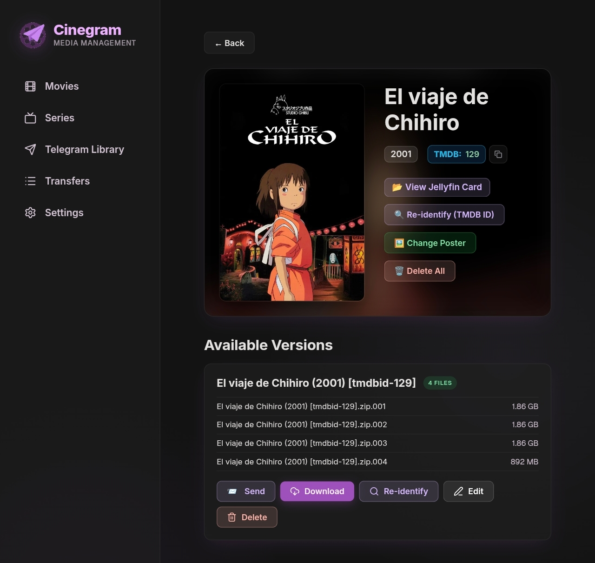
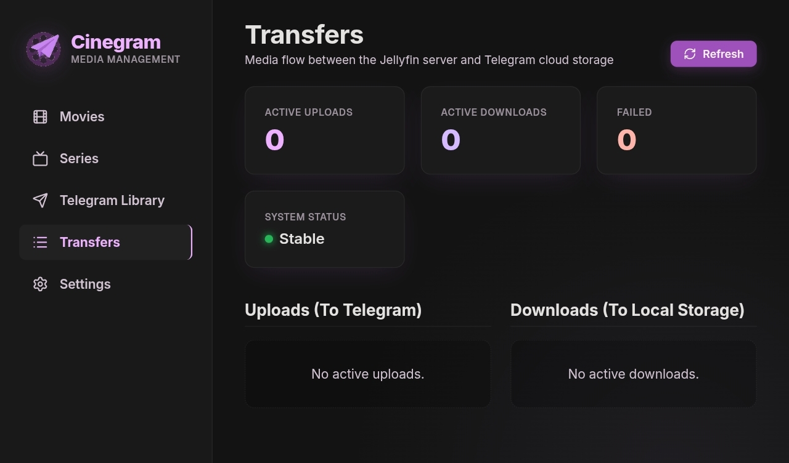
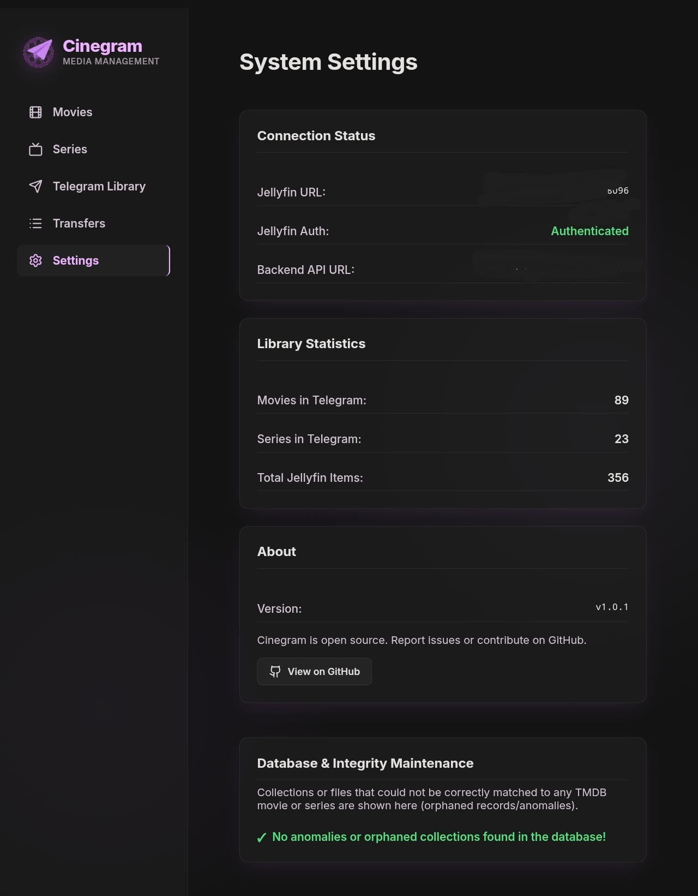
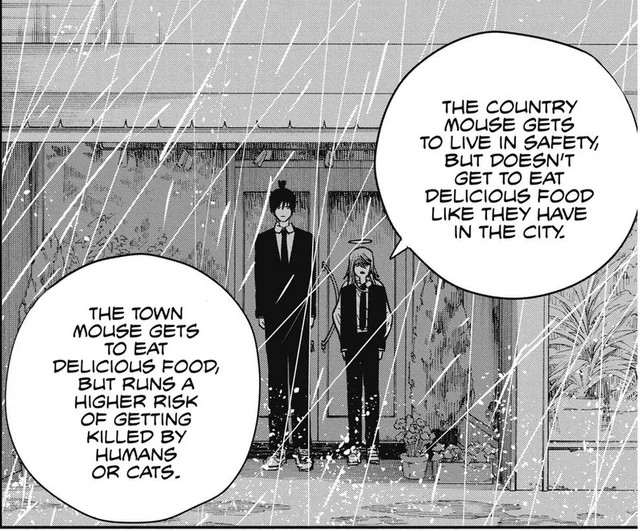

Hola de nou!

Avui post curtet (espero). Segueixo acabant els projectes que tinc a mitges, per gastar els tokens de Claude sincerament. He tornat a pagar un altre mes i volia avançar en altres projectes que no em requereixin una anàlisi molt exagerada del codi. Així que avui publico Cinegram.
## Origen
Farà cosa d'un any que vaig començar a crear un bot de Telegram que et permetia enviar-li arxius, intentava trobar-los a la base de dades de TMDB i els referenciava en una base de dades. Poc després vaig fer que et permetés descarregar arxius. Era un projecte per aprendre a fer serveis amb bases de dades i poder-me connectar des de fora creant un backend amb FastAPI. I allà em vaig quedar, perquè crec que se'm va fastidiar alguna cosa del mini PC i vaig perdre una mica de feina i llavors em va fer mandra continuar.
## Ai la IA
Doncs com he dit, he tornat a pagar un mes de Claude. Realment volia donar-li una oportunitat a pagar tokens d'algun model xinès, he estat investigant, però el poc temps lliure que tinc i el còmode que és que tingui accés a Claude des de qualsevol lloc, ho he deixat per al mes que ve. Bé, això és tema per a un altre post.

La veritat és que la meva idea era continuar el bot i que tot ho fessis des de Telegram, però, ja que hi és la IA, per què no fa una pàgina web? I ja que hi som, per què no ho linco a la meva instància de Jellyfin? Amb la IA, el límit és la imaginació, els tokens i la paciència.

Així ho vaig fer, a mesura que se m'acudien coses per afegir, anava iterant. La idea era simple: que totes les pel·lícules sense copyright que tinc al meu Jellyfin pugui guardar-les en un bot privat de Telegram i així preservar la cultura. D'altra banda si trobo pel·lícules lliures de drets d'autor, poder-les passar al bot i quan vulgui veure-les descarregar-les còmodament i que es posin automàticament a Jellyfin. Crec que queda clar.

## Per demanar que no falti
La veritat és que li vaig posar bastantes coses, moltes més de les que anava a fer en un principi. El projecte es divideix en 3 blocs.

### Backend
L'encarregat de guardar totes les dades i dotar els altres serveis d'elles. El vaig començar en Python per simple curiositat i per augmentar el coneixement amb FastAPI. La veritat és que és molt fàcil de començar a usar-lo i amb poca cosa ja pots tenir una API decent i amb documentació.

Quan la vaig fer jo a mà simplement vaig pensar l'estructura de les pel·lícules. Cada pel·lícula era única i podia tenir una col·lecció de col·leccions i cada col·lecció té un conjunt d'arxius. D'aquesta forma si una pel·lícula estava continguda en un únic arxiu, era una col·lecció amb un arxiu, però si per qüestions de límit de mida d'arxius és major, estarà continguda en una col·lecció amb diversos arxius. Després amb la IA vaig afegir les sèries que és el mateix però amb sèrie -> temporada -> episodi, i també es va afegir per a les tasques de pujada i descàrrega.

Per accedir i manipular aquestes dades hi ha diferents rutes. Abans estava tot en un arxiu perquè jo ho vaig començar així en tenir poca cosa però llavors es va fer monstruós. Li vaig demanar a Gemini que ho dividís en arxius i la va liar molt, llavors Claude ho va arreglar. No hi ha res extraordinari, afegir, modificar i eliminar dades, cerca i manteniment si queda alguna col·lecció òrfena.

També vaig afegir una llibreria per connectar-me amb TMDB i poder obtenir informació rellevant de cada element.

### Bot
El bot el vaig fer amb una llibreria de C# que em va agradar molt, [WTelegramBot](https://github.com/wiz0u/WTelegramBot). És molt simple de configurar i rebenta els límits d'altres formes de crear bots de Telegram. Permet pujada i descàrregues d'arxius a molt bona velocitat i amb els límits d'un usuari normal. Crec que si hagués usat WTelegramClient podria haver millorat si s'usa amb un compte premium, però per al que és crec que és suficient.

Era el primer cop que feia un servei així en .NET pur i la veritat és que em va agradar l'experiència i vaig aprendre bastantes coses. Vaig fer un sistema que creaves una comanda i automàticament es registrava sol. La veritat és que em va agradar molt. Realment la idea era poder fer-ho tot amb el bot i comandes, però és més incòmode que tenir una web específica per al projecte i les comandes van quedar bastant inacabades. El propòsit ara del bot és rebre arxius, emmagatzemar-los i retornar-los amb una caràtula bonica si se'ls demana.

### Web
L'orquestrador de tot. Peça que millora molt l'experiència. La veritat és que el 95% del desenvolupament el vaig fer jo des del mòbil. Està feta amb Vue3 perquè és el framework que he usat, tot i que gairebé no he mirat el codi de la web. Al final del desenvolupament vaig voler provar [Stitch](https://stitch.withgoogle.com/), no el bitxo blau de 4 braços, sinó una nova eina d'IA de Google per fer dissenys que no està malament. Vaig exportar el projecte i el vaig donar a Claude i vam anar iterant. Sincerament l'aspecte visual m'és bastant igual per a aquestes eines, però he de reconèixer que no es veu malament. M'he enfocat molt en mòbil ja que és on ho vaig a usar la major part del temps.

Té una secció per a pel·lícules i sèries que carrega de Jellyfin, amb la seva portada, indicador de si existeix a la base de dades, nom i any de publicació. Pots filtrar i ordenar. Cada targeta té una pantalla individual per poder-la pujar a Telegram.

En una altra secció es poden veure tots els elements que hi ha a la base de dades de Telegram. Una visualització semblant, però mostrant les col·leccions que conté. Cada una té també una pàgina individual amb informació i controls per canviar la portada, reidentificar l'element, descarregar a Jellyfin o enviar pel bot.

Per últim he posat una pàgina per veure les descàrregues i pujades actives i una pàgina amb informació de la instància i per corregir algun element que no s'hagi pogut identificar.

## Projecte de camp o projecte de ciutat
Em va agradar molt la faula del ratolí de camp i el ratolí de ciutat que usen a la pel·lícula de [Chainsaw Man](https://christt105.github.io/MediaTracker/movies/chainsaw-man---la-pel%C3%ADcula-el-arco-de-reze-2025/), i crec que podem fer una analogia amb els projectes i la IA.

Veig dos tipus de projectes. Els projectes que vols que tot estigui ben estructurat i maco, que et donaria respecte si algú mira el codi i que tens un vincle proper. Vas línia per línia revisant que tot tingui sentit i et passes grans sessions comprovant que el que estàs fent és la millor solució.

D'altra banda estan els projectes que simplement vols el resultat final i t'és igual com està fet per dins. Simplement vols que funcioni i t'és igual. Això abans de la IA era molt més difícil de veure.

Cinegram va començar com un projecte de camp. Era un interès personal per automatitzar i fer més còmodes els meus processos, però volia aprendre a usar bé FastAPI, aprofundir més en el desenvolupament de C# fora de Unity i aprendre més de bases de dades molt simples. Però s'ha convertit en un projecte de ciutat, i no és dolent.

Realment sense la IA podria haver-lo continuat, però dubto que hagués arribat a aquest punt, s'hagués quedat en un simple bot cutre i hagués trigat molt més a acabar-lo si m'haguessin tornat les ganes i la motivació de continuar-lo.

I aquí ve una mica la reflexió. Sense la IA segurament aquest projecte s'hauria quedat en l'oblit, però per una simple subscripció de 20€ i una setmana, he estat capaç de reprendre el projecte, ampliar el servei del backend per afegir les sèries i altres millores i afegir-li una pàgina web per gestionar-ho tot. I realment, tampoc hauria passat res si s'hagués quedat en l'oblit.

## Compartir és viure
I com sempre, de codi obert per a que el pugui usar qui vulgui. Si ho useu deixeu-me aquí a baix la vostra opinió o si teniu alguna dubte. Aquesta vegada he volgut publicar la imatge de docker també a GitHub, la teniu també a Docker Hub, com sempre.



I fins aquí, espero que us hagi agradat i ens veiem aviat amb més.

Agur!
