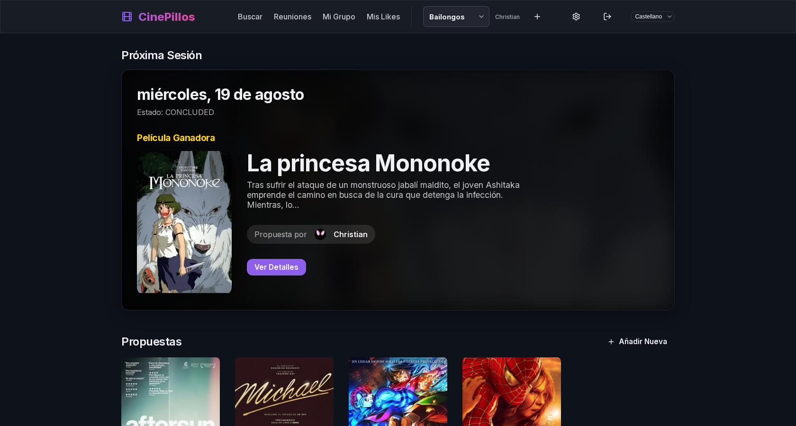
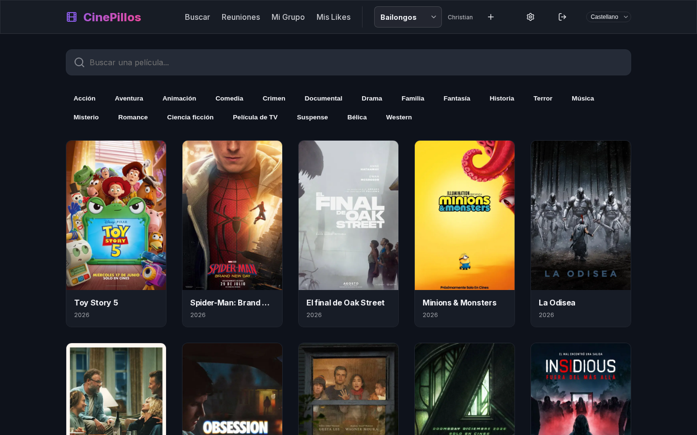

Hey again!

I'm still finishing off projects I've had sitting around, and today it's Cinepillos' turn. I started it a few months back, around January, as "Club de Cine", a site for keeping a shared board of movie suggestions with a group of friends, scheduling a session and voting on which one to watch. Honestly, I've never really needed it, I barely watch movies myself, let alone with other people, but I liked the idea of having a site for it. I doubt I'll ever use it for real, but well, maybe it's useful to someone.

## Where the name comes from
My dog has a toy we call "zorropillo" ("little fox thing"), and mashing that together with "cine" (cinema) gave Cinepillos. So the rebrand from "Club de Cine" isn't much more thought out than that.

## From self-hosted to Vercel and Neon
It was the only site out of all my projects I had self-hosted on my mini PC, through Cloudflare tunnels, and this time I wanted to try alternatives instead of piling it onto my server, which is already starting to drown under everything. So I decided to build it on [Vercel](https://vercel.com) for deployment and [Neon](https://neon.tech) as managed Postgres. Nothing on the mini PC, no disks to maintain, every push to the main branch deploys itself. Honestly both platforms offer pretty generous free tiers, plenty for this project.

That said, for anyone who'd rather run it on their own server, it's still perfectly self-hostable with Docker Compose, more on that later.

## About monetizing it
I went back and forth on trying to make some money off this project, just to make the time I put into it worth something, I'm not expecting to become a millionaire. But in the end I dropped it. Neither was the monetization idea I had any good, nor was it worth getting tangled up with the terms of use of TMDB and TVDB, the two databases the site pulls from, which don't allow commercial use just like that. So Cinepillos stays free and open source, like the rest of my projects, and me: broke. I lack a shark's instincts. Long live open source.

## How it works
The idea is simple. A group keeps a shared board of movie suggestions, and any member can add one by searching for it directly on the site. Whenever people feel like getting together, a session gets scheduled with a date and time, voting opens between the suggestions, and everyone votes for the one they want to watch. When voting closes, the most voted one wins and gets logged as that day's session.

A single instance can host several clubs at once, and each one is completely private, nobody in one club sees anything from another. Login is with Google, and on `/settings` everyone can pick an avatar taken from a TMDB poster or a TVDB character photo, so even the avatar pulls from the same databases as the rest of the site.

## Working with AI
With Claude I followed the same flow as in other projects, but this time with an addition I really liked. Every time I open a PR, Vercel deploys a preview and Neon clones a copy of the production database for that preview. That keeps tasks nicely contained: I give Claude a specific task, it pushes it to GitHub, and by the time it's done I already have a working preview with real data to test the change, look over the code and, if all goes well, merge it. No need to set anything up by hand or worry about breaking production while testing.

## Open source and free
As always, all the code is on GitHub for anyone who wants to use it, tinker with it or improve it. Cinepillos is free and already up at [cinepillos.vercel.app](https://cinepillos.vercel.app), login is Google-only because it was the simplest option for me, but being open source anyone can spin up their own instance with Docker Compose and their own TMDB and TVDB keys if that fits better.



And that's it for today's post. If you try Cinepillos or the code, you know where to leave a comment.

Until next time!
