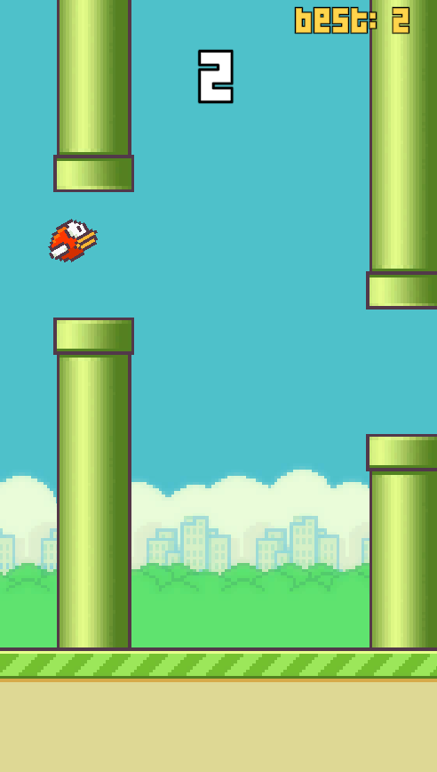
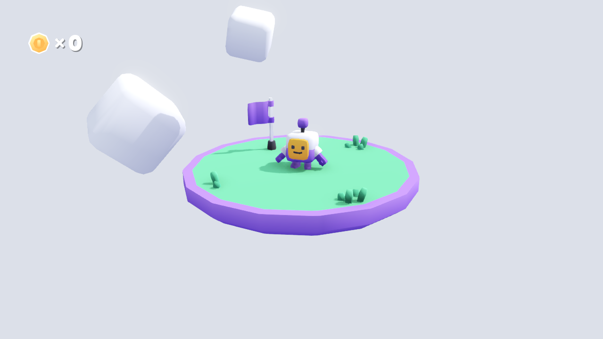
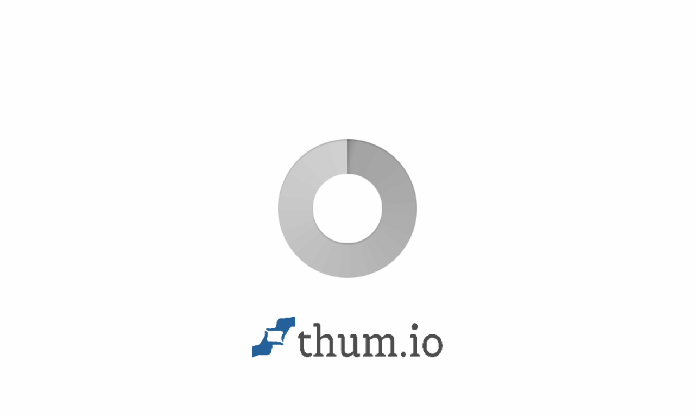

¡Hola de nuevo!

Esta semana he estado bastante liado impartiendo un taller a adolescentes sobre desarrollo de videojuegos. Ya es el segundo año que me meto en este lío y, por suerte, ha salido bastante mejor que el anterior.

La verdad es que enseñar siempre me ha gustado. No soy el mejor profesor del mundo, pero intento que los conceptos queden claros. Disfruto mucho preparando los materiales, explicándolos y, sobre todo, viendo cómo ellos también me enseñan cosas a mí.

La oportunidad surgió en la universidad donde estudié, en colaboración con el ayuntamiento, como parte de un programa para fomentar la universidad entre los jóvenes.

## El año pasado: Mi primera experiencia

El año pasado tuve estudiantes desde primero hasta cuarto de la ESO, y la verdad es que me pasé bastante con el material. En mi defensa diré que era mi primera experiencia y que me habían dicho que los alumnos serían mayores. El formato era de 4 días, a tres horas por día.

Para añadir algo de contexto, a principios de ese mismo año había hecho un taller de solo dos horas con alumnos de cuarto de la ESO y Bachillerato. Al tener tan poco tiempo, me decanté por hacer un clon de Flappy Bird en Unity. La idea era darles un proyecto vacío con los sprites y programarlo entre todos. Con llegar a que el pájaro saltara y las tuberías aparecieran, ya era suficiente para una primera toma de contacto. 

Por si a alguien le sirve, el material de ese taller lo tenéis aquí:





Como el taller de verano eran cuatro días seguidos, pensé ingenuamente que daría tiempo a acabar el Flappy Bird y que necesitaría más juegos para rellenar. Decidí hacer un juego por día para que, si alguien faltaba, al día siguiente pudiera empezar de cero con el resto. Preparé un Pong (Unity), el Flappy Bird (Unity), un Asteroids (Godot) y un plataformas 3D (Godot).

Hacer el Flappy Bird fue medio obligación, ya que habían publicitado el taller usando el logo de Unity. Yo insistí bastante en que Godot era mucho mejor para adolescentes. Pesa apenas 100MB, es descargar y abrir. Nada de los 15GB de Unity ni la tortura de obligar a los chavales a crearse cuentas. Además, los tiempos de compilación en Unity en ordenadores poco potentes son un horror, y GDScript es mucho más limpio para ellos. Fui bastante pesado para colar Godot en el temario, y la verdad que salió bien. Otra cosa no, pero convenciendo sobre productos por los que no me paga nadie, soy un genio.

Al final, la cosa fue algo peor de lo que esperaba. Aunque se lo pasaron muy bien, no dio tiempo a acabar casi ningún juego. A los más pequeños les costaba la vida seguir el ritmo, y tenía que ir uno por uno arreglando lo que tocaban, lo que dejaba a los mayores esperando aburridos.

El mejor día fue, sin duda, el último, con el plataformas 3D. Preparé una versión modificada del excelentísimo *Starter-Kit* de Kenney. Borré un par de líneas para que el personaje no se moviera de inicio, las programamos juntos rápido y, a partir de ahí, les dejé crear sus propios niveles arrastrando plataformas y monedas. Se lo pasaron muy bien. Algunos hasta sacaron papel y boli para diseñar los niveles antes de montarlos. 





## Este año: Mejorando la fórmula

Para este año quería mejorar la experiencia. Como no me dieron mucha más información, asumí que tendría el mismo rango de edades. Usé el mismo repositorio que el año pasado:



La decisión más importante fue recortar contenido. Cuatro juegos eran demasiados, así que me quedé con los dos más visuales: Flappy Bird y el plataformas 3D. Así teníamos dos días de Unity y dos de Godot. Quizá usar dos motores les podía confundir un poco, pero me interesaba que vieran que hay varias herramientas con sus pros y contras (y porque la organización quería Unity y yo Godot, para qué mentir).

El primer día lo planteé igual: proyecto vacío y hacer el Flappy Bird entre todos. El segundo día les pasé el proyecto ya avanzado, borré algunas partes para rellenarlas juntos y les dejé tiempo libre para añadir mecánicas y cambiar los sprites.

El tercer día lo dedicamos a rellenar código para crear las mecánicas base del plataformas, y el último día fue enteramente para que crearan su propio nivel mientras yo les ayudaba a programar cualquier cosa que se les ocurriera.

## Usando IA para mejorar el material

Cuando estaba preparando todo esto para este año, aún tenía la suscripción a Claude, así que decidí aprovecharla para hacer cosas que por tiempo (o pereza) no habría hecho.

El año pasado noté que los más autónomos se aburrían si yo estaba ayudando a los más pequeños. Así que le pedí a Claude que me generara unas guías paso a paso para que los que iban perdidos pudieran repasar, y los avanzados pudieran añadir mecánicas extra por su cuenta. 

Las guías estaban genial, pero en formato archivo iban a ser un poco complejo de consultar para ellos. Como GitHub Pages es súper fácil de usar, le pedí a la IA que montara una web sencilla con las guías. Quedó exactamente como quería: accesible y muy visual. También integré las presentaciones usando un formato de diapositivas en Markdown (Marp) que me enseñó Claude. Todo quedó en un único punto de consulta con enlaces de descarga. La web es esta: [CITMGameWorkshop](https://christt105.github.io/CITMGameWorkshop/).



Por último, el tema de tener una rama con la solución y otra con la plantilla era un caos de mantener. La IA me dio la idea de usar comentarios específicos en el código completo. Monté un CI en GitHub Actions que, al hacer push, busca esos comentarios, elimina los trozos de código correspondientes y actualiza la *release* con la plantilla lista para los alumnos. Una maravilla que, sin IA, se salía totalmente de mi scope para el tiempo que tenía. No concibo usar regex sin IA.

```python
# Script que uso en el CI para generar la plantilla vacía
import glob, re
for f in glob.glob('FlappyBirdWorkshop/Assets/Scripts/**/*.cs', recursive=True):
    with open(f, 'r', encoding='utf-8') as file:
        content = file.read()
    
    # Elimina todo el código de solución entre los marcadores
    content = re.sub(r'([ \t]*)// <SOL>.*?[ \t]*// </SOL>\n?', r'\1\n', content, flags=re.DOTALL)
    
    with open(f, 'w', encoding='utf-8') as file:
        file.write(content)
```

Por ejemplo, para el plataformas 3D en Godot, el código se ve así en el repositorio principal, y el CI se encarga de eliminar las líneas rojas dejándolo listo para los alumnos:

```diff
  func _physics_process(delta):
      # TODO: Aplica la gravedad al personaje
-     # <SOL>
-     velocity.y -= gravity * delta
-     # </SOL>
```

## El desarrollo del taller

El taller de este año ha ido fenomenal. Para mi sorpresa, todos los alumnos eran de tercero y cuarto de la ESO, así que el nivel estaba mucho más unificado. Estuvieron súper concentrados, sin necesidad de ir detrás de ellos, y no pararon de hacer preguntas y tener ideas.

Mi objetivo principal era despertar su creatividad, y el último día fue un éxito total. Un chaval descubrió que si emparentaba objetos, se movían juntos. Así que hizo una plataforma que se caía al pisarla y le colgó un montón de pinchos mortales. Básicamente, si pisabas, te caía una lluvia de pinchos que tenías que esquivar. Otro alumno se montó un sistema de "diálogos" muy guay usando áreas y triggers que habíamos visto por encima. Todos terminaron su nivel y acabaron jugando a los de los demás.

Al final les pregunté qué motor les había gustado más, y la mayoría dijo Godot. Para un taller es imbatible: en 10 minutos ya lo tenían todos descargado, abierto y listo. Con Unity siempre se pierde mucho más tiempo, y como a alguno le falle el login de la cuenta, ya vas con retraso.

## Conclusiones

Aunque este año ha ido genial, creo que va a ser la última vez que haga el taller, mi Last Dance. He cambiado de trabajo, el horario es más estricto y esta vez he tenido que gastar más días de vacaciones para poder darlo. Me gusta mucho hacerlo, pero no sé si me compensa perder esos días.

Si tuviera que repetirlo, tengo claras un par de cosas: lo haría 100% en Godot. Haría el Flappy Bird en Godot para que el editor les suene desde el primer día. Y el día del plataformas 3D les daría un proyecto con muchas mecánicas ya hechas para que no se agobien programando y se centren en diseñar niveles y arrastrar objetos desde el minuto uno.

Me lo he pasado muy bien estos cuatro días. La organización también se quedó muy contenta viendo lo que los chavales habían logrado el último día. Parece que ya los he convencido que se podría hacer todo con Godot. Yo me llevo un buen aprendizaje sobre cómo tratar y enseñar a adolescentes. Al final, lo más importante en estas edades es fomentarles el esfuerzo, la creatividad y que vean que son capaces de crear cosas de las que sentirse orgullosos.

Os dejo, que el post me ha quedado algo extenso. ¡Nos vemos en el próximo post!