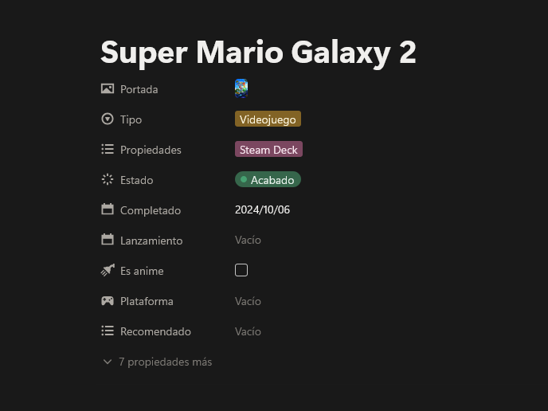
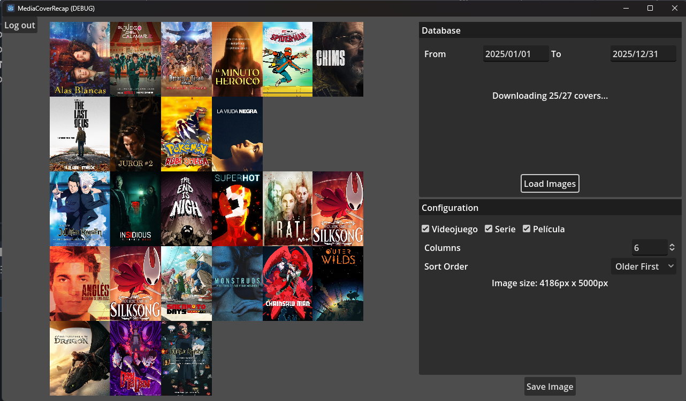
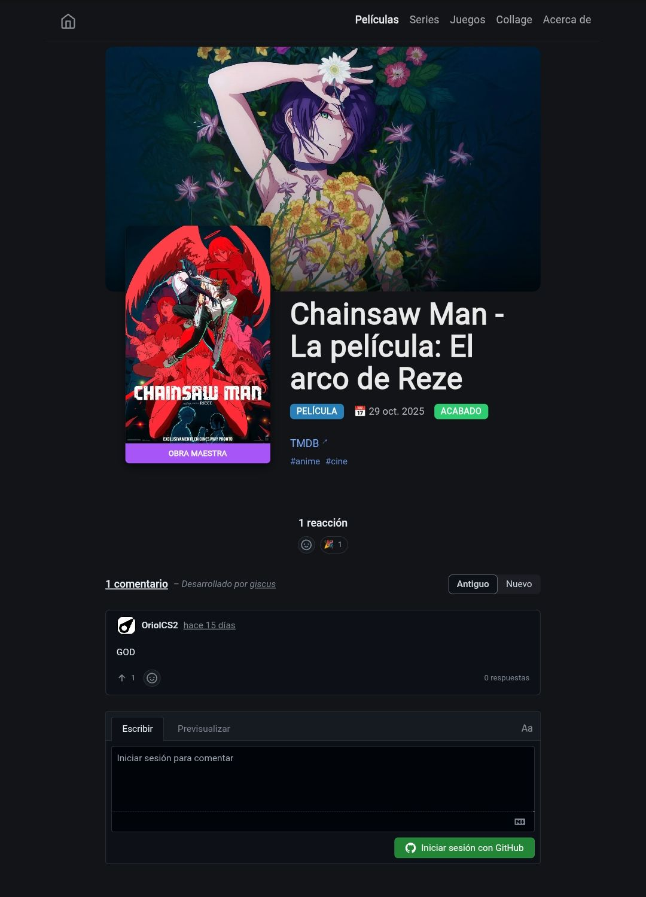

Hola de nuevo. Esta vez ha pasado menos tiempo desde el último post, y espero que sea algo más corto que el anterior.

En este post os voy a explicar lo que he hecho en referencia a mi nuevo [media tracker](https://christt105.github.io/MediaTracker/).
## Antecedentes
Siento la turra pero antes necesito hacer recapitulación de este tema. Si no te interesa puedes ir directamente a [La nueva solución](#la-nueva-solución).

### Twitter y TvTime
Todo empezó en 2022 cuando me di cuenta de que no había jugado a nada de lo que llevaba de año ni estaba acostumbrado a ver series ni películas. Quería llevar un control de lo que veía y jugaba, así que empecé a hacer un hilo de Twitter con los juegos que me iba pasando, y usé [TvTime](https://www.tvtime.com) para llevar un registro de las películas y series. Me pasé varios juegos seguidos ese mes, pero lo dejé de lado. Estuve usando TvTime para llevar un control de los episodios pero a veces me olvidaba de seleccionar un episodio como visto, soy un poco desastre.

En 2023 empecé otro hilo para todo lo que jugaba y veía ese año. Ahora sí que lo llevaba más serio. Cuando acababa un juego, una película o una serie, escribía un tuit con un comentario y añadía imágenes.

Continué en 2024 con lo mismo. TvTime lo usaba para llevar el control de lo que veía para no olvidarme del episodio por el que iba y tener perspectiva de lo que estaba consumiendo.

### Stash y Backloggd
Para las películas y series, TvTime estaba bien, pero para los videojuegos tenía un problema. Estuve barajando varias opciones. 

Primeramente encontré [Stash](https://stash.games/), que es una aplicación para el móvil para llevar un tracking de los videojuegos. Puedes marcar los juegos como completado con la historia principal, la principal más las secundarias o completado al 100%.

Posteriormente vi [Backloggd](https://backloggd.com/) y estuve investigando. Es muy parecido a Stash pero en web pero tenían en el roadmap algo que me interesaba mucho y era la creación de una API. Por lo que podría leer y modificar datos externamente. Nunca la llegaron a crear y la quitaron del roadmap.
### Notion
Con las herramientas previamente mencionadas podía llevar un tracking de todo, pero no era propietario de mis datos, no tenía forma de extraer los datos para meterlos en otra herramienta por si llegaran a descontinuarla. Justo en 2024 me llegó la fiebre de [Notion](https://www.notion.com).  Con esta herramienta podía crearme mis propias bases de datos y se me ocurrió tener el tracking ahí. La idea era seguir usando Twitter, como escaparate social, y TvTime como tracker episódico. El problema principal con Twitter era que no podía modificar el tuit si había algún error, es información muy volátil y buscar algo se estaba volviendo muy complicado. TvTime simplemente funcionaba, le faltaba alguna cosa como poder ver por donde iban mis amigos en cada serie, pero por lo demás simplemente me funcionaba.

Por otro lado, con Notion podía generar una base de datos y que cada elemento fuera una película, serie o videojuego. Podía editar cualquier nota en cualquier momento y podía publicarlo en la web. Posteriormente añadieron posibilidad de hacer gráficos para mostrar estadísticas. Todo era muy bonito, así que creé una [plantilla](https://www.notion.com/templates/media-tracker-es) y empecé a portear todo a Notion. Publiqué [la página web](https://christt105.notion.site/media-tracker) con Notion y seguí usando Twitter y TvTime como de costumbre, iba trackeando las series en TvTime y al acabar una serie, juego o película, la publicaba en twitter y la añadía a Notion.

En Notion tenía varias secciones donde se mostraban los elementos. Cada película, serie o videojuego tiene varias propiedades. Las esenciales son:
- Portada (Imagen): normalmente la url directa de la imágen de [tmdb](https://www.themoviedb.org/) o [thetvdb](https://www.thetvdb.com/), o una imagen subida.
- Tipo (Seleccionar): Película, Serie o Videojuego.
- Estado (Estado): Sin Empezar, En curso, Pausado, Abandonado o Acabado.
- Completado (Fecha): Fecha de completado.
- Lanzamiento (Fecha): Decha de lanzamiento, con posibilidad de notificación para avisar.
- Propiedades (Selección múltiple): Diferentes propiedades como la plataforma de juego, si lo he visto en el cine, si es anime o si lo he completado al 100%.



Cada vez que quería añadir un nuevo elemento, lo que debía hacer era ir a [TMDB](https://www.themoviedb.org/), [TVDB](https://www.thetvdb.com/) o [SteamGridDB](https://www.steamgriddb.com/), buscar el nombre, copiarlo, volver a Notion, crear una nueva nota, pegar el nombre, volver a la web, buscar por los carteles el que más me gustara, copiar la url, volver a Notion, pegarlo en la sección de cover como url y finalmente seleccionar el tipo de elemento que es. No es excesivamente mucho trabajo, pero nada comparable al flujo que he conseguido ahora.

Hay otras propiedades como botones que cambian el estado y la fecha o recomendado a gente, pero no son interesantes. Con todas estas propiedades se puede hacer un tracker más que decente.
#### La web con Notion
Notion te permite publicar tus notas a la web. Publiqué el Media Tracker con Notion y me generó esta url: https://christt105.notion.site/media-tracker. La web es básicamente la interfaz de Notion pero sin la posibilidad de interactuar. No se puede cambiar el estilo, por lo que las portadas quedan muy pequeñas y el resultado deja bastante que desear.


#### Media Cover Recap
Antes de acabar 2024, me gustó la idea de hacer un collage con todas las portadas de todo lo que había consumido ese año y me puse a trabajar en ello. Para solucionar eso, Notion tiene una API que me permitía coger información de mis bases de datos y así es como hice el [Media Cover Recap](https://christt105.github.io/es/projects/mediacoverrecap/), un proyecto web de [Godot](https://godotengine.org/es/) que generaba collages de la base de datos de Notion. Obviamente Godot no es la mejor herramienta para eso, pero por aquel entonces estaba muy obsesionado con Godot y quise probar. 

Funcionaba decentemente pero el problema principal era el [CORS](https://developer.mozilla.org/es/docs/Web/HTTP/Guides/CORS), que no se permiten peticiones http de un servicio a otro. Por lo que o creaba un pequeño servidor que redireccionara las peticiones o lo hacía aplicación de escritorio y móvil. Y tampoco sería una buena solución porque las imágenes con links pueden dejar de estar disponibles o la API de Notion puede cambiar y dejaría de funcionar. Así que todo el tiempo que le dediqué a este proyecto estaba destinado a irse a la basura.



## La nueva solución
Una vez visto todo hasta llegar justo a la nueva solución, toca explicar de qué trata.

Para mi nuevo Media Tracker quería tener varios puntos presentes:
- Todos mis datos deben pertenecerme.
- Poder migrar los datos a otra aplicación si hiciera falta.
- Accesible desde cualquier dispositivo. Ser capaz de añadir, eliminar y editar cualquier dato  principalmente desde mi móvil, pero que también sea accesible desde el ordenador.
- Poder añadir comentarios, imágenes y vídeos a cada elemento.
- Tener una página web que sea fácilmente accesible desde cualquier dispositivo y completamente adaptable a mis necesidades.
- Poder añadir películas, series y juegos en la misma base de datos y que sea cómodo de hacerlo.

Después de investigar, decidí decantarme por la idea de usar [Obsidian](https://obsidian.md/) para la creación y edición de cada elemento del tracker y [Hugo](https://gohugo.io/) como generador de la página web.
### Obsidian
Para los que sabéis cómo funciona Notion, habréis arqueado la ceja antes al decir que con Notion mis datos me pertenecían y no es cierto, en Notion los datos no son tuyos, te pueden revocar acceso a ellos cuando ellos consideren porque son de su propiedad, así que tocaba mover ficha.

De una fiebre a otra, llegó a mi vida [Obsidian](https://obsidian.md/). Gracias a mi nueva adquisición, un mini pc, podía sincronizar mis notas de manera muy eficaz, como ya expliqué en mi otro post [Seis meses con mi primer servidor casero](https://christt105.github.io/es/blog/six-months-with-my-first-home-server/), que era el punto que me echaba más hacia atrás de Obsidian. Ahora voy a explicar cómo tengo configurado Obsidian para el Media Tracker, puede que en un futuro haga un post explicando como tengo configurado todo mi Obsidian, ya que me parece una muy buena herramienta para integrar en tu día a día.
#### Organización
Decidí tener el Media Tracker dentro de mi vault principal de Obsidian. El Media Tracker vive únicamente en una carpeta, así evito que se mezcle con las otras notas y son más fácil de diferenciar. Dentro de `Juegos/`, `Movies/`, `TVs/` y `Seasons/` viven individualmente cada instancia de juegos, películas, series y temporadas respectivamente. Los nombres son raros por como tengo organizados los plugins. También tengo la carpeta `Portadas/` donde pongo las imágenes de las portadas y banners de elementos que no tienen en la web, sobre todo de fangames.


En `Media Tracker/` está el archivo `Media Tracker Views.base` que es un archivo base con varias vistas. Las bases es un añadido muy reciente, justo lo acababan de poner cuando empecé a usar Obsidian. Es un archivo que te permite poder visualizar tus notas de varias formas, parecido a las vistas de Notion. Tiene una API por lo que la comunidad ya está empezando a usarlas para cosas más complejas. De momento únicamente he creado vistas muy básicas, casi no las uso, ya que tengo la web.

 


#### Series y Temporadas
Con las series tenía un problema. No sabía que hacer con las series con temporadas. Por un lado, hay series que tienen varias temporadas y las veo en diferentes momentos, por lo que debería separar cada serie por temporadas, pero por otro lado, hacer una nota de serie duplicado puede quedar raro si únicamente hay una temporada. También es verdad que hay series que organizan muy mal las temporadas, lo que puede llegar a ser caótico.

Es por eso que al final decidí usar una solución híbrida. Cada serie tendrá su propia nota con las mismas propiedades que las películas. Si una serie tiene únicamente una temporada, se usa la nota de la serie. Si una temporada tiene varias temporadas, se crea una nota por cada temporada y a la fecha de la nota de la serie se le pone la misma que la última temporada vista.

Lo único malo es que tengo que tener en cuenta de actualizar dos estados y dos fechas para una misma serie con la nota de la serie y de la última temporada vista. Creo que es la solución más factible a este problema.

#### Plugins y Scripts
Una de las cosas más increíbles que tiene Obsidian es la personalización con los plugins creados por la comunidad. Se abre un campo gigante de posibilidades. Principalmente he usado tres plugins que han hecho que la experiencia de usar el Media Tracker sea mucho mejor que con las soluciones antes vistas.

##### Templater
El plugin [Templater](obsidian://show-plugin?id=templater-obsidian) va muy bien para usar plantillas, ejecutar acciones y añadir información al crear nuevas notas. Esto nos va a ayudar a importar información de bases de datos de películas, series y juegos y organizar las notas al momento de crearlas.

##### Movie Search
El plugin [Movie Search](obsidian://show-plugin?id=movie-search) es un plugin algo antiguo pero sigue funcionando muy bien. Tiene alguna cosa que cambiaría, pero de momento es más que suficiente. El plugin añade un botón que abre un panel para introducir el nombre de la película o serie.


Al buscar hará una búsqueda usando la API de TMDB y te mostrará todos los resultados.


Al seleccionar una opción, creará una una nueva nota con una plantilla que he configurado, reemplazará las variables por los valores de la películas o serie y ejecutará el código de Templater que he puesto. TMDB tiene dos tipos `movie` y `tv` que se añadirán directamente a la propiedad de `type` para poder diferenciarla. Se asignará un poster y un banner predeterminado por TMDB usando el link a la imagen y se almacenará el id de TMDB para poder referenciarla después. Se guardarán también los géneros y la sinopsis formateándolos de manera correcta, ya que el plugin tiene problemas si incluyen barras o comillas dobles. También comprueba si es una serie y le añade la propiedad de `temporadas`. Por último, coge el año y modifica el nombre del archivo para incluirlo y evitar problemas al crear notas de dos películas diferentes con el mismo nombre. La plantilla que estoy usando actualmente es esta:

```
---
title: "{{title}}"
type: <% "{{media_type}}".toLowerCase() %>
date: 
rewatches: []
release_date: "{{release_date}}"
status: Sin Empezar
cover: "{{poster_path}}"
banner: "{{backdrop_path}}"
rating: 
genres: <%=movie.genres.map(genre=>`\n  - ${genre}`).join('')%>
tmdb_id: <%=movie.id %>
tags: []
related: []
overview: "<%= movie.overview.replace(/[\r\n]+/g, ' ').replace(/"/g, '\\"') %>"
<%* if("{{media_type}}".toLowerCase() == "tv") { -%>
temporadas: []
<%* } -%>
---

<%*
const year = "{{release_date}}".split("-")[0];
if (year) {
        await tp.file.rename(`${tp.file.title} (${year})`);
    }
%>
```

Y este sería el resultado final de la nota:


Con este plugin tenemos cubierta la creación de las películas y series con muy pocos clics y sin salir de la aplicación. Veamos ahora el otro plugin que nos solucionará los videojuegos, temporadas y nos hará la vida más fácil con algunas características.

##### QuickAdd
El plugin de [QuickAdd](obsidian://show-plugin?id=quickadd) te permite hacer muchas cosas, pero principalmente yo lo uso para crear scripts y ejecutarlos mediante acciones. De esta forma puedo crear y editar mis notas fácilmente y accediendo a APIs externas desde la interfaz de Obsidian. Los scripts son en JavaScript, la mayoría están hechos con IA y posteriormente los edito, es rápido y no se equivoca mucho. Estas son algunas de las funciones que he creado:

###### Añadir Juego
Para los videojuegos decidí usar la base de datos de [IGDB](https://www.igdb.com/). Para poder usar la API de IGDB tienes que iniciar sesión con Twitch, lo cual es un poco raro. La verdad que las bases de datos en ámbito de videojuegos está bastante por detrás de las películas y series. Todas están completamente en inglés y la información no es completa para todos los juegos. Decidí usar IGDB a diferencia de las otras porque era la única que tenían fangames que había jugado.

Usé este script de [Elaws/script_videogames_quickAdd](https://github.com/Elaws/script_videogames_quickAdd) y lo modifiqué para personalizarlo a mi plantilla. Así sería una nota de un videojuego vista desde Obsidian:


###### Crear Temporada
Después de decidir la estructura de Series/Temporadas, necesitaba que con un botón pudiera crear, a partir de una nota tipo Serie, una nota de tipo Temporada con todos los atributos y referencia de la Serie. Hice un script que al ejecutarlo, comprueba que estás en una nota de tipo serie, te pide un número de temporada y genera una nota que el nombre de la serie y añadiendo `" - Temporada X"` al final. La nueva nota copia las imágenes de la serie y las enlaza mediante la propiedad `temporadas` y `serie`. Así quedaría una nota de temporada.


###### Actualizar Imágenes
Usar únicamente la primera imagen que proporcionaban TMDB e IGDB no es muy personalizable y tener que buscarlas manualmente en las distintas webs no era una opción. He creado un script que te muestra distintas imágenes, seleccionas la que te gusta y la sustituye directamente. El script funciona tanto para portadas como para banners, al ejecutar la acción te pregunta cuál quieres cambiar. El script identifica que tipo de elemento es, si es película o serie, busca en TMDB con el id guardado en la nota y te va enseñando portadas de 5 en 5, si es videojuego, uso la api de [SteamGridDb](https://www.steamgriddb.com/), ya que las imágenes de IGDB son muy malas. En las notas de videojuegos primeramente busca si hay un id de SteamGridDb, si no lo encuentra, te busca juegos en su base de datos con un nombre similar y al seleccionarlo, guarda el id para futuras búsquedas.


#### Plantilla
Escribiendo este post me he dado cuenta que hay muchas cosas configuradas y puede ser un poco lioso. No he añadido los scripts ni demás plantillas para no hacer el post más largo y tedioso. Si estás interesado en que publique una plantilla de este media tracker y un tutorial, no dudes en dejarlo en los comentarios.
### Hugo
[Hugo](https://gohugo.io/) es una herramienta magnífica. Es un generador de webs estáticas enfocado en el formato Markdown. Ya hablé de Hugo en mi post [Porteando mi web a hugo](blog/porting-to-hugo/index.es.md), donde estuve creando mi página web y este mismo blog con Hugo. Me parece maravillosa y se integra muy bien con Obsidian, ya que el núcleo de ambas herramientas son los archivos Markdown, así que decidí usarlo para crear la página web y sea el escaparate de mi Media Tracker.

#### Tema
Hugo funciona a partir de un tema. Obviamente no hay ningún tema (o yo no lo he encontrado) que tenga todo lo que necesito. Igualmente no iba a hacer un tema de zero, mi idea era hacer lo mismo que hice con la página web, buscar un tema y editarlo a mi gusto, ya que no tengo muchos conocimientos de programación web. Estuve mirando y me decanté finalmente por el tema [hugo-blog-awesome](https://github.com/hugo-sid/hugo-blog-awesome). Es un tema muy simple y minimalista, justo lo que buscaba para empezar.

Una vez elegido el tema, creé un [repositorio en GitHub](https://github.com/christt105/MediaTracker) que contendrá el contenido de la página web y las modificaciones del tema. Podría haber separado el contenido de las modificaciones del tema, pero al ser un proyecto relativamente simple, decidí ponerlo en el mismo repositorio. Hugo funciona de forma que si creas un archivo con el mismo nombre, usará ese como prioridad al del tema. Así, que en el repositorio vive el contenido de la web, que simplemente es un archivo Markdown por cada elemento, y los archivos para sobreescribir el tema con lo necesario.

También configuré en [GitHub Actions](https://docs.github.com/actions), para que cada commit, generase los archivos de la web y los publique en una web. Podéis ver el resultado final en [https://christt105.github.io/MediaTracker/](https://christt105.github.io/MediaTracker/).

##### Cambios en el tema
No voy a entrar en mucho detalle porque la mayoría de cambios los ha hecho la IA. Principalmente he cogido el estilo del tema base y le he añadido estilos nuevos y he cambiado prácticamente toda la estructura. He cambiado la página principal para mostrar una vista en galería de cada elemento ordenador de más reciente a más antiguo. Las páginas de cada categoría es parecida a la principal. También he añadido un script que carga un banner aleatorio cada vez que accedes a la web.
##### RSS
No suelo usar [RSS](https://wikipedia.org/wiki/RSS) aunque me parece interesante para notificar contenido nuevo. He creado dos archivos, [uno con todos los elementos](https://christt105.github.io/MediaTracker/index.xml) y otro [únicamente con los elementos acabados](https://christt105.github.io/MediaTracker/acabados.xml). Lo he añadido al servidor de Discord, aunque mis amigos aún no lo saben.
##### Script
Aunque Hugo funciona con Markdown, hay que hacer unos ajustes en cuanto a estructura para que funcione todo correctamente, así que he creado un script en Python para convertir las notas. El script lo tengo en el repositorio de la web: [https://github.com/christt105/MediaTracker/scripts/migration.py](https://github.com/christt105/MediaTracker/blob/main/scripts/migration.py).

El script lo ejecuto cada vez que quiero actualizar la web. Primeramente borra el contenido generado por el script anteriormente para empezar siempre limpio y posteriormente va recorriendo cada nota de mi vault personal, crea una carpeta en el repositorio con el nombre y pega la nota dentro de la carpeta.

Cada nota es procesada para hacer algunos cambios. Primeramente cambia todos los Wikilinks, los que usa obsidian de esta forma `[[Otra Nota]]`, por un link en formato Markdown, si la nota referenciada es otra película, serie o videojuego, o por texto simple. Esto lo hago porque lo mismo referencio una nota de mi vault personal que no estará en la web o referencio una película dentro de otra. Seguidamente modifico los links a youtube que hubiera en la nota y los modifico por el [shortcode](https://gohugo.io/content-management/shortcodes/) de Hugo para que se muestre correctamente.

Hay varios procesos que envuelven el tema de las imágenes. Principalmente tengo tres tipos de imágenes. 

Primeramente tenemos las imágenes de las portadas y los banners que están en un servicio externo como TMDB o Steamgridb. En esta categoría entran todas las imágenes que estén dentro de las propiedades `cover` y `banner` y tengan una url a tmdb, tvdb, steamgriddb o donde sea. Estas imágenes son las únicas que se pueden perder en algún momento, el servicio puede cerrar o eliminar esas imágenes. Estas imágenes se copian al repositorio, así evito que si una imagen deja de estar disponible en internet, yo la tengo guardada y a la hora de cargar la web todas provienen del mismo servidor. Cada url de imagen se codifica para que tenga su nombre identificativo que siempre será el mismo. El script comprueba si esa imagen ya está en el repositorio y si es el caso la ignora y si no, la descarga. En caso de que la url de la imagen cambie, la guardaría en el repositorio y al final del script elimina todas las imágenes que no se han usado.

Por otro lado tenemos las imágenes de las portadas y banners que se guardan localmente en el propio vault. Estas imágenes se copian siempre ya que pueden cambiar pero tener el mismo nombre, y al ser un proceso local no dura mucho. Todas las imágenes se guardan en una carpeta de caché y posteriormente de van copiando a cada carpeta de cada nota que la use. Se separan en carpetas para las portadas y los banners y se guardan con un sufijo para saber la procedencia del archivo.

Finalmente tenemos las imágenes que están dentro de las notas. Estas imágenes se copian directamente del vault y se guardan dentro de la carpeta de la nota.

De esta forma, el script genera una copia inmutable de mis datos, mis notas en el vault principal siempre serán las que se modifiquen. Gracias a que guardo las imágenes como caché, el script es muy rápido y evito que la web deje de funcionar correctamente por factores externos.
##### Generación de Collages
Aún falta una cosa por integrar, el generador de collages. Es una tontería pero me hacía ilusión.

No estaba muy seguro de si podría hacerlo siendo una página web estática, pero sí que es posible. Gracias a la herramienta [html2canvas-pro](https://yorickshan.github.io/html2canvas-pro/), es posible generar una imagen de un elemento de la web.

Después de varios intentos porque me generaba las imágenes con mala calidad si había bastantes elementos, conseguí que descargase una imagen con la calidad original de cada portada. Si hay muchos elementos, el tamaño de la imagen es bastante grande. Añadí varios parametros para filtrar por fecha y tipo y modificar el número de columnas. Ahora puedo generar un collage de las portadas desde cualquier dispositivo y en cualquier momento con un click.


##### Comentarios
En Hugo es frecuente tener un apartado de comentarios. No creo que sea muy útil, pero me hacía ilusión ponerlo. En el blog estoy usando [Giscus](https://giscus.app), un sistema de comentarios que usa las discusiones de Github para almacenarlos. El problema principal es que necesitas una cuenta de GitHub para poder comentar, lo que añade una barrera importante para que alguien comente. Para un blog de tecnología es más que aceptable y funciona muy bien, pero para un lugar de películas, series y videojuegos, no es un sistema que encaje. Estuve mirando [Disqus](https://disqus.com/), pero añade anuncios en la capa gratuita y no quiero nada de eso en mis páginas web. También estuve mirando [Cusdis](https://cusdis.com/), que es una alternativa opensource y autohospedada, pero me da bastante pereza hostearlo cuando realmente nadie lo usará. Así que al final he usado Giscus.



## Próximos pasos
Y con esto ya he explicado todo lo que tengo, suficiente. He tenido que hacer un parón de este post para optimizar la web porque usaba muchísimos recursos al descargar las imágenes.

Dejaré este proyecto por un tiempo pero tengo muchas ideas para ir mejorando. Me gustaría añadir gráficos para mostrar estadísticas de lo que veo y juego. También me gustaría añadir un sistema de filtros en la pantalla principal, para poder filtrar por tipo y etiquetas, y así eliminar las secciones. Otro punto importante es darle uso a la propiedad de `rewatches` y generar una entrada en cada fecha incluida en esa propiedad, de forma que si hay una película que he visto dos veces, que aparezca en ambas fechas. Me gustaría añadir un motor de búsqueda, para poder ir directamente a la nota por nombre. Finalmente, debería dedicarle algo de tiempo a optimizar la web, añadir elementos relacionados en cada nota y mejorar la lógica de series y temporadas.

## Conclusiones
No es la herramienta más cómoda de configurar y usar, pero tiene todo lo que quiero. Esto no es ningún tutorial, por lo que hay muchos archivos que no los he puesto para no hacer el post muy largo. Si estás interesado en que publique un tutorial sobre como crear este Media Tracker, házmelo saber en los comentarios de abajo.

Probablemente podría haber creado un post por cada sección porque me ha quedado un post mucho más largo de lo que me gustaría.

Espero que te haya gustado y nos vemos en el siguiente post.

