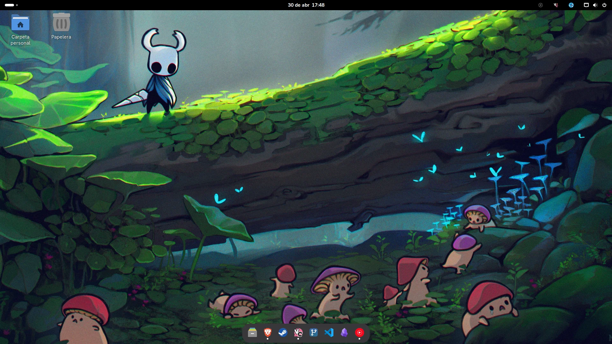
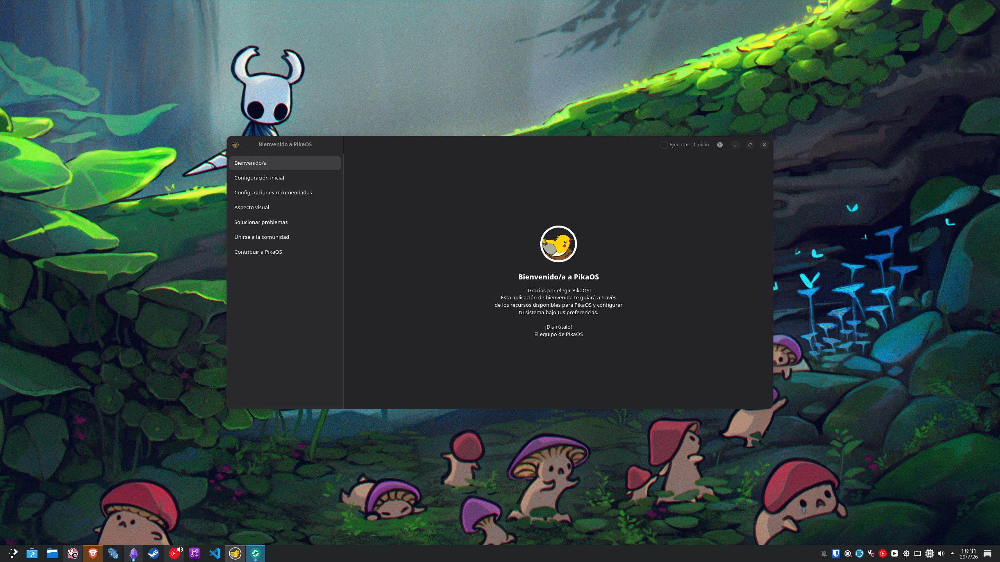

Hola de nou.

Feia setmanes que no encenia l'ordinador, però cada vegada que l'encenc em fa una il·lusió especial, o com diria algú que jo em sé, m'omple d'orgull i satisfacció.

## De Windows a Debian

Fa anys que vaig treure el Windows del meu ordinador personal i no me'n penedeixo. També és veritat que no el faig servir gaire i tot el que faig és compatible.

Vaig començar amb Kubuntu, un Ubuntu amb l'escriptori KDE Plasma. Em vaig acabar cansant. Fa uns mesos em va semblar interessant PikaOS, una distro basada en Debian. Realment, amb el servidor amb Debian, estic acostumat a aquest entorn i només buscava distros basades en Debian.

Vaig instal·lar PikaOS en la seva versió amb GNOME, per provar, em semblava bonic. Vaig estar molt de temps configurant-lo al meu gust i el vaig fer servir durant força temps.

## El taló d'Aquil·les de GNOME

Però realment tenia un taló d'Aquil·les: el porta-retalls múltiple.

Em sorprèn perquè la majoria de gent amb qui parlo em diu que no el fa servir, però jo no puc viure sense el porta-retalls múltiple. Poder copiar diverses coses i enganxar qualsevol de les que hagi copiat en qualsevol moment és indispensable, i GNOME no té això per defecte. Vaig trobar un parell d'aplicacions però no em van funcionar bé.

## El canvi a KDE sense reinstal·lar

Vaig decidir instal·lar PikaOS en la seva versió amb KDE. El problema és que no volia haver de reinstal·lar tot el sistema operatiu.

Vaig trobar per reddit que podia canviar l'escriptori sense reinstal·lar tot el sistema operatiu, simplement instal·lant els paquets de KDE de PikaOS i desinstal·lant els paquets de GNOME.

I això vaig fer, no ho vaig fer jo, ho vaig deixar a Claude, què podia sortir malament? Realment no era gaire difícil, el que sí que em va ajudar va ser a acabar d'eliminar coses de GNOME que no s'havien esborrat bé.

## El resultat

I ja està, vaig triar KDE a la pantalla d'inici de sessió i ja està, tot estava tal com ho havia deixat però amb un altre entorn d'escriptori i altres aplicacions.

I aquí estava, clicant la tecla de Windows + V, tenia un porta-retalls molt útil, preparat per enganxar qualsevol cosa que hagués copiat.

## Conclusió

I fins aquí el post. Realment és una cosa increïble de Linux, tenir la possibilitat de triar les parts del teu sistema operatiu que més t'agradin és una cosa increïble. Haver pogut canviar de GNOME a KDE Plasma sense haver de reinstal·lar tot el sistema operatiu ha estat increïble.

Res més, continuo amb més projectes, ens veiem aviat!