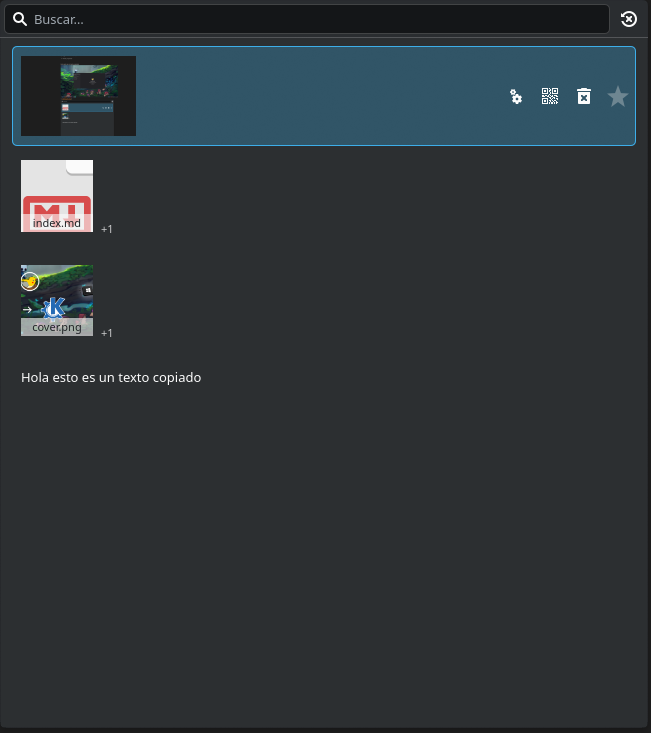

Hi again.

It had been weeks since I last turned on the computer, but every time I do it gives me a special kind of joy, or as someone I know would say, it fills me with pride and satisfaction.

## From Windows to Debian

I removed Windows from my personal computer years ago and I don't regret it. It's also true that I don't use it much, and everything I do is compatible.

I started with Kubuntu, an Ubuntu with the KDE Plasma desktop. I eventually got tired of it. A few months ago PikaOS caught my eye, a distro based on Debian. Since I run Debian on my server, I'm used to that environment and I was only looking for Debian-based distros.

I installed PikaOS in its GNOME version, just to try it, I thought it looked nice. I spent a lot of time setting it up to my liking and used it for quite a while.

## GNOME's Achilles heel

But it really had an Achilles heel: the multi-clipboard.

It surprises me because most people I talk to say they don't use it, but I can't live without a multi-clipboard. Being able to copy several things and paste any of them at any moment is essential, and GNOME doesn't have this by default. I found a couple of apps for it but they didn't work well for me.

## Switching to KDE without reinstalling

I decided to install PikaOS in its KDE version. The problem was that I didn't want to reinstall the whole operating system.

I found on reddit that I could switch desktops without reinstalling the whole operating system, just by installing PikaOS's KDE packages and uninstalling the GNOME ones.

And that's what I did, well, I didn't do it myself, I left it to Claude, what could go wrong? It really wasn't that hard, and it did help me clean up some GNOME leftovers that hadn't been removed properly.

## The result

And that was it, I picked KDE on the login screen and that was it, everything was exactly as I'd left it but with a different desktop environment and different apps.

And there I was, pressing Windows + V, with a really useful clipboard, ready to paste anything I'd copied.

## Conclusion

And that's it for this post. It's really something amazing about Linux, being able to choose the parts of your operating system you like best is amazing. Being able to switch from GNOME to KDE Plasma without having to reinstall the whole operating system has been amazing.

That's it for now, more projects coming, see you soon!