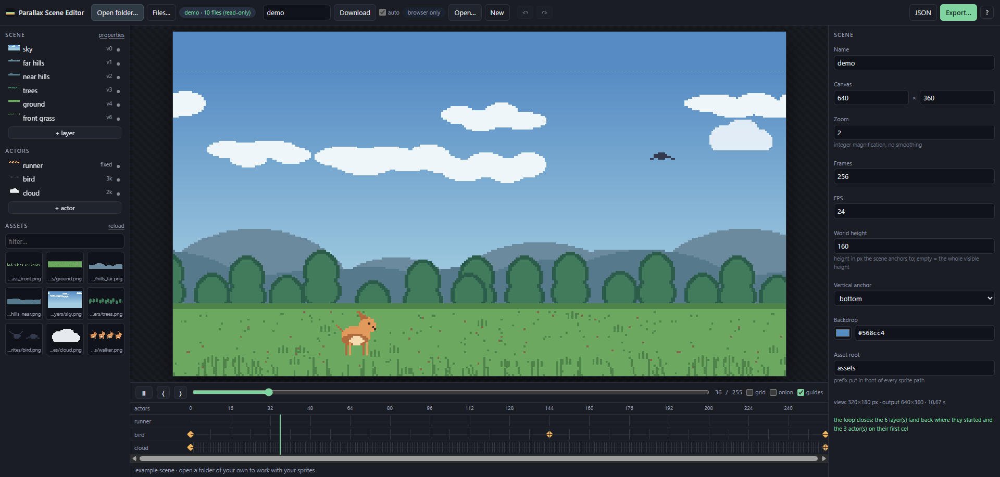

Benvinguts a un nou post!

Aquest cop va d'una cosa petita: el README del meu perfil de GitHub. Volia que fos simple, un GIF que digués alguna cosa de mi, una mica friqui però sense passar-se, una descripció curta i poca cosa més. Al final se'm va escapar de les mans força més del que tocava.

## La idea

El punt de partida va ser la intro de Pokémon Maragda: el personatge surt en bicicleta mentre uns quants Pokémon corren al seu costat, just abans dels crèdits. Aquesta escena sempre m'ha agradat, així que volia alguna cosa amb el mateix esperit, personalitzada, però que es reconegués la mateixa idea. Senzill, en teoria.

## Primer intent: Aseprite

Em vaig descarregar [Aseprite](https://www.aseprite.org/) perquè feia temps que volia una excusa per aprendre'l. Mentre m'hi familiaritzava, vaig demanar a Claude que anés extraient els sprites de [pokeemerald](https://github.com/pret/pokeemerald), el projecte de decompilació. No hi tenia gaire fe, però ho va fer força bé: va treure els sprites força ordenats, per parts, i després els va ajuntar en un únic spritesheet, i el mateix amb els fons de les diferents escenes, urbà, mar, bosc.

Li vaig preguntar si era capaç de recrear l'escena original a Aseprite, i també ho va aconseguir. Aquí em vaig trobar amb el problema de debò: Aseprite funciona per frames. No hi ha manera, que jo sàpiga, de moure't lliurement entre keyframes arbitraris i que interpoli; cada frame el dibuixes o el col·loques a mà. Perfecte per fer sprites, no tant per coreografiar una càmera i mitja dotzena d'actors al llarg de centenars de frames.

## El gir

Així que li vaig demanar que muntés la mateixa escena directament a partir d'un JSON amb les dades i posicions dels actors, tretes directament del joc. Imitava a la perfecció l'escena original. I aquí és quan va aparèixer la idea que de debò volia: i si un projectet d'una tarda el convertia en un d'una setmana?

Així va néixer el [Parallax Scene Editor](https://github.com/christt105/parallax-scene-editor). Li vaig demanar una pàgina web que treballés amb sprites i un JSON que descrivís l'escena, i vam anar iterant a partir d'aquí. Dues restriccions des del principi: tot local, i havia d'escriure directament al disc, no quedar-se en un estat intern de l'aplicació que exportes a mà al final.

## L'editor



Una escena de parallax aquí és un únic fitxer JSON: càmera, capes, actors, keyframes. L'edites mentre es reprodueix en bucle, i t'avisa en vermell en el moment en què alguna cosa no tancarà bé. Algunes de les coses que va acabar fent:

- **Llegeix i escriu directament al teu disc.** Obres una carpeta amb la File System Access API (només Chromium, pensat per anar de la mà amb Aseprite) i a partir d'aquí cada canvi s'escriu de nou al mateix fitxer uns quants centenars de mil·lisegons després que deixis de tocar res. Una píndola al costat de *Save* diu en tot moment on està escrivint.
- **Els sprites es recarreguen sols.** Repintes alguna cosa a Aseprite, guardes, i un parell de segons després ja és al canvas, sense que hagis de fer res.
- **Actors amb keyframes i easing**, més moviment `sine`/`cosine`/`wobble` a sobre per als detalls petits, un rebot a la bici, un ocell que es mou una mica mentre vola, sense haver-ho de dibuixar a mà.
- **Fa l'aritmètica de tancament de bucle per tu.** Si la velocitat d'una capa no encaixa al tile, o el nombre de cels d'un actor no divideix el bucle, l'editor no es limita a avisar-te: t'ofereix la solució exacta, les dues velocitats més properes que sí que tanquen, o una nova durada de bucle, amb un botó per a cadascuna.
- **Onion skin, línia de temps arrossegable, historial de desfer**, les coses de sempre que voldries i trobaries a faltar si no hi fossin.
- **Exporta a GIF, WebM o una seqüència de PNG.** El codificador de GIF està escrit des de zero: si tota l'animació cap en 256 colors, que és el cas de gairebé tot el pixel art, la paleta és exacta, sense dithering ni deriva de color.

És completament open source, sense dependències ni pas de compilació, així que GitHub Pages el serveix tal qual. Hi ha una versió en viu a [christt105.github.io/parallax-scene-editor](https://christt105.github.io/parallax-scene-editor/) per si li voleu fer un cop d'ull.

## Fent el GIF de debò

Amb l'editor en un estat prou madur, vaig tornar al GIF en si. Vaig conservar el personatge en bicicleta, el vaig posicionar a l'escena, i em vaig posar a buscar un Pokémon corrent per posar al seu costat. Vaig trobar un spritesheet de Mudkip de Pokémon Mundo Misteriós que, sorprenentment, encaixava gairebé de fàbrica en la mida i la perspectiva que necessitava.

L'únic problema va ser el color: l'estil artístic de Mundo Misteriós és prou diferent al de Maragda perquè Mudkip desentonés al costat de tota la resta. Vaig demanar a Claude que analitzés els altres sprites de Pokémon que ja hi havia a l'escena i ajustés la paleta de Mudkip per igualar-la, i el resultat no està malament, sobretot al voltant de la vora. També vaig provar unes animacions de combat de Pokémon que vaig trobar per internet, però l'estil i la perspectiva estaven massa lluny com per encaixar, així que les vaig descartar i em vaig quedar amb el ciclista i Mudkip corrent sobre un fons de bosc. Hauria estat bé muntar un equip complet de sis que hagués jugat en algun moment, però portar els sprites a aquest nivell de consistència és més del que vull assumir ara mateix. Vaig aplicar un lleuger zoom out i ho vaig deixar aquí, senzill, però net.

## Automatitzant l'actualització

L'editor exporta a GIF i WebM, així que el pla era: el repo del projecte de Pokémon exporta el GIF, i el README del perfil el referencia. Volia que això fos el més automàtic possible, així que vaig afegir una [GitHub Action](https://github.com/christt105/PokemonEmeraldIntroVideo/blob/main/.github/workflows/export.yml) al repo de [PokemonEmeraldIntroVideo](https://github.com/christt105/PokemonEmeraldIntroVideo) que s'executa a cada push: fa checkout d'una build de l'editor, la condueix en mode headless amb Playwright, i fa commit del GIF i el WebM resultants directament a `out/`.



El README del perfil simplement apunta a la URL raw d'aquest fitxer. Així que en el moment en què toco una velocitat o moc un keyframe a l'escena i faig push, l'animació es regenera sola i el README s'actualitza amb ella, sense el pas d'exportar-commitejar-pushejar per la meva banda.

## El resultat

Una descripció de mi mateix, curta a propòsit, i una petita llista de l'stack que faig servir al dia a dia. Aquest gif és just a dalt de tot, com a capçalera, que és en realitat tota la idea: alguna cosa que digui una mica de mi abans que ho faci una sola paraula.

Tot això es va allargar força més del previst, i em fa gràcia haver acabat escrivint un editor de parallax complet només per aconseguir un GIF animat en una pàgina de perfil. No vaig arribar a mirar si ja existia alguna cosa semblant, però aquí està el meu, de codi obert, perquè qui vulgui retòrcer-lo cap a una altra cosa ho pugui fer. Ja tinc una altra idea per al README, una mica més ambiciosa, però aquesta és per a un altre post.

Espero que us hagi agradat, i podeu provar l'editor si teniu al cap alguna escena de parallax pròpia.

Fins la propera!
