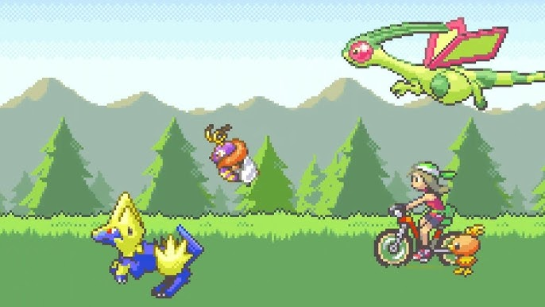
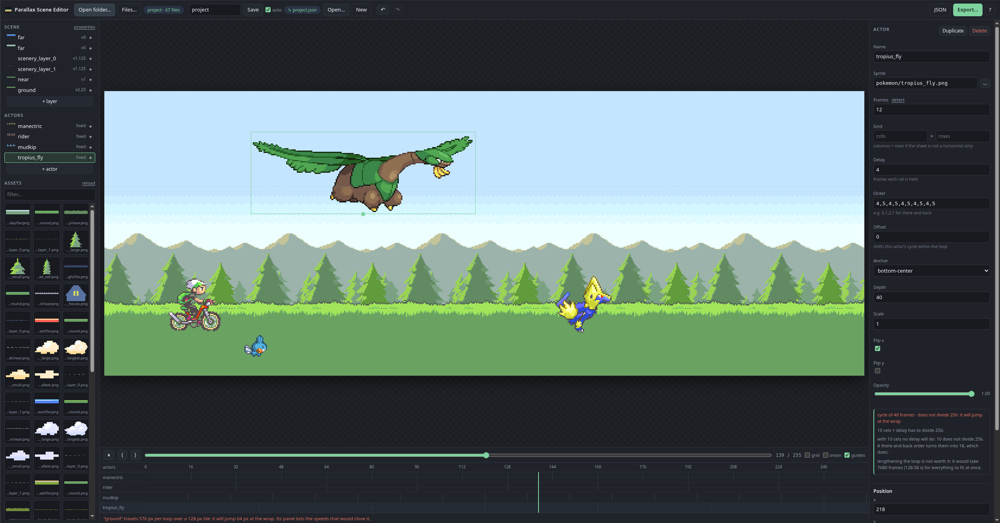
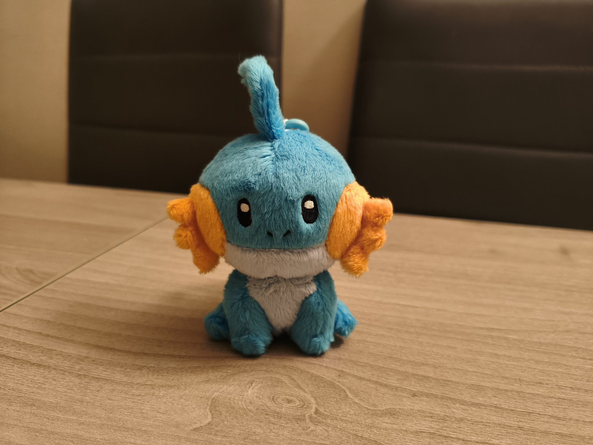
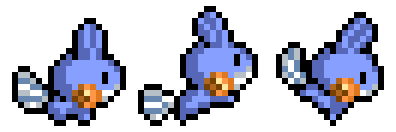
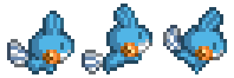
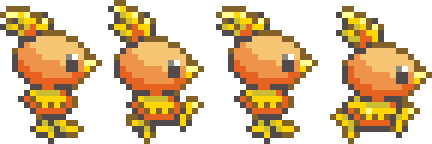

¡Bienvenidos a un nuevo post!

Esta vez va de algo pequeño: el README de mi perfil de GitHub. Quería que fuera simple, un GIF que dijera algo de mí, algo friki pero sin pasarse, una descripción corta y poco más. Al final se me fue de las manos bastante más de lo que tocaba.

## La idea

El punto de partida fue la intro de Pokémon Esmeralda: el personaje sale en bicicleta mientras varios Pokémon corren a su lado, justo antes de los créditos. Esa escena siempre me ha gustado, así que quería algo con el mismo espíritu, personalizado, pero que se reconociera la misma idea. Simple, en teoría.

## Primer intento: Aseprite

Me descargué [Aseprite](https://www.aseprite.org/) porque llevaba tiempo queriendo una excusa para aprender a usarlo. Mientras me familiarizaba con él, le pedí a Claude que fuera extrayendo los sprites de [pokeemerald](https://github.com/pret/pokeemerald), el proyecto de descompilación. No tenía mucha fe en que aquello fuera a ningún lado, pero lo hizo bastante bien. Sacó los sprites bastante ordenados, por partes, y luego los juntó en varios spritesheets, y lo mismo con los fondos de las distintas escenas, urbano, mar y bosque.

Le pregunté si era capaz de recrear la escena original en Aseprite, y también lo consiguió. Ahí me topé con el problema de verdad. Aseprite funciona por frames. No hay forma, que yo sepa, de moverte libremente entre keyframes arbitrarios y que interpole; cada frame lo dibujas o lo colocas a mano. Perfecto para hacer sprites, no tanto para coreografiar una cámara y actores a lo largo de cientos de frames.

## Plot twist

Así que le pedí que montara la misma escena directamente a partir de un JSON con los datos y posiciones de los actores, sacados directamente del juego. Imitaba a la perfección la escena original. Y ahí fue cuando apareció la idea que de verdad quería: ¿y si un proyectito de una tarde lo convertía en uno de una semana?

Así nació el [Parallax Scene Editor](https://github.com/christt105/parallax-scene-editor). Le pedí una página web que trabajara con sprites y un JSON que describiera la escena, y fuimos iterando desde ahí. Dos restricciones desde el principio: todo local, y tenía que escribir directamente en disco, no quedarse en un estado interno de la app que exportas a mano al final.

## El editor

### Parallax
Antes de seguir, un inciso para quien no le suene el término. El parallax es el truco de toda la vida para dar sensación de profundidad en 2D. En vez de un único fondo, se apilan varias capas (cielo, montañas, árboles, suelo...) y cada una se mueve a su propia velocidad, las lejanas más despacio, las cercanas más rápido. El ojo interpreta esa diferencia de velocidad como distancia, aunque debajo solo haya sprites planos. Es la misma técnica de los juegos de 16 bits, y la que usa Pokémon Esmeralda en su intro.

*Ejemplo de [slynyrd.com](https://www.slynyrd.com/blog/2019/11/12/pixelblog-23-parallax-scrolling), que tiene un post entero muy recomendable sobre cómo dibujar parallax scrolling en pixel art.*

### Usando el editor

Como siempre os dejo el repositorio del editor con el código fuente para quien quiera trastear.



Vamos a ver cómo funciona esta pequeña herramienta.

Una escena de parallax aquí es un único archivo JSON: cámara, capas, actores, keyframes. La editas mientras se reproduce en bucle, y te avisa en rojo en el momento en que algo no va a cerrar bien. Algunas de las cosas que acabó haciendo:

- **Lee y escribe directamente en tu disco.** Abres una carpeta con la File System Access API (solo Chromium) y a partir de ahí cada cambio se escribe de vuelta al mismo archivo unos milisegundos después de que dejes de tocar algo. Un mensaje junto a Save dice en todo momento dónde está escribiendo.
- **Los sprites se recargan solos.** Repintas algo en Aseprite, guardas, y un par de segundos después ya está en el canvas, sin que tengas que hacer nada.
- **Actores con keyframes y easing**, más movimiento `sine`/`cosine`/`wobble` encima para los detalles pequeños, un rebote en la bici, un pájaro que se mueve un poco mientras vuela, sin tener que dibujarlo a mano.
- **Hace la aritmética de cierre de bucle por ti.** Si la velocidad de una capa no encaja en el tile, o el número de cels de un actor no divide el bucle, el editor no se limita a avisarte: te ofrece la solución exacta, las dos velocidades más cercanas que sí cierran, o una nueva duración de bucle, con un botón para cada una.
- **Onion skin, línea de tiempo arrastrable, historial de deshacer**, las cosas de siempre que querrías y echarías en falta si no estuvieran.
- **Exporta a GIF, WebM o una secuencia de PNG.** El codificador de GIF está escrito desde cero. Si toda la animación cabe en 256 colores, que es el caso de casi todo el pixel art, la paleta es exacta.

Así se ve trabajando ya sobre el proyecto de verdad, con el ciclista, Mudkip y un Tropius volando, y el panel de la derecha avisando en rojo de que el ciclo de Tropius no cierra en el bucle:

Es completamente open source, sin dependencias ni paso de compilación, así que GitHub Pages lo sirve tal cual. Hay una versión en vivo en [christt105.github.io/parallax-scene-editor](https://christt105.github.io/parallax-scene-editor/) por si le queréis echar un ojo.

## Haciendo el GIF de verdad

Con el editor en un estado suficientemente maduro, volví al GIF en sí. Conservé el personaje en bicicleta, lo posicioné en la escena, y me puse a buscar un Pokémon corriendo para poner a su lado. Encontré un spritesheet de Mudkip de Pokémon Mundo Misterioso que, sorprendentemente, encajaba casi de fábrica en el tamaño y la perspectiva que necesitaba. Casualidad que es mi Pokémon favorito.

El único problema fue el color. El estilo artístico de Mundo Misterioso es lo bastante distinto al de Esmeralda como para que Mudkip desentonara al lado de todo lo demás. Le pedí a Claude que analizara los demás sprites de Pokémon que ya había en la escena y ajustara la paleta de Mudkip para igualarla, y el resultado no está mal, sobre todo alrededor del borde.

También probé unas animaciones personalizadas de Pokémon que encontré por internet, pero el estilo y la perspectiva estaban demasiado lejos como para encajar, así que las descarté y me quedé con el protagonista y un Mudkip corriendo sobre un fondo de bosque. Habría estado bien montar un equipo completo de seis que hubiera jugado en algún momento, pero llevar los sprites a ese nivel de consistencia es más de lo que quiero asumir ahora mismo. Apliqué un ligero zoom out y lo dejé ahí, simple, pero limpio.

## Automatizando la actualización

El editor exporta a GIF y WebM, así que el plan era: el repo del proyecto de Pokémon exporta el GIF, y el README del perfil lo referencia. Quería que eso fuera lo más automático posible, así que añadí una [GitHub Action](https://github.com/christt105/PokemonEmeraldIntroVideo/blob/main/.github/workflows/export.yml) al repo de [PokemonEmeraldIntroVideo](https://github.com/christt105/PokemonEmeraldIntroVideo) que se ejecuta en cada push: hace checkout de una build del editor, la conduce en modo headless con Playwright, y commitea el GIF y el WebM resultantes directamente en `out/`.



El README del perfil simplemente apunta a la URL raw de ese archivo. Así que en el momento en que toco una velocidad o muevo un keyframe en la escena y hago push, la animación se regenera sola y el README se actualiza con ella, sin el paso de exportar-commitear-pushear por mi parte.

## El resultado

Una descripción de mí mismo, corta a propósito, y una pequeña lista del stack que uso en el día a día. Ese gif está justo arriba de todo, como cabecera, que es en realidad toda la idea: algo que diga un poco de mí antes de que lo haga una sola palabra.

Todo esto se alargó bastante más de lo previsto, y me hace gracia haber acabado haciendo un editor de parallax completo solo para conseguir un GIF animado en una página de perfil. No llegué a mirar si ya existía algo parecido, pero aquí está el mío, de código abierto, para que quien quiera retorcerlo hacia otra cosa pueda hacerlo. Ya tengo otra idea para el README, algo más ambiciosa, pero esa es para otro post (si me da la vida).

Espero que os haya gustado, y podéis probar el editor si tenéis en mente alguna escena de parallax propia.

¡Hasta la próxima!
