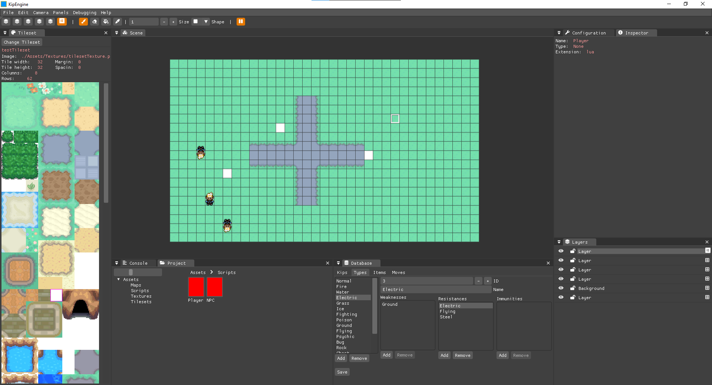

Hola un altre cop. Aquesta vegada faré un repàs del recorregut que ha tingut Godosters, des del seu origen fins ara.

Aquest contingut havia d'estar en el post anterior, però ja era prou llarg i no tan rellevant com per incloure’l.

## Origen

Des que vaig començar a aprendre a programar he tingut la idea de crear un projecte base per fer jocs a l’estil Pokémon. La inspiració ve de Pokémon Essentials, un projecte base fet amb RPG Maker XP, un programari molt antic. M’agradava la idea de fer el mateix però amb una base més moderna.

És un projecte que vaig pensar fa molt temps, i la idea era fer un motor de jocs Pokémon pel meu treball de final de grau. Però al final vaig decidir reduir la càrrega i centrar-me només en un aspecte del motor. Així va néixer [Elit3D](https://christt105.itch.io/elit3d), un editor de mapes per tiles en 3D.

La idea era anar ampliant el projecte fins a crear tota la base en C++, però des que vaig acabar la universitat he estat treballant a jornada completa i no he pogut dedicar gaire temps als meus projectes personals. He anat treballant de forma intermitent tant en Elit3D com en Godosters i altres projectes.

## Evolució

Godosters no és un projecte que comencés directament amb Godot 4, sinó que ha tingut diversos predecessors.

### Kip Engine

Poc després de "finalitzar" Elit3D, vaig fer un fork privat i hi vaig afegir el mòdul de scripting en Lua del [meu motor de videojocs](https://empty-whisper.github.io/WhispEngine/). La idea era reprendre el concepte original d’Elit3D: un motor de jocs de monstres de butxaca en 2.5D, barrejant models 3D amb pixel art.

Hi vaig treballar uns mesos fins que, per falta de temps, el vaig deixar de banda. No vaig fer gran cosa: moviment bàsic del jugador, un parell d’NPCs i l’inici de la base de dades de tipus de Pokémon.

### Pokémon Esmeralda Godot 3

La veritat és que el desenvolupament d’aquest projecte ha estat una muntanya russa. Vaig descartar l’ús de C++ per la seva complexitat i vaig decidir fer una prova amb Godot l’any 2022. Vaig començar amb Godot 3, ja que Godot 4 encara no havia sortit oficialment (si no recordo malament).

La idea era provar Godot per veure què podia oferir. Vaig passar un mes aprenent i desenvolupant un prototip de Pokémon Esmeralda. Vaig fer coses molt bàsiques: moviment del jugador, alguns NPCs i l’inici del sistema de diàleg. Es pot veure en aquest vídeo:



### Kip Unity Framework

Uns dies després vaig començar el que vaig anomenar Kip Unity Framework, un projecte de Unity per fer jocs de Pokémon. No recordo gaire bé per què vaig canviar de Godot a Unity, potser el vaig veure massa verd i vaig decidir aprofundir més en Unity i C#, que és el que feia servir diàriament.

En aquest projecte vaig avançar força. En principi el vaig començar per aprendre a fer shaders en Unity, i vaig anar afegint funcionalitats. Algunes de les coses que vaig fer:

- Un shader per renderitzar un fons infinit  
- Un sistema de tiles temporals com petjades a la sorra  
- Un shader que imita el reflex de l’aigua del Pokémon Esmeralda  
- L’inici de la introducció amb totes les animacions i efectes  
- Un sistema de scripting per nodes, amb el qual vaig fer la intro del professor Bedoll  

Si t’interessa, vaig penjar vídeos en aquesta llista de reproducció: [Pokémon Emerald Unity per christt105](https://youtube.com/playlist?list=PL9EieIseZRQD4dVf_MWqubnc0_0wV6vZj&si=mtHnbZRdVdDaFLJU)



Hi vaig estar treballant de forma intermitent durant aproximadament un any, fins que el setembre del 2023 Unity va anunciar els nous canvis de tarifes. Com que ja havia sortit Godot 4, vaig decidir tornar a provar Godot.

### Godosters

Ara sí, em vaig enamorar de Godot. Vaig crear un nou projecte amb Godot 4 i la idea ha estat replicar el que tenia en Kip Unity Framework mentre explorava el motor.

Vaig començar implementant el moviment del personatge. Estava (i estic) aprenent, així que hi ha moltes coses que he anat canviant i hauré de tornar a fer en el futur. La idea és fer tota la base en 2D i, gràcies a la flexibilitat de Godot, crear també una versió en 2.5D amb els mapes d’Elit3D (tot i que dubto que hi arribi, però aquesta és la idea).

Aquest és el primer vídeo que tinc del projecte Godosters:

---

I això és tot per ara. Em venia de gust fer un repàs a la història del projecte, perquè a vegades sembla que no hem avançat gaire… però mirant enrere, hi ha hagut molts intents i molt d’aprenentatge.

Si tens curiositat per les funcionalitats actuals del projecte, et recomano donar una ullada al [post anterior](https://christt105.github.io/blog/ca/p/godosters-devlog-0/), on explico amb més detall l’estat actual de Godosters.

Ens veiem a la pròxima entrada!
