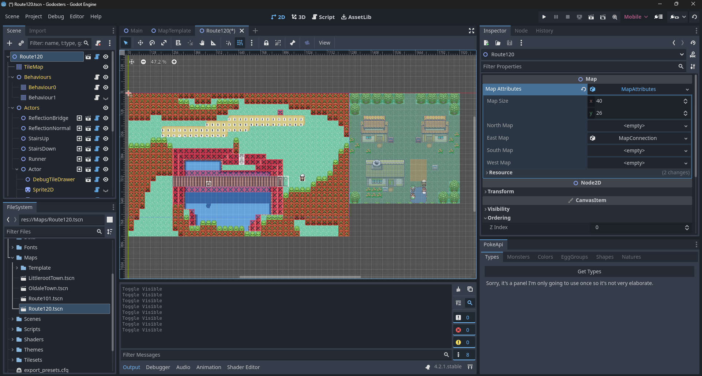

---  
title: "Presentant Godosters – Devlog #0"  
description: "Primera entrada del diari de desenvolupament de Godosters, un motor per crear jocs tipus Pokémon amb Godot. En aquesta publicació, faig un repàs de l’estat actual del projecte, les seves funcionalitats i cap a on vull portar-lo."  
date: 2025-05-26T00:00:00
slug: "godosters-devlog-0"  
image: cover.png  
keywords: ["godot", "godosters", "devlog", "motor pokémon", "indie dev"]  
readingTime: true  
license:
comments: true  
categories:  
  - Godosters  
tags:  
  - godot
  - devlog  
---

Hola! En aquesta entrada vull explicar breument l’estat actual del projecte en què he estat treballant: **Godosters**.

## Descripció

Godosters és un motor per crear jocs estil Pokémon. És un projecte que vaig començar fa diversos anys i que ha anat canviant de tecnologia fins a quedar-se amb Godot 4. En el futur, escriuré una entrada explicant l’evolució i les decisions que em van portar a triar Godot.

Ara mateix és un projecte base a Godot amb algunes funcionalitats bàsiques, però l’objectiu és crear totes les eines necessàries perquè l’usuari no necessiti conèixer Godot per crear el seu joc.

Actualment és privat, però tan bon punt tingui alguna cosa estable, el faré públic. La idea és minimitzar les dependències i escriure-ho tot amb GDScript, o amb GDExtensions si realment és necessari.

## Funcionalitats actuals

En aquest blog aniré escrivint un diari de desenvolupament on comentaré funcionalitats i canvis al projecte. Fem una ullada a les funcionalitats actuals. Si alguna t’interessa i vols saber com l’he fet, escriu-me als comentaris.

Una petita demostració en vídeo de l’estat actual del projecte:



### Shader de reflex a l’aigua

Encara recordo la primera vegada que vaig arribar a `Ciudad Petália` i vaig veure el meu reflex al llac, al costat d’aquell nen. Era un efecte que pensava que seria fàcil de fer i per això el vaig triar com a primer. Em cridava l’atenció el món dels shaders, i he de dir que la simplicitat de Godot per escriure’ls em va sorprendre molt. És força semblant a GLSL. Vaig fer aquest [shader d’aigua](https://godotshaders.com/shader/sprite-water-reflection-pixel-art/), al link teniu tots els detalls. Es pot activar per entitat, canviar-ne el color i ajustar-ne la posició. Per exemple, al vídeo es veu com el reflex del jugador i del Kecleon sota el pont està uns quants tiles més avall i amb un tint fosc.

### Shader de fons infinit (Unmoving Plaid)

Seguint amb shaders, en vaig fer un per al [fons infinit (o “unmoving plaid”)](https://godotshaders.com/shader/infinite-sprite/). La idea és que cada mapa tingui una mida fixa, cosa que ajuda a calcular límits i connectar àrees. El problema és que, quan arribes a la vora del mapa, es veu el fons si no s’ha omplert tot. Per evitar feina extra, vaig fer un shader que genera una imatge contínua al fons. Cada mapa podrà tenir la seva imatge de fons, i així no caldrà pintar fora dels límits.

### Sistema de mapes

Pel sistema de mapes, he optat per fer cada àrea com una escena que hereta d’una plantilla de mapa. Sé que l’herència d’escenes no és la millor opció segons es diu, però ara mateix està així. Cada mapa té alguns atributs — de moment només la mida del mapa en tiles i connexions a altres àrees.

 

Dins de cada escena de mapa hi ha un node TileMap on es dibuixa tot, tot i que encara no està actualitzat al nou sistema de tilemaps de Godot. He definit alguns valors de Z-index per controlar l’ordre de dibuix. Per exemple, els reflexos tenen un valor de -15.

També hi ha un conjunt de TileMaps de comportament. Aquests assignen propietats a les caselles pintant amb diferents sprites: es pot bloquejar el moviment totalment o direccionalment, o assignar-hi un ID de tipus de tile, com si és aigua o si deixa petjades, etc. Un cop pintat, cal prémer un botó per aplicar-ho a la capa. Com que pot haver-hi múltiples TileMaps de comportament, es poden activar o desactivar durant el joc. Per exemple, al vídeo es veu un pont a la Ruta 120 que utilitza dos TileMaps de comportament: un bloqueja l’aigua quan ets a sobre del pont, i l’altre s’activa quan estàs a sota. Quan el jugador travessa el pont, es canvia el TileMap actiu. Encara és un sistema molt inicial i amb moltes millores pendents. L’objectiu és que tot això es pugui modificar des d’una eina pròpia, sense preocupar-se del que passa per dins.

Finalment, hi ha una llista d’Actors o esdeveniments. Aquests són NPCs o objectes físics amb comportaments.

### Actors

Un actor és una entitat amb comportament. Se li pot assignar una textura, si té reflex, a quina capa està, si és sòlid, etc.

Els actors tenen un camp on s’hi pot afegir un script de comportament. Cada objecte de comportament té funcions que es disparen segons com interactuem amb ell: si prems el botó d’acció davant, si hi entres a sobre, o si s’executa en bucle. Es poden afegir accions a una llista i aquestes s’executen en ordre. Hi ha diversos tipus d’accions, i es poden crear d’útils i reutilitzables. Ara mateix, tot es fa des de l’inspector i és molt rudimentari. En el futur m’agradaria fer un llenguatge senzill per definir-ho tot des d’un fitxer. També tinc la idea de fer-ho amb nodes, com vaig fer amb el [Kip Unity Framework](https://youtu.be/_zOz2Mj4AMI?si=Zeix66XkwtTjLc9d), que crec que pot anar molt bé per a qui no li agrada programar.

 

### Sistema de combats

No us enganyaré — el sistema de combats és el que menys ganes tinc de fer. Té tantes variables i és tan complex que requereix molt de temps per fer-lo decent. He fet un sistema molt bàsic que aniré ampliant segons calgui.

He pensat a utilitzar el motor de combats de Showdown per no haver de programar tota la lògica i garantir que funciona perfectament, però no estic segur que sigui possible. Ho hauré d’investigar.

### Base de dades

M’agrada molt la gestió de dades, però també ha estat un dels motius pels quals vaig aturar el projecte durant un temps. Al Kip Unity Framework utilitzava ScriptableObjects per a cada Pokémon i per a cada característica de les espècies. Tenir-ho tot separat en assets m’agradava molt. El problema va ser intentar replicar això a Godot amb Resources — no és el mateix. Són una bona eina però no estan pensades per això. El principal problema són les referències circulars. És un [tema molt parlat a la comunitat](https://github.com/godotengine/godot-proposals/issues/7363) i hi ha moltes opinions. Durant el desenvolupament vaig veure que les futures versions tindrien `.uid` per a cada fitxer, i vaig pensar que potser això ho solucionaria. Ho he anat mirant de tant en tant, però encara no sé si continuar amb aquest sistema o canviar de model per a la base de dades.

 

## Demo

Tot i que està trencat per molts llocs, intentaré treure una versió amb cada devlog per mostrar com avança el projecte. Tingues en compte que és una versió molt inicial, i que moltes funcionalitats no funcionen o només funcionen des de l’editor.



## Futur

La veritat és que no sé fins on arribarà aquest projecte. És un projecte personal sense ànim de lucre, així que hi treballo quan tinc temps i ganes. Estic molt content amb Godot, així que seguiré amb aquest motor. Unity ja no és l’eina adequada per als meus projectes personals per les seves polítiques i els riscos que implica. Fer-ho tot des de zero amb C++ seria massa feina i no em permetria avançar. Godot és el punt mig perfecte entre flexibilitat i la sensació que el projecte és realment meu.

Encara he d’aprendre molt de Godot, però m’ho estic passant bé. Vull fer-ho tot sense llibreries externes i només amb GDScript. El projecte encara no és públic, així que el mantindré privat una mica més. Però si algun dia tinc alguna cosa estable i de la qual em senti orgullós, el publicaré.

Aquest últim any ha estat molt intens i no he pogut dedicar-li temps. Espero poder fer-ho ara, i que aquest blog em serveixi de motivació per seguir.

Fins aquí la primera entrada amb contingut. Tinc moltes coses a explicar i més projectes per compartir, així que intentaré ser més actiu.

Ens veiem a la pròxima actualització.

Adéu!
