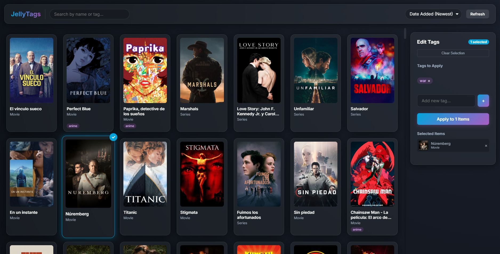
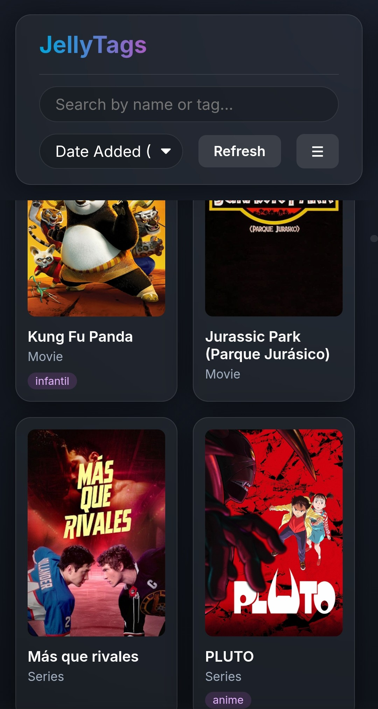
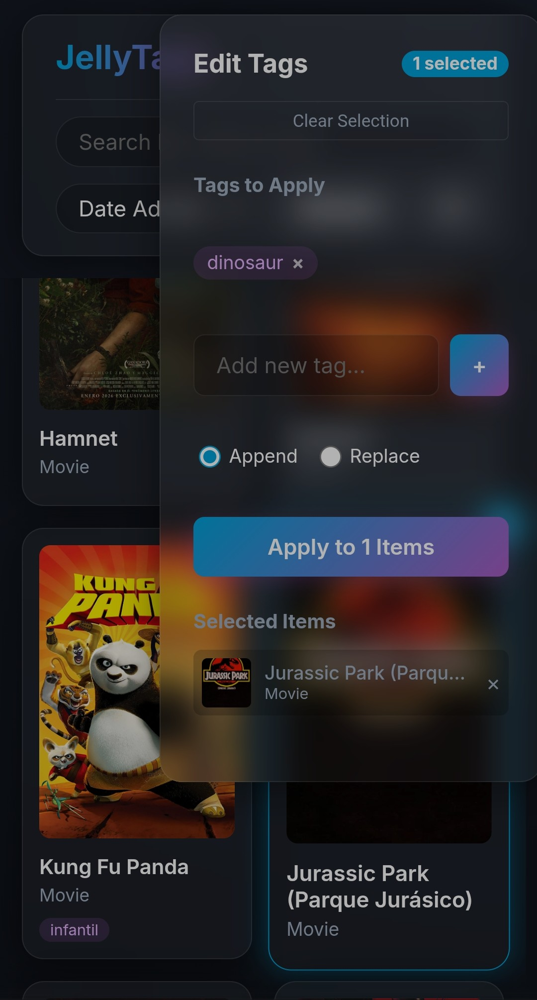

Benvinguts a un nou post!

Com ja és costum, he pausat momentàniament el desenvolupament del Media Tracker per centrar-me en una cosa nova. La meva intenció és acabar-lo, però abans m'agradaria crear un tema de Hugo específic perquè qualsevol pugui implementar-lo fàcilment.

Avui us porto un projecte curt però funcional que tenia moltes ganes de materialitzar.

## El Problema
Com vaig comentar en posts anteriors, mantinc una instància de [Jellyfin](https://jellyfin.org/) al meu servidor domèstic. Al principi és gratificant veure com creix la biblioteca, però amb el temps es converteix en un caos visual difícil de gestionar.

Comparteixo el servidor amb diversos familiars i hi ha molt contingut que a uns els interessa i a d'altres no. Actualment, Jellyfin no permet ocultar elements per usuari de manera manual, [encara que pot canviar en un futur](https://features.jellyfin.org/posts/1072/let-the-user-hide-a-movie-or-tv-show).

Després d'investigar, vaig veure dues opcions: separar el contingut en múltiples biblioteques (el que genera més desordre) o utilitzar etiquetes per restringir l'accés a certs usuaris. Aquesta última és la solució ideal de moment, però té un inconvenient: Jellyfin no permet l'edició múltiple d'etiquetes. Anar un per un (per exemple, com faig ara amb l'etiqueta `anime`) és un procés lent i tediós quan vols organitzar centenars d'elements.

## La Solució: Jellytags
Per solucionar això, vaig decidir desenvolupar una aplicació web que aprofita l'API de Jellyfin. Així neix [Jellytags](https://github.com/christt105/jellytags), un projecte de codi obert desenvolupat en només dos dies.



### Stack Tecnològic
Buscava una cosa simple i moderna que s'ajustés a les meves habilitats actuals:

- [Vite](https://vite.dev/) i [TypeScript](https://www.typescriptlang.org/)
- [jellyfin-sdk-typescript](https://typescript-sdk.jellyfin.org/)
- [Docker](https://www.docker.com/)

Tot i que podria haver-ho fet amb HTML i JavaScript pur, volia experimentar amb Vite i TypeScript. L'ús de l'SDK oficial de Jellyfin per a TypeScript va facilitar enormement les peticions a l'API. Finalment, tot s'empaqueta en una imatge de Docker perquè qualsevol usuari pugui desplegar-lo en segons.

### Resultat
La web és minimalista i eficient. Es compon de només tres fitxers (`index.html`, `main.ts` i `style.css`), mantenint la complexitat al mínim. Gran part de l'acabat visual i la rapidesa de desenvolupament se l'he d'agrair a l'assistència de la IA.



La interfície es divideix en tres seccions:
- **Barra superior:** Cercador d'elements i etiquetes, selector d'ordre i botó de refresc.
- **Panell principal (esquerre):** Llistat de pel·lícules i sèries amb el seu tipus i etiquetes actuals, llestos per ser seleccionats.
- **Panell de control (dret):** Gestió de la selecció i eines per afegir o netejar etiquetes de forma massiva.

#### Optimització mòbil
Era imprescindible que la web fos funcional des del telèfon, i el resultat és decent:




## Desplegament
Perquè el projecte sigui útil a la comunitat, he configurat un [workflow a GitHub Actions](https://github.com/christt105/jellytags/blob/main/.github/workflows/docker-publish.yml). Cada cop que publico una etiqueta de versió (ex. `v1.0.0`), es genera automàticament una imatge a [Docker Hub](https://hub.docker.com/r/christt105/jellytags).

Per instal·lar-lo al teu servidor, només necessites un fitxer `docker-compose.yml`:

```yaml
services:
  jellytags:
    image: christt105/jellytags:latest
    container_name: jellytags
    restart: unless-stopped
    ports:
      - "8181:80"
    environment:
      - VITE_JELLYFIN_URL=http://your-jellyfin-server-ip:8096
      - VITE_JELLYFIN_TOKEN=your_admin_api_token
```

Només cal executar `docker compose up -d` per tenir Jellytags funcionant a `http://la-teva-ip-local:8181`.

## Conclusions
Aquest ha estat un post breu i directe, que és com crec que haurien de ser la majoria.

Espero que Jellytags us resulti útil. El projecte és totalment gratuït i està obert a contribucions a GitHub. Si trobeu algun error, no dubteu a obrir una issue. Un "m'agrada" al [repositori](https://github.com/christt105/jellytags) o un comentari aquí sota s'agraeixen molt.

Fins a la propera!