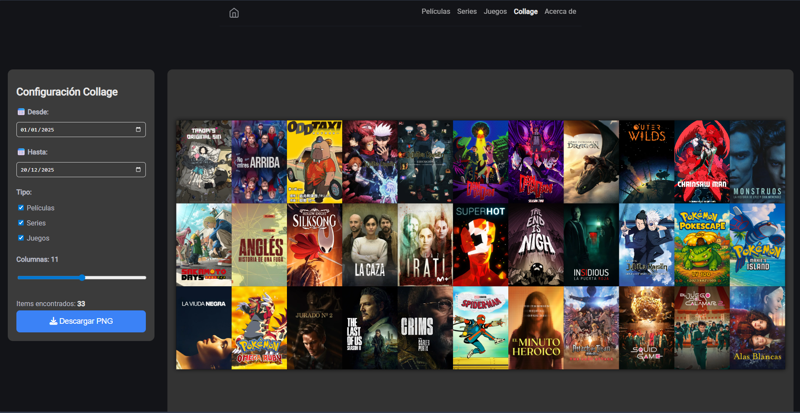

Hola de nuevo.  Hoy os traigo la tercera y última parte de la serie de "En busca del registro multimedia definitivo". Hoy os enseñaré la última pieza necesaria para cumplir todos los puntos que requería esta nueva solución.

[En el primer post](../media-tracker-origins) hablé de todas las herramientas que probé para tener un registro de películas, series y juegos vistos y jugados. [En el segundo post](../media-tracker-origins) os expliqué el corazón de mi nuevo Media Tracker usando [Obsidian](https://obsidian.md) con unos pocos plugins y scripts. En este último post os explicaré cómo he hecho la página web usando los datos de Obsidian. Esta es la página web: https://christt105.github.io/MediaTracker/.

## Hugo
[Hugo](https://gohugo.io/) es una herramienta magnífica. Es un generador de webs estáticas enfocado en el formato Markdown. Ya hablé de Hugo en mi post "[Porteando mi web a hugo](blog/porting-to-hugo/index.es.md)", donde estuve creando mi página web y este mismo blog con Hugo. Me parece maravillosa y se integra muy bien con Obsidian, ya que el núcleo de ambas herramientas son los archivos Markdown, así que decidí usarlo para crear la página web y sea el escaparate de mi Media Tracker.

### Tema
Hugo funciona a partir de un tema. Obviamente no hay ningún tema (o yo no lo he encontrado) que tenga todo lo que necesito. Igualmente no iba a hacer un tema de cero, mi idea era hacer lo mismo que hice con la página web, buscar un tema y editarlo a mi gusto, ya que no tengo muchos conocimientos de programación web. Estuve mirando y me decanté finalmente por el tema [hugo-blog-awesome](https://github.com/hugo-sid/hugo-blog-awesome). Es un tema muy simple y minimalista, justo lo que buscaba para empezar.

Una vez elegido el tema, creé un [repositorio en GitHub](https://github.com/christt105/MediaTracker) que contendrá el contenido de la página web y las modificaciones del tema. Podría haber separado el contenido de las modificaciones del tema, pero al ser un proyecto relativamente simple, decidí ponerlo en el mismo repositorio. Hugo funciona de forma que si creas un archivo con el mismo nombre, usará ese como prioridad al del tema. Así, que en el repositorio vive el contenido de la web, que simplemente es un archivo Markdown por cada elemento, y los archivos para sobreescribir el tema con lo necesario.

También configuré [GitHub Actions](https://docs.github.com/actions) para que en cada commit generase los archivos de Hugo y los publique en una web. Todo hosteado en GitHub.

#### Cambios en el tema
No voy a entrar en mucho detalle porque la mayoría de cambios los ha hecho la IA. Principalmente he cogido el estilo del tema base, le he añadido estilos nuevos y he cambiado prácticamente toda la estructura. He cambiado la página principal para mostrar una vista en galería de cada elemento ordenado de más reciente a más antiguo. Las páginas de cada categoría son parecidas a la principal. También he añadido un script que carga un banner aleatorio cada vez que accedes a la web. Cada elemento tiene su página, donde se muestran todos los detalles: portada, nota, fecha de compleción y comentario personal.


#### RSS
No suelo usar [RSS](https://wikipedia.org/wiki/RSS) aunque me parece interesante para notificar contenido nuevo. He creado dos archivos, [uno con todos los elementos](https://christt105.github.io/MediaTracker/index.xml) y otro [únicamente con los elementos acabados](https://christt105.github.io/MediaTracker/acabados.xml). Lo he añadido al servidor de Discord, aunque mis amigos aún no lo saben. Así que cada vez que vea o acabe un película, serie o videojuego, el bot enviará un mensaje con el link a la web de ese elemento.

#### Generación de Collages
Había una cosa por integrar, el generador de collages. Es una tontería pero me hacía ilusión.

No estaba muy seguro de si podría hacerlo siendo una página web estática, pero sí que es posible. Gracias a la herramienta [html2canvas-pro](https://yorickshan.github.io/html2canvas-pro/), es posible generar una imagen de un elemento de la web.

La herramienta hace exactamente lo que dice su nombre. Crea capturas de pantalla a partir de elementos html de la página. Tiene algunas limitaciones pero nada que afecte a esta web.

Después de varios intentos porque me generaba las imágenes con mala calidad si había bastantes elementos, conseguí que descargase una imagen con la calidad original de cada portada. Si hay muchos elementos, el tamaño de la imagen es bastante grande. Añadí varios parametros para filtrar por fecha y tipo y modificar el número de columnas. Ahora puedo generar un collage de las portadas desde cualquier dispositivo y en cualquier momento con un click, simplemente yendo al apartado [Collage](https://christt105.github.io/MediaTracker/collage/) de mi web.



#### Comentarios
En Hugo es frecuente tener un apartado de comentarios. No creo que sea muy útil, pero me hacía gracia ponerlo. En el blog estoy usando [Giscus](https://giscus.app), un sistema de comentarios que usa las discusiones de Github para almacenarlos. El problema principal es que necesitas una cuenta de GitHub para poder comentar, lo que añade una barrera importante para que alguien comente. Para un blog de tecnología es más que aceptable y funciona muy bien, pero para un lugar de películas, series y videojuegos, no es un sistema que encaje. Estuve mirando [Disqus](https://disqus.com/), pero añade anuncios en la capa gratuita y no quiero nada de eso en mis páginas web. También estuve mirando [Cusdis](https://cusdis.com/), que es una alternativa opensource y autohospedada, pero me da bastante pereza hostearlo cuando realmente nadie lo usará. Así que al final he usado Giscus otra vez.


#### Cabecera aleatoria 
La web se veía bastante bien, pero quería algo de dinamismo. Se me ocurrió la idea de reutilizar los banners de cada elemento y que cada vez que entraras en la página, muestre una cabecera aleatoria de todos los elementos completados.

### Script
Aunque Hugo funciona con Markdown, hay que hacer unos ajustes en cuanto a estructura para que funcione todo correctamente, así que he creado un script en Python para convertir las notas de Obsidian a Hugo. El script lo tengo en el repositorio de la página web: [https://github.com/christt105/MediaTracker/scripts/migration.py](https://github.com/christt105/MediaTracker/blob/main/scripts/migration.py).

El script lo ejecuto cada vez que quiero actualizar la web. Primeramente borra el contenido generado por el script anteriormente para empezar siempre limpio y posteriormente va recorriendo cada nota de mi vault personal, crea una carpeta en el repositorio con el nombre de la película, serie o juego y pega la nota dentro de la carpeta.

Cada nota es procesada para hacer algunos cambios. Primeramente cambia todos los Wikilinks, los que usa obsidian de esta forma `[[Otra Nota]]`, por un link en formato Markdown, si la nota referenciada es otra película, serie o videojuego, o por texto simple si la referencia está fuera de la carpeta `Media Tracker/` de mi vault. Esto lo hago porque lo mismo referencio una nota de mi vault personal que no estará en la web o referencio una película dentro de otra. Seguidamente modifico los links a youtube que hubiera en la nota y los modifico por el [shortcode](https://gohugo.io/content-management/shortcodes/) de Hugo para que se muestre correctamente integrado en la web.

Hay varios procesos que envuelven el tema de las imágenes. Principalmente tengo tres tipos de imágenes. 

Primeramente tenemos las imágenes de las portadas y los banners que están en un servicio externo como TMDB o Steamgridb. En esta categoría entran todas las imágenes que estén dentro de las propiedades `cover` y `banner` y tengan una url a tmdb, tvdb, steamgriddb o donde sea. Estas imágenes son las únicas que se pueden perder en algún momento, el servicio puede cerrar o eliminar esas imágenes. Estas imágenes se copian al repositorio, así evito que si una imagen deja de estar disponible en internet, yo la tengo guardada y a la hora de cargar la web todas provienen del mismo servidor. Cada url de imagen se codifica para que tenga su nombre identificativo que siempre será el mismo. El script comprueba si esa imagen ya está en el repositorio y si es el caso la ignora y si no, la descarga. En caso de que la url de la imagen cambie, la guardaría en el repositorio y al final del script elimina todas las imágenes que no se han usado.

Por otro lado tenemos las imágenes de las portadas y banners que se guardan localmente en el propio vault. Estas imágenes se copian siempre ya que pueden cambiar pero tener el mismo nombre, y al ser un proceso local no dura mucho. Todas las imágenes se guardan en una carpeta de caché y posteriormente se van copiando a cada carpeta de cada nota que la use. Se separan en carpetas para las portadas y los banners y se guardan con un sufijo para saber la procedencia del archivo.

Finalmente tenemos las imágenes que están dentro de las notas. Estas imágenes se copian directamente del vault y se guardan dentro de la carpeta de la nota.

De esta forma, el script genera una copia inmutable de mis datos, mis notas en el vault principal siempre serán las que se modifiquen. Gracias a que guardo las imágenes como caché, el script es muy rápido y evito que la web deje de funcionar correctamente por factores externos.

## Actualizador automático 
Ya tengo la web configurada y el script para convertir mis notas de Obsidian a Hugo. Sin embargo, surge un problema: no quiero tener que pasar las notas al ordenador y ejecutar el script manualmente cada vez que quiera actualizar algo.

​Gracias a mi Mini PC y a [Syncthing](https://syncthing.net/), tengo mi _vault_ de Obsidian sincronizado entre todos mis dispositivos. De este modo, cualquier cambio que haga en mis notas desde el móvil se refleja automáticamente en el Mini PC. Con la carpeta del Media Tracker siempre sincronizada, solo faltaba automatizar la ejecución.

​Para ello, he configurado una tarea en el Mini PC usando [cron](https://wikipedia.org/wiki/Cron_\(Unix\)) que se ejecuta cada día a las 9:00. Esta tarea lanza el script de Python sobre el repositorio y, una vez finalizado, si detecta cambios, realiza un git push. Así, cada mañana, el sistema actualiza los archivos y los sube a GitHub, generando una nueva versión de la web. Ya no tengo que preocuparme por el despliegue, todo el proceso es completamente automático.

```sh
#! /bin/bash

export PATH=/usr/local/bin:/usr/bin:/bin:/usr/sbin:/sbin

LOGFILE="/home/christian/logs/cron_mediatracker_log.txt"

date=$(date +"%Y-%m-%d %T")
message="Auto-commit $(date --iso-8601=seconds)"

REPO="/home/christian/Projects/MediaTracker"

exec >> "$LOGFILE" 2>&1

echo "--- Starting backup: $date ---"

cd "$REPO" || { echo "Could not enter $REPO"; exit 1; }

source ./venv/bin/activate
python3 ./scripts/migration.py

git add ./content ./static

if ! git diff-index --quiet HEAD; then
    git commit -m "$message"
    echo "Changes committed."
else
    echo "Nothing new to commit."
fi

NEEDS_PUSH=$(git log origin/main..HEAD --oneline)

if [ -n "$NEEDS_PUSH" ]; then
    echo "Pending changes found. Attempting push..."
    
    if git push origin main; then
        echo "Push successful."
    else
        echo "ERROR: Push failed. Check SSH/Token permissions."
    fi
else
    echo "Repo is synchronized (Clean)."
fi

echo "---------------------------------"
```

## Flow Actual
Simkl + jellyfin + Obsidian + RSS

## Próximos pasos
Y con esto ya he explicado todo lo que tengo, suficiente. He tenido que hacer un parón de este post para optimizar la web porque usaba muchísimos recursos al descargar las imágenes.

Dejaré este proyecto por un tiempo pero tengo muchas ideas para ir mejorando. Me gustaría añadir gráficos para mostrar estadísticas de lo que veo y juego. También me gustaría añadir un sistema de filtros en la pantalla principal, para poder filtrar por tipo y etiquetas, y así eliminar las secciones. Otro punto importante es darle uso a la propiedad de `rewatches` y generar una entrada en cada fecha incluida en esa propiedad, de forma que si hay una película que he visto dos veces, que aparezca en ambas fechas. Me gustaría añadir un motor de búsqueda, para poder ir directamente a la nota por nombre. Finalmente, debería dedicarle algo de tiempo a optimizar la web, añadir elementos relacionados en cada nota y mejorar la lógica de series y temporadas.

## Conclusiones
No es la herramienta más cómoda de configurar y usar, pero tiene todo lo que quiero. Esto no es ningún tutorial, por lo que hay muchos archivos que no los he puesto para no hacer el post muy largo. Si estás interesado en que publique un tutorial sobre como crear este Media Tracker, házmelo saber en los comentarios de abajo.

Iba a ser un post pero lo he dividido en 3. He aprendido mucho de obsidian y hugo. Me gusta

Espero que te haya gustado y nos vemos en el siguiente post.

