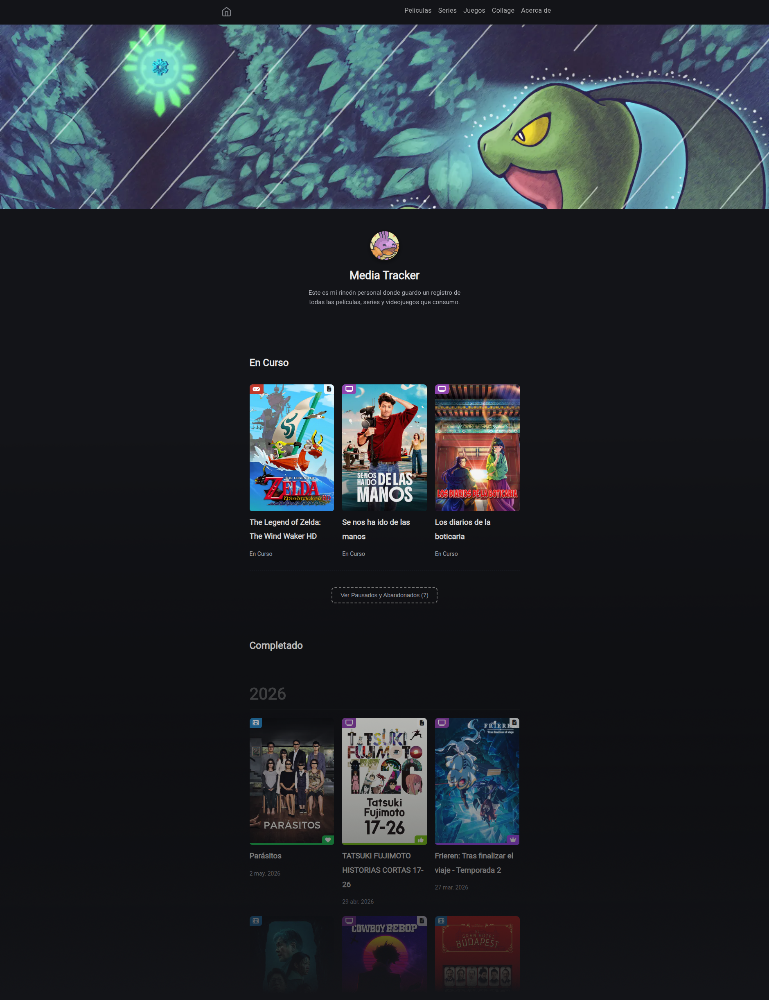
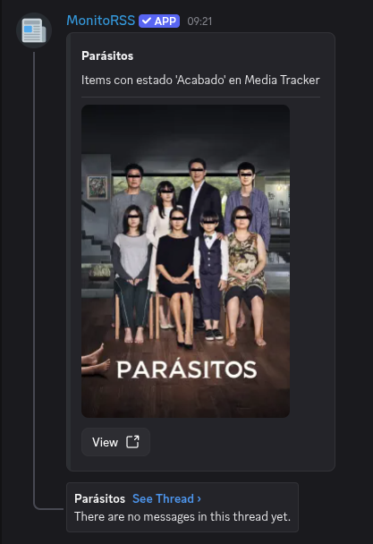
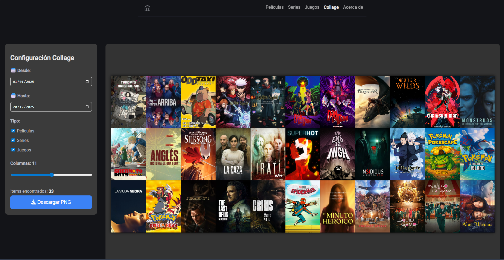
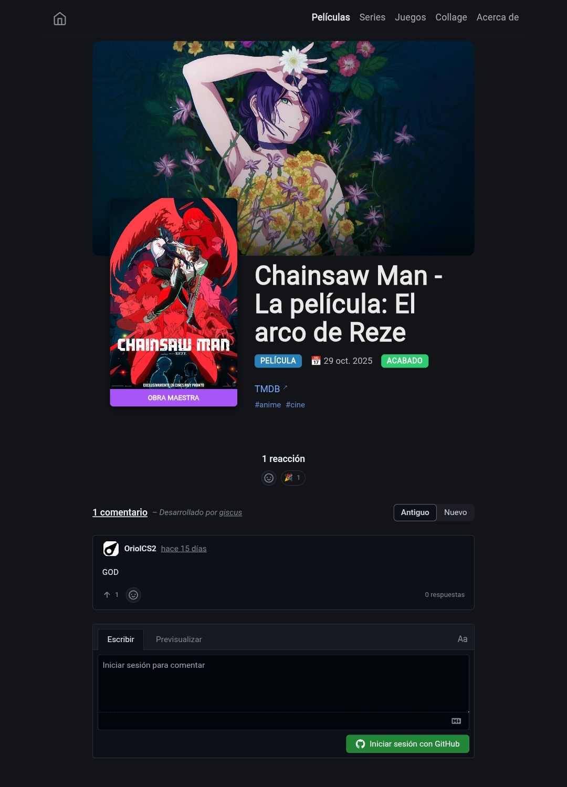

Hello again. Today I bring you the third and final part of the "In search of the ultimate media tracker" series. Today I will show you the last piece needed to fulfill all the requirements of this new solution.

[In the first post](../media-tracker-origins) I talked about all the tools I tried to keep a record of movies, series, and games watched and completed. [In the second post](../media-tracker-origins) I explained the heart of my new Media Tracker using [Obsidian](https://obsidian.md) with a few plugins and scripts. In this final post, I will explain how I made the website using the data from Obsidian. This is the website: https://christt105.github.io/MediaTracker/.

## Hugo
[Hugo](https://gohugo.io/) is a magnificent tool. It is a static site generator focused on the Markdown format. I already talked about Hugo in my post "[Porting my website to Hugo](blog/porting-to-hugo/index.es.md)", where I was creating my website and this blog with Hugo. I find it wonderful and it integrates very well with Obsidian, since the core of both tools are Markdown files, so I decided to use it to create the website and have it be the showcase for my Media Tracker.

### Theme
Hugo works based on a theme. Obviously, there is no theme (or I haven't found it) that has everything I need. Likewise, I wasn't going to build a theme from scratch; my idea was to do the same thing I did with the website: find a theme and edit it to my liking, since I don't have much web programming knowledge. I looked around and finally settled on the [hugo-blog-awesome](https://github.com/hugo-sid/hugo-blog-awesome) theme. It's a very simple and minimalist theme, exactly what I was looking for to start with.

Once the theme was chosen, I created a [GitHub repository](https://github.com/christt105/MediaTracker) that will contain the website content and the theme modifications. I could have separated the content from the theme modifications, but being a relatively simple project, I decided to put it in the same repository. Ideally, it would be better this way so more people could use it, but lately I've been short on time and I want to work on several projects without wasting time on work that no one will eventually use. Regardless, if you would like to have something like this more easily, let me know by showing your support.

Hugo works in such a way that if you create a file with the same name, it will use that as priority over the theme's file. So, the website content lives in the repository, which is simply one Markdown file for each element, along with the files to overwrite the theme with what's necessary.

I also configured [GitHub Actions](https://docs.github.com/actions) so that on every commit it generates the Hugo files and publishes them to a website. All hosted on GitHub.

#### Theme changes
I won't go into much detail because most of the changes were made by AI. Mainly, I took the style of the base theme, added new styles, and changed practically the entire structure. I changed the main page to show a gallery view of each element sorted from newest to oldest. The pages for each category are similar to the main one. I also added a script that loads a random banner every time you access the site. Each element has its own page, where all the details are shown: cover, rating, completion date, and personal comment.



#### RSS
I don't usually use [RSS](https://wikipedia.org/wiki/RSS) although I find it interesting for notifying about new content. I've created two files, [one with all elements](https://christt105.github.io/MediaTracker/index.xml) and another [only with finished elements](https://christt105.github.io/MediaTracker/acabados.xml). I've added it to the Discord server, although my friends don't know yet. So every time I watch or finish a movie, series, or video game, the bot will send a message with the link to that element's page.



#### Collage Generation
There was one thing left to integrate: the collage generator. It's a small thing, but I was excited about it.

I wasn't very sure if I could do it being a static website, but yes, it is possible. Thanks to the [html2canvas-pro](https://yorickshan.github.io/html2canvas-pro/) tool, it's possible to generate an image from a web element.

The tool does exactly what its name suggests. It creates screenshots from HTML elements on the page. It has some limitations but nothing that affects this site.

After several attempts because it generated low-quality images if there were many elements, I managed to get it to download an image with the original quality of each cover. If there are many elements, the image size is quite large. I added several parameters to filter by date and type and modify the number of columns. Now I can generate a cover collage from any device at any time with one click, simply by going to the [Collage](https://christt105.github.io/MediaTracker/collage/) section of my website.



#### Comments
In Hugo, it's common to have a comments section. I don't think it's very useful, but I felt like adding it. On the blog, I'm using [Giscus](https://giscus.app), a comment system that uses GitHub discussions to store them. The main problem is that you need a GitHub account to be able to comment, which adds a significant barrier for someone to comment. For a tech blog, it's more than acceptable and works very well, but for a place for movies, series, and video games, it's not a system that fits. I looked at [Disqus](https://disqus.com/), but it adds ads in the free tier and I don't want any of that on my websites. I also looked at [Cusdis](https://cusdis.com/), which is an open-source and self-hosted alternative, but I'm quite lazy to host it when no one will really use it. So in the end, I used Giscus again.



#### Random Header
The site looked pretty good, but I wanted some dynamism. I came up with the idea of reusing the banners of each element and having it show a random header from all completed elements every time you enter the page.

### Script
Although Hugo works with Markdown, some structural adjustments need to be made for everything to work correctly, so I created a Python script to convert Obsidian notes to Hugo. I have the script in the website's repository: [https://github.com/christt105/MediaTracker/scripts/migration.py](https://github.com/christt105/MediaTracker/blob/main/scripts/migration.py).

I run the script every time I want to update the site. First, it deletes the content previously generated by the script to always start clean, and then it goes through each note in my personal vault, creates a folder in the repository with the name of the movie, series, or game, and pastes the note inside the folder.

Each note is processed to make some changes. First, it changes all Wikilinks, the ones Obsidian uses like `[[Another Note]]`, to a Markdown format link if the referenced note is another movie, series, or video game, or to simple text if the reference is outside the `Media Tracker/` folder of my vault. I do this because I might reference a note from my personal vault that won't be on the web or reference one movie within another. Next, I modify any YouTube links in the note and replace them with the Hugo [shortcode](https://gohugo.io/content-management/shortcodes/) so they are correctly integrated into the site.

There are several processes surrounding the images. Mainly, I have three types of images.

First, we have cover and banner images that are on an external service like TMDB or Steamgridb. This category includes all images within the `cover` and `banner` properties that have a URL to TMDB, TVDB, Steamgridb, or wherever. These images are the only ones that could be lost at some point; the service could close or delete those images. These images are copied to the repository; this way I avoid losing access if an image is no longer available online, as I have it saved, and when loading the web, all images come from the same server. Each image URL is encoded so it has its identifying name which will always be the same. The script checks if that image is already in the repository and if so, ignores it; if not, it downloads it. If the image URL changes, it would save it in the repository and at the end of the script, it deletes all images that haven't been used.

On the other hand, we have cover and banner images that are stored locally in the vault itself. These images are always copied since they can change but have the same name, and being a local process, it doesn't take long. All images are saved in a cache folder and then copied to each folder of each note that uses them. They are separated into folders for covers and banners and saved with a suffix to know the source of the file.

Finally, we have the images that are inside the notes. These images are copied directly from the vault and saved inside the note's folder.

In this way, the script generates an immutable copy of my data; my notes in the main vault will always be the ones being modified. Thanks to saving the images as cache, the script is very fast and I prevent the site from stopping working correctly due to external factors.

## Automatic Updater
I already have the site configured and the script to convert my Obsidian notes to Hugo. However, a problem arises: I don't want to have to transfer the notes to the computer and run the script manually every time I want to update something.

Thanks to my [home server](blog/six-months-with-my-first-home-server/index.es.md) and [Syncthing](https://syncthing.net/), I have my Obsidian *vault* synchronized across all my devices. This way, any change I make to my notes from my mobile is automatically reflected on the Mini PC. With the Media Tracker folder always synchronized, I just needed to automate the execution.

To do this, I configured a task on the Mini PC using [cron](https://wikipedia.org/wiki/Cron_\(Unix\)) that runs every day at 9:00. This task launches the Python script on the repository and, once finished, if it detects changes, it performs a git push. Thus, every morning, the system updates the files and uploads them to GitHub, generating a new version of the site. I no longer have to worry about deployment; the entire process is completely automatic. The script could be much better, but it works for me.

```sh
#! /bin/bash

export PATH=/usr/local/bin:/usr/bin:/bin:/usr/sbin:/sbin

LOGFILE="/home/christian/logs/cron_mediatracker_log.txt"

date=$(date +"%Y-%m-%d %T")
message="Auto-commit $(date --iso-8601=seconds)"

REPO="/home/christian/Projects/MediaTracker"

exec >> "$LOGFILE" 2>&1

echo "--- Starting backup: $date ---"

cd "$REPO" || { echo "Could not enter $REPO"; exit 1; }

source ./venv/bin/activate
python3 ./scripts/migration.py

git add ./content ./static

if ! git diff-index --quiet HEAD; then
    git commit -m "$message"
    echo "Changes committed."
else
    echo "Nothing new to commit."
fi

NEEDS_PUSH=$(git log origin/main..HEAD --oneline)

if [ -n "$NEEDS_PUSH" ]; then
    echo "Pending changes found. Attempting push..."
    
    if git push origin main; then
        echo "Push successful."
    else
        echo "ERROR: Push failed. Check SSH/Token permissions."
    fi
else
    echo "Repo is synchronized (Clean)."
fi

echo "---------------------------------"
```

## Current Workflow
My current flow is:
### Movies
I watch a movie. If I'm watching it on my Jellyfin account, it's added to Simkl automatically. If I've watched it on another Jellyfin account or elsewhere, I have to add it to Simkl manually. When I finish it, I open Obsidian on my phone and add the note, setting the status to "Finished" and the date of that day, a rating from 1 to 7, and a comment if I feel like it. It synchronizes with my server and the next day at 9:00, a commit will be made and the site will be generated. Within half an hour at most, the Discord RSS bot receives the new note and posts a message with the link and the cover art.

### Series
Usually, I always watch series on Jellyfin; this way I can always know where I left off and it synchronizes with Simkl. When starting a series, I create it in Obsidian and change the status to "In Progress"; this way it will appear on the site in the section of things I'm currently watching or playing. If the series has only one season, I use the main note; if there are several, I create a note per season and modify the properties of the season notes. When I finish a season, I change the status to "Completed" and set the current date. The next day, a message will be sent via Discord with the watched series. If it's anime, I add it to MyAnimeList when starting and when finishing I set it as completed and give it a rating.

### Video Games
With video games, it's simple. When starting, I add it to Obsidian and when finishing I set it as completed and add the date. If it's not the first time I've played it, I use the rewatches section; this way it will appear on the site multiple times. In video games, I usually jot down things so I don't forget; since it's not important for the site, I extract it into an external note in my personal vault so it doesn't appear on the site. In video games, I usually include images, such as screenshots, which will be placed directly on the site.

## Next Steps
And with that, I've explained everything I have; enough. I had to take a break from this post to optimize the site because it was using a lot of resources when downloading images.

I'll leave this project for a while but I have many ideas for improvement. I'd like to add charts to show statistics of what I watch and play. I'd also like to add a filter system on the main screen to be able to filter by type and tags, and thus eliminate the sections. I'd like to add a search engine to be able to go directly to a note by name. I'd also like to add a calendar with all elements on each day. Finally, I should spend some time optimizing the site, adding related elements to each note, and improving the series and seasons logic.

Another important thing to do is to separate the theme from the site; this way anyone can have their page and modify it.

## Conclusions
It's not the easiest tool to configure and use, but it has everything I want. This is not a tutorial, so there are many files I haven't included to keep the post from being too long. If you are interested in me publishing a tutorial on how to create this Media Tracker, let me know in the comments below.

My main idea was to split the website theme and explain how to configure everything so anyone could have their Media Tracker website, but lately I've been very busy and I'm not sure if many people would use it. So for now, I'm going to leave it as is; if anyone wants to use it, they can fork the repository and modify it to their liking.

I hope you liked it and see you in the next post.