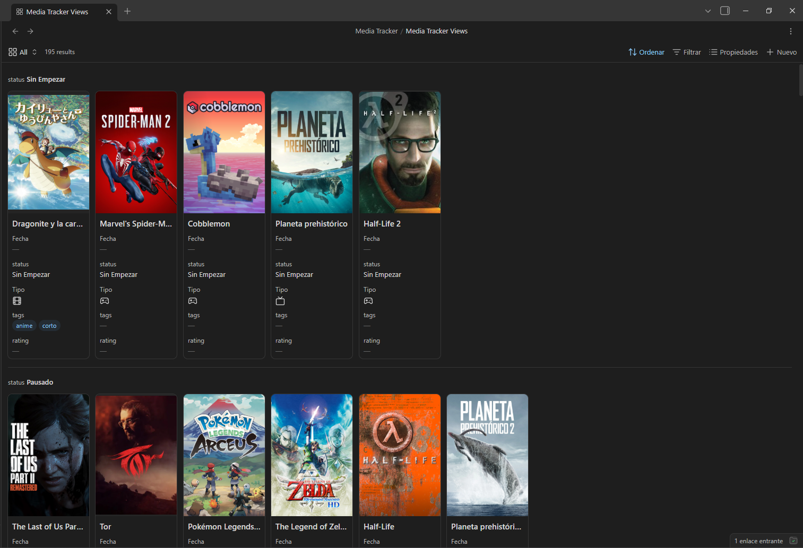
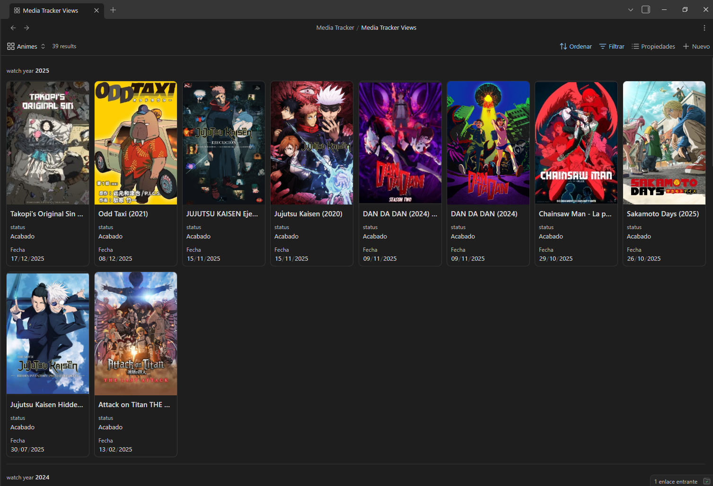
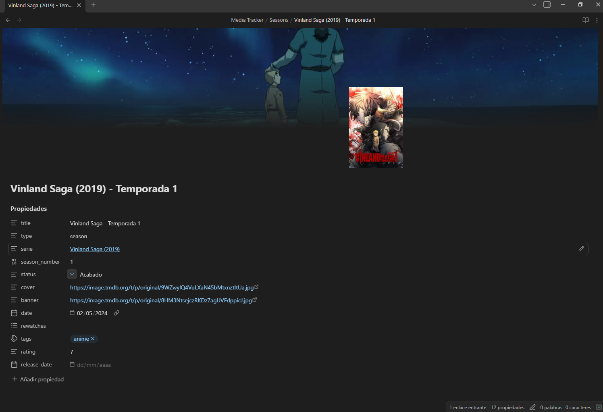
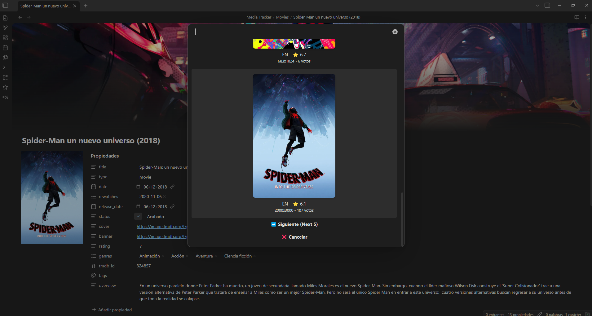

Benvinguts a la segona part de la sèrie "A la recerca del registre multimèdia definitiu". En aquest post us mostraré l'eina principal del meu nou media tracker.

[En l'anterior post](../media-tracker-origins) vaig explicar totes les eines prèvies a aquesta. Aquest post probablement serà el més extens dels tres. El meu objectiu és explicar tot el que tinc configurat, amb tots els scripts i configuracions, per si algú vol replicar el que he fet. La meva nova solució utilitza dues eines, però aquesta és el cor del meu media tracker. Som-hi.

## La nova solució

Per al meu nou Media Tracker volia tenir diversos punts presents:
- Totes les meves dades m'han de pertànyer.
- Poder migrar les dades a una altra aplicació si calgués.
- Accessible des de qualsevol dispositiu. Ser capaç d'afegir, eliminar i editar qualsevol dada, principalment des del mòbil, però que també sigui accessible des de l'ordinador.
- Poder afegir comentaris, imatges i vídeos a cada element.
- Tenir una pàgina web que sigui fàcilment accessible des de qualsevol dispositiu i completament adaptable a les meves necessitats.
- Poder afegir pel·lícules, sèries i jocs a la mateixa base de dades i que sigui còmode fer-ho.

Després d'investigar, vaig decidir decantar-me per la idea d'utilitzar [Obsidian](https://obsidian.md/) per a la creació i edició de cada element del tracker. Per la naturalesa d'Obsidian amb Markdown, i amb l'experiència d'haver fet la meva pàgina web i blog amb [Hugo](https://gohugo.io/), vaig decidir utilitzar-lo per generar la pàgina web del meu media tracker. Encara que d'això en parlarem en el següent post.

## Obsidian
Per als que sabeu com funciona [Notion](https://www.notion.com/), haureu arquejat la cella en el [post anterior](../media-tracker-origins) en dir que amb Notion les meves dades em pertanyien; i no és cert. A Notion les dades no són teves: et poden revocar l'accés a elles quan considerin perquè són de la seva propietat, així que tocava moure fitxa.

D'una febre a una altra, va arribar a la meva vida [Obsidian](https://obsidian.md/). Aquesta eina és una aplicació per prendre notes en format Markdown. Et permet crear relacions entre les teves notes per generar un graf. És molt semblant a l'estructura de la [Viquipèdia](https://www.wikipedia.org/), on pots anar recorrent diferents pàgines a través dels enllaços relacionals.

Gràcies a la meva nova adquisició, un mini PC, podia sincronitzar les meves notes de manera molt eficaç amb [Syncthing](https://syncthing.net/), com ja vaig explicar en el meu altre post [Sis mesos amb el meu primer servidor casolà](https://christt105.github.io/es/blog/six-months-with-my-first-home-server/), que era el punt que em feia més enrere d'Obsidian. Ara explicaré com tinc configurat Obsidian per al Media Tracker. Potser en un futur faré un post explicant com tinc configurat tot el meu Obsidian, ja que em sembla una eina increïble per integrar en el teu dia a dia.

### Plantilla
No tenia pensat fer-ho, però al final he creat una plantilla amb tots els arxius necessaris perquè funcioni tal com ho tinc jo. Configurar-ho en un vault ja existent pot ser una mica tediós; hauria d'haver estat un plugin, però ho he anat fent sobre la marxa i no creia que molta gent ho anés a usar, ja que està tot fet per cobrir les meves necessitats específiques. Pots descarregar el vault, obrir-lo amb Obsidian i comprovar com està tot configurat.

En el cas que tingués molt de suport, podria considerar fer un plugin específic per a Obsidian.

### Organització
Vaig decidir tenir el Media Tracker dins del meu _vault_ principal d'Obsidian. El Media Tracker viu únicament en una carpeta; així evito que es barregi amb les altres notes i és més fàcil de diferenciar. Dins de `Juegos/`, `Movies/`, `TVs/` i `Seasons/` viuen individualment cada instància de jocs, pel·lícules, sèries i temporades respectivament; cada element té la seva nota. També tinc la carpeta `Portadas/` on guardo les imatges de les portades i banners d'elements que no estan a la web, sobretot de fangames.

A `Media Tracker/` hi ha l'arxiu `Media Tracker Views.base`, que és un arxiu tipus base amb diverses vistes. Les bases són un afegit molt recent; just les acabaven d'implementar quan vaig començar a usar Obsidian. És un arxiu que et permet visualitzar les teves notes de diverses formes, semblant a les vistes de Notion. Té una API, per la qual cosa la comunitat ja està començant a usar-les per a coses més complexes. De moment únicament he creat vistes molt bàsiques i gairebé no les uso, ja que tinc la web.

 

### Sèries i Temporades
Amb les sèries tenia un problema. No sabia què fer amb les sèries amb múltiples temporades. D'una banda, hi ha sèries amb diverses temporades que veig en diferents moments, per la qual cosa hauria de separar cada una, però de l'altra, fer una nota de sèrie duplicada pot quedar estrany si únicament hi ha una temporada. També és veritat que hi ha sèries que organitzen molt malament les temporades, cosa que pot arribar a ser caòtica.

És per això que al final vaig decidir usar una solució híbrida. Cada sèrie tindrà la seva pròpia nota amb les mateixes propietats que les pel·lícules. Si una sèrie té únicament una temporada, s'usa la nota de la sèrie. Si té diverses temporades, es crea una nota per cada temporada i a la data de la nota de la sèrie se li posa la mateixa que la de l'última temporada vista.

L'únic dolent és que he d'actualitzar dos estats i dues dates per a una mateixa sèrie (a la nota de la sèrie i a la de l'última temporada). Crec que és la solució més factible a aquest problema.

### Plugins i Scripts
Una de les coses més increïbles d'Obsidian és la personalització amb els connectors (plugins) de la comunitat. S'obre un camp gegant de possibilitats. Principalment he usat tres plugins que han fet que l'experiència sigui molt millor que amb les solucions anteriors.

Realment podria haver creat un plugin que ho englobés tot, però com que vaig anar a poc a poc i no tenia molta experiència amb Obsidian, vaig anar afegint plugins i scripts a mesura que necessitava funcionalitats. Us explicaré com ho tinc funcionant.

#### Templater
El plugin [Templater](obsidian://show-plugin?id=templater-obsidian) va molt bé per usar plantilles, executar accions i afegir informació en crear noves notes. Això ens ajuda a importar informació de bases de dades de pel·lícules, sèries i jocs i a organitzar les notes al moment de crear-les.

#### Movie Search
El plugin [Movie Search](obsidian://show-plugin?id=movie-search) és una mica antic però segueix funcionant molt bé. Té alguna cosa que canviaria, però de moment és més que suficient. Afegeix un botó que obre un panell per introduir el nom de la pel·lícula o sèrie. En cercar, consulta l'API de TMDB i et mostra els resultats.

En seleccionar una opció, crea una nova nota amb una plantilla configurada, reemplaça les variables pels valors corresponents i executa el codi de Templater. TMDB té dos tipus (`movie` i `tv`) que s'afegeixen directament a la propietat `type`. S'assigna un pòster i un banner predeterminat usant l'enllaç a la imatge i s'emmagatzema l'ID de TMDB per a futures referències. Es guarden també els gèneres i la sinopsi formatant-los correctament, ja que el plugin té problemes si inclouen barres o cometes dobles. També comprova si és una sèrie i afegeix la propietat de `temporades`. Finalment, agafa l'any i modifica el nom de l'arxiu per incloure'l i evitar duplicats. La plantilla que uso actualment és aquesta: [Movie.md](https://github.com/christt105/media-tracker-obsidian-template/blob/main/MediaTrackerTemplate%2FTemplates%2FMovie.md)

I aquest seria el resultat final de la nota:

#### QuickAdd
El plugin [QuickAdd](obsidian://show-plugin?id=quickadd) permet crear scripts i executar-los mitjançant accions. D'aquesta manera puc editar les meves notes fàcilment accedint a APIs externes. Els scripts estan en JavaScript; la majoria estan fets amb IA i posteriorment editats per mi. Aquestes són algunes de les funcions que he creat:

##### Afegir Joc
Per als videojocs vaig decidir usar la base de dades d'[IGDB](https://www.igdb.com/). Per usar la seva API has d'iniciar sessió amb Twitch, la qual cosa és un poc estrany. Les bases de dades de videojocs estan per darrere de les de cinema: solen estar en anglès i la informació és incompleta. Vaig triar IGDB perquè era l'única que incloïa els fangames que he jugat.

Vaig usar aquest script d [Elaws/script_videogames_quickAdd](https://github.com/Elaws/script_videogames_quickAdd) i el vaig modificar per a la meva plantilla [IGDB.md](https://github.com/christt105/media-tracker-obsidian-template/blob/main/MediaTrackerTemplate%2FTemplates%2FIGDB.md), resultant en [aquest script](https://github.com/christt105/media-tracker-obsidian-template/blob/main/MediaTrackerTemplate%2FScripts%2FQuickAdd%2Figdb.js). El funcionament és similar al cercador de pel·lícules: introdueixes el nom i selecciones l'opció per crear la nota.

##### Crear Temporada
Necessitava que, amb un botó, pogués crear des d'una nota de Sèrie una nota de Temporada amb els seus atributs i referències. Vaig fer [aquest script](https://github.com/christt105/media-tracker-obsidian-template/blob/main/MediaTrackerTemplate%2FScripts%2FQuickAdd%2FcreateSeason.js) que comprova que estàs en una nota de sèrie, demana el número de temporada i genera la nota usant [aquesta plantilla](https://github.com/christt105/media-tracker-obsidian-template/blob/main/MediaTrackerTemplate%2FTemplates%2FSeason.md), afegint `" - Temporada X"` al nom. La nova nota copia les imatges de la sèrie i les enllaça mitjançant les propietats `temporades` i `serie`.

##### Actualitzar Imatges
Usar només la primera imatge de TMDB o IGDB no és molt personalitzable. He creat [aquest script](https://github.com/christt105/media-tracker-obsidian-template/blob/main/MediaTrackerTemplate%2FScripts%2FQuickAdd%2FupdateImages.js) que mostra diferents imatges perquè triïs la que prefereixis. Funciona per a portades i banners. Si és cinema, cerca a [TMDB](https://www.themoviedb.org/?language=es); si és videojoc, usa l'API de [SteamGridDb](https://www.steamgriddb.com/), ja que les imatges d'IGDB solen ser de baixa qualitat. L'script cerca primer l'ID de SteamGridDb; si no el troba, cerca per nom i guarda l'ID per al futur.

##### Steam ID
Per als jocs de la meva antiga base de Notion, necessitava guardar l'ID de Steam per generar enllaços a la botiga i mostrar arts oficials. Vaig crear [aquest script](https://github.com/christt105/media-tracker-obsidian-template/blob/main/MediaTrackerTemplate/Scripts/QuickAdd/steam.js) que cerca a la botiga i insereix l'ID a la nota.

##### Importar scripts
Si vols importar tots aquests scripts directament, pots usar l'eina de QuickAdd "import packages" amb l'arxiu [quickadd-package.quickadd.json](https://github.com/christt105/media-tracker-obsidian-template/blob/main/MediaTrackerTemplate/QuickAdd%20Packages/quickadd-package.quickadd.json).

#### Pretty Properties
[Pretty Properties](obsidian://show-plugin?id=pretty-properties) és un connector visual que uso per renderitzar les portades i els banners directament a les propietats de cada nota.

## Flux actual
El meu flux és el següent:
1. **Pel·lícules:** Si la veig a [Jellyfin](https://jellyfin.org/), un plugin la marca com a vista a [Simkl](https://simkl.com/) automàticament. Si és al cinema, l'afegeixo a Simkl a mà. Després, a Obsidian, creo la nota, poso l'estat "Acabat", li assigno la meva puntuació personal i escric la meva opinió.
2. **Sèries:** El flux és el mateix episodi a episodi. En acabar la temporada, la registro a Obsidian.
3. **Videojocs:** En acabar-los, els agrego i trio les imatges que més m'agradin.

## Conclusions
Amb aquestes eines tinc un gestor multimèdia comodíssim. Gràcies a Obsidian i els seus scripts, ho gestiono tot sense sortir de l'app. Les dades són simples arxius de text sota el meu control i amb còpia de seguretat automàtica dues vegades al dia en estar al meu vault personal.

Aquesta solució no té res a envejar a les eines comercials. De la llista inicial, només falta un punt: la pàgina web per compartir-ho amb amics. Gràcies a Hugo i al fet que Obsidian usa Markdown, ha estat molt fàcil, però això ho veurem al pròxim post.

Espero que t'hagi agradat. He trigat a publicar-ho perquè volia deixar llista la plantilla per si algú la vol usar. Si et serveix, t'agrairia una reacció o una estrella al repositori.

Ens veiem al següent post, on ensenyaré com crear una web com [aquesta](https://christt105.github.io/MediaTracker/) amb aquestes dades!

Fins a la pròxima!