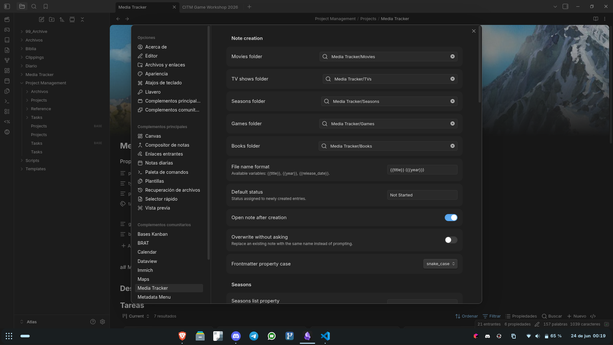
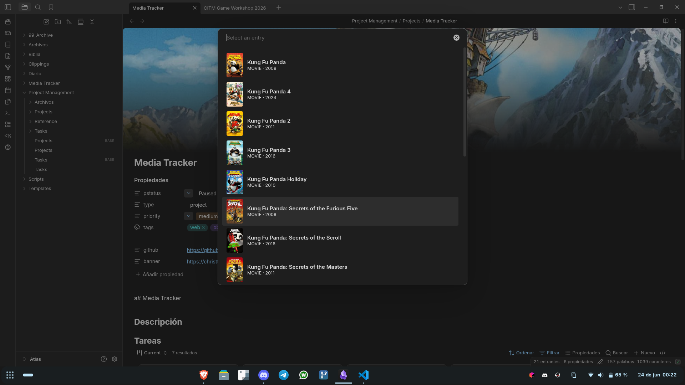
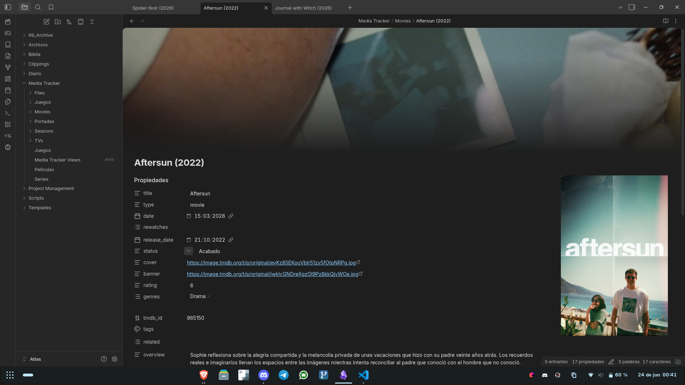
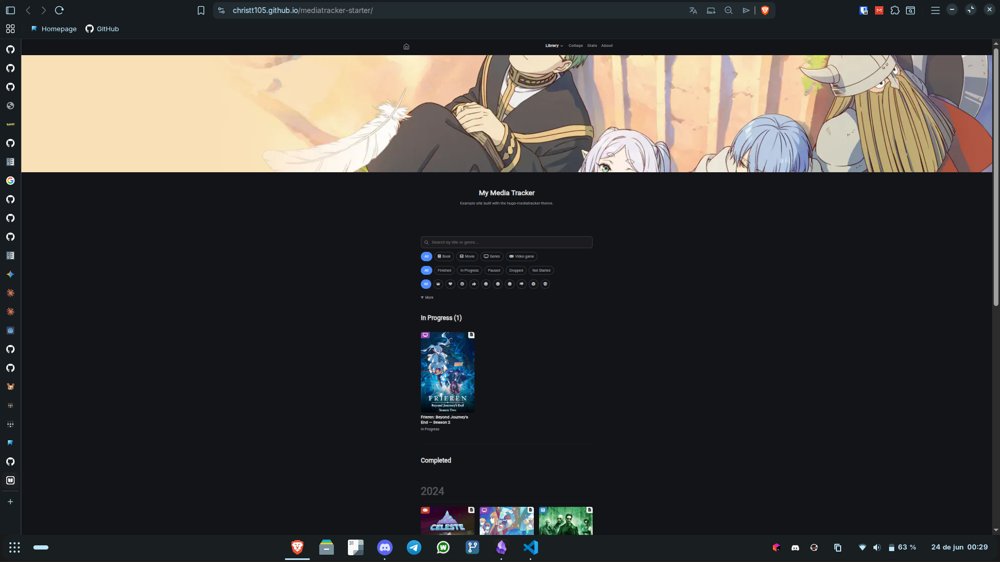
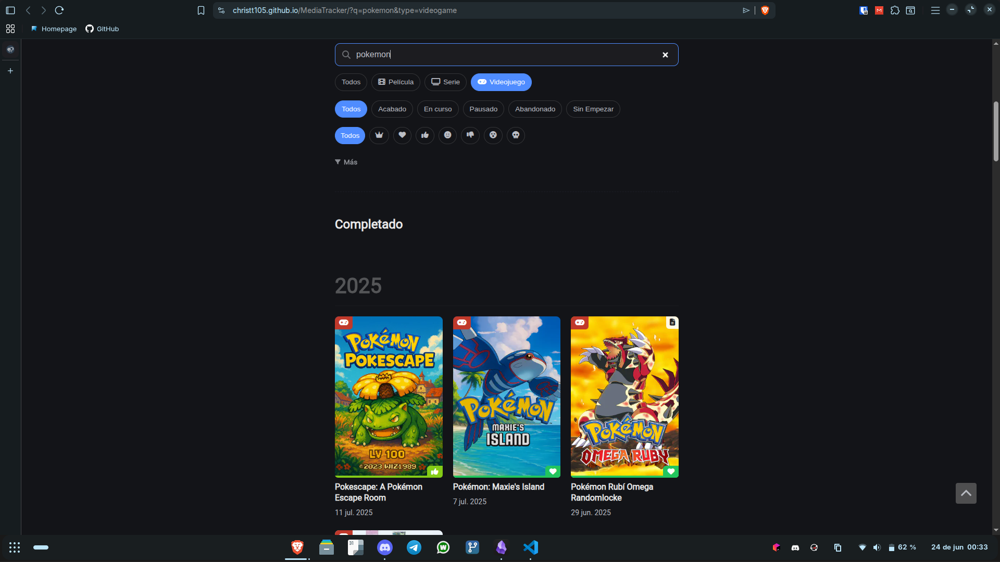
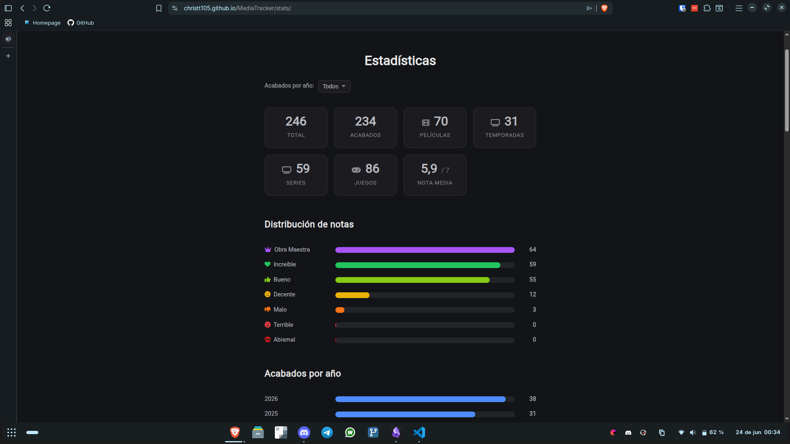
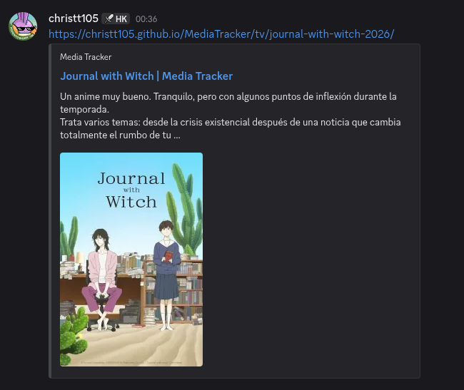

Hello again. I know what you're thinking: "you said the third part was the last one." And it was. But at the end of [that post](../media-tracker-hugo) I left a list of things I'd like to do "someday", and it turns out that day has arrived. So consider this an unexpected epilogue to the "In search of the ultimate media tracker" series.

The news is that this time I didn't go alone. I have re-written a good part of the Media Tracker with the help of [Claude](../one-month-with-claude), and that changed the equation: things that weren't worth doing before because "no one was going to use them" suddenly were worth it, because making them no longer cost me weeks. Let me tell you what I changed and how the project looks right now.

## The problem I was dragging along

If you remember the previous two posts, my Media Tracker had two halves:

1. **Obsidian**, where I create and edit every movie, show, or game. It worked by pasting together three plugins ([Templater](obsidian://show-plugin?id=templater-obsidian), [Movie Search](obsidian://show-plugin?id=movie-search), and [QuickAdd](obsidian://show-plugin?id=quickadd)) and a handful of custom-made JavaScript scripts.
2. **Hugo**, which converts those notes into [the website](https://christt105.github.io/MediaTracker/).

Both worked, but both had the same flaw: they were **impossible to share**. For someone else to set up the same thing, they had to clone my vault, install specific plugins, import QuickAdd packages, configure scripts one by one, and on top of that, wrestle with a Hugo repository where the content and the theme were mixed. I said it myself in the previous post: *"it should have been a plugin"* and *"another important thing is to separate the theme from the page"*. Well, that's exactly what I've done.

## The Obsidian half: a real plugin

First things first: I threw the scripts and the three plugins into the trash and packed everything into a single native Obsidian plugin: **[hugo-mediatracker-plugin](https://github.com/christt105/hugo-mediatracker-plugin)**.

Now there is nothing to wire up. You install the plugin, open its settings, enter your API keys, and that's it. It has its own native settings screen, commands, sidebar icons, and customizable hotkeys.





What it does, in broad terms:

- **Movies and shows:** you search on **[TMDB](https://www.themoviedb.org/)** or **[TheTVDB](https://www.thetvdb.com/)** and it creates the note with poster, banner, genres, cast, director, synopsis, and so on. You can choose which provider each type uses; the usual setup (like in Jellyfin) is TMDB for movies and TheTVDB for shows.
- **Shows with properly numbered seasons:** TheTVDB respects the actual numbering of the seasons, which is highly appreciated with anime and split shows, where TMDB puts everything into a single season.
- **Video games:** it searches on **[IGDB](https://www.igdb.com/)** and, if the game is on Steam, it automatically uses the official artwork.
- **Seasons:** from an open show note, it generates the linked season note via a command, just like the old QuickAdd script did.
- **Updating images:** you can change the cover or banner choosing from a paginated gallery, using **[SteamGridDB](https://www.steamgriddb.com/)** for games.



One thing I particularly like is that it doesn't invent a new format: the notes it creates have **exactly the properties that the Hugo theme expects**, so the other half of the system keeps working without changing a thing. And for those of you who use [Pretty Properties](obsidian://show-plugin?id=pretty-properties), the covers and banners look just as good as before.



It is installed with [BRAT](https://github.com/TfTHacker/obsidian42-brat), so it updates automatically. I have **archived** the old [media-tracker-obsidian-template](https://github.com/christt105/media-tracker-obsidian-template), with its pre-installed scripts and plugins: it's no longer needed at all, and I'm only keeping it as a historical reference.

I wanted to make a special mention of the plugin [Gubchik123/obsidian-movie-search-plugin](https://github.com/Gubchik123/obsidian-movie-search-plugin), since I got a large part of the flow from there.

## The Hugo half: splitting the theme

The second major pending task was to separate the theme from the content. Before, everything lived in the same repository because, as I explained, it wasn't worth the time to do it "right" since no one was going to use it. Now I have split it into **three** pieces following the [Hugo modules](https://gohugo.io/hugo-modules/) pattern:

```
hugo-mediatracker-theme   →  the reusable theme (Hugo module)
mediatracker-starter      →  "Use this template" template ready to clone
MediaTracker              →  my personal content + the migration script
```

- **[hugo-mediatracker-theme](https://github.com/christt105/hugo-mediatracker-theme)** is the theme, now as an independent module built on top of [hugo-blog-awesome](https://github.com/hugo-sid/hugo-blog-awesome). To use it, you just need to add a block to your `hugo.toml`; updates to the base theme keep arriving on their own.
- **[mediatracker-starter](https://github.com/christt105/mediatracker-starter)** is a GitHub template: you click "Use this template", run `hugo server`, and you have a working website with a couple of examples of each type. This is what I can now show people instead of my personal repository full of my own things.
- **[MediaTracker](https://github.com/christt105/MediaTracker)** is left only with my content, my configuration, and `migration.py`.





## And along the way, almost all of the "someday" list

Since I was already in the thick of it and had Claude by my side, I took the opportunity to cross off practically all of the "next steps" I left in the previous post:

- **Media types by data.** Before, adding a new type (for example, "books") meant modifying about eight files. Now there is a single `data/media_types.yml`: you add a block there and a menu entry, and you're good to go. The templates read from that file instead of having the list of types hardcoded everywhere.
- **New API for books.** For all those lovers of rectangles of knowledge, I've tried [Open Library](https://openlibrary.org/) to be able to create book notes very easily.
- **Normalized statuses.** Statuses used to be literal in Spanish (`Acabado`, `En Curso`...) scattered throughout the template logic. Now they are canonical keys (`finished`, `in_progress`, `paused`, `dropped`, `not_started`) and the visible labels come from the translation files. This paves the way for having the website in multiple languages.
- **Search and filters.** This was what I was most excited about. I removed the separate sections by type and now the home page has a **filter bar** (type, status, rating, genre, platform, year) and a **search bar** that runs client-side. A single screen to see it all.



- **Statistics.** There is a statistics page with rating distribution, breakdown by year, platform charts, and specific sections for anime and cinema. It was one of those "silly things that I was excited about", like the collage generator.



- **Social cards fixed.** Before, when sharing a link, the cover wouldn't show up because the `og:image` pointed to a non-existent location. Now social network cards show the cover and a snippet of my review.



- **Improved RSS.** Feeds now feature cover thumbnails, and there is still a feed dedicated only to finished items (the one that alerts the Discord bot).

## The current pipeline

With all this, the complete workflow looks like this:

```
Obsidian + hugo-mediatracker-plugin   ← I create and edit notes
        │  (Syncthing syncs the vault to the mini PC)
        ▼
scripts/migration.py                  ← converts the vault to Hugo content
        │  (daily cron at 9:00 → git push)
        ▼
hugo-mediatracker-theme               ← renders the web from the content
        │
        ▼
GitHub Actions → GitHub Pages         ← compiles and publishes
```

The automation part from the [previous post](../media-tracker-hugo) remains the same: the cron job on the mini PC runs the script every morning, and if there are changes it does a `commit` and `push`. The difference is that now the Obsidian half is a real plugin and the Hugo half is a theme that anyone can use.

## Working with Claude

I don't want to gloss over this, because it's the reason this post exists. I already mentioned in the previous post that "most of the changes were made by AI," but this was another level. Much of the rewrite, the entire plugin, the division into modules, the generalization of types, was practically done by Claude.

The interesting thing is not that it writes code, but how it changes the decision of **what is worth doing**. Things I had been putting off for months with the excuse of "I don't have time and nobody is going to use it" turned into casual afternoons.

For many of these features, I would tell Claude from my phone to do them, spin them up locally, and test them. Everything done and verified by Claude, until it was running and I would test it on my phone, make a Pull Request, quickly review it, and tell it to merge it. A loop where I wasn't even at home; I just had it on my computer with access to my projects.

## Current status and what's left

To be honest, not everything is wrapped up:

- The website still has its **content only in Spanish**. The interface is already translatable (the strings are in i18n files), but translating each post is another matter. For now, it stays in Spanish.
- I still have ideas up my sleeve: a calendar with items by day, better-designed related items, and continuing to refine the logic for series and seasons.

But the important part for me is done: **anyone can set this up**. If you want your own Media Tracker, install the [plugin](https://github.com/christt105/hugo-mediatracker-plugin) in Obsidian and clone the Hugo [starter template](https://github.com/christt105/mediatracker-starter). And if you're up for it, leave me a star on the repos or let me know what you think in the comments; this time it really will serve to let more people use it.

I hope you enjoyed this epilogue. Now, see you in the next post.

Until next time!
