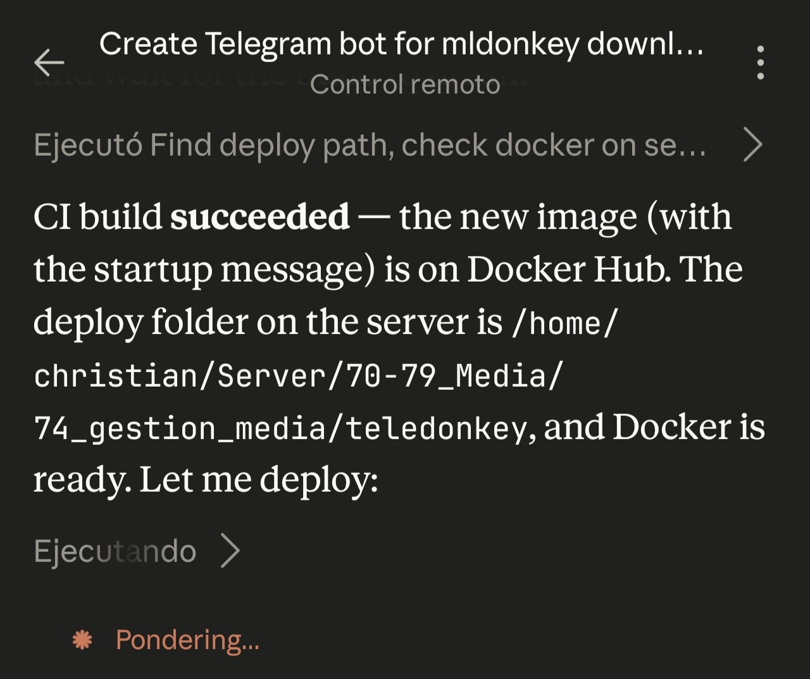
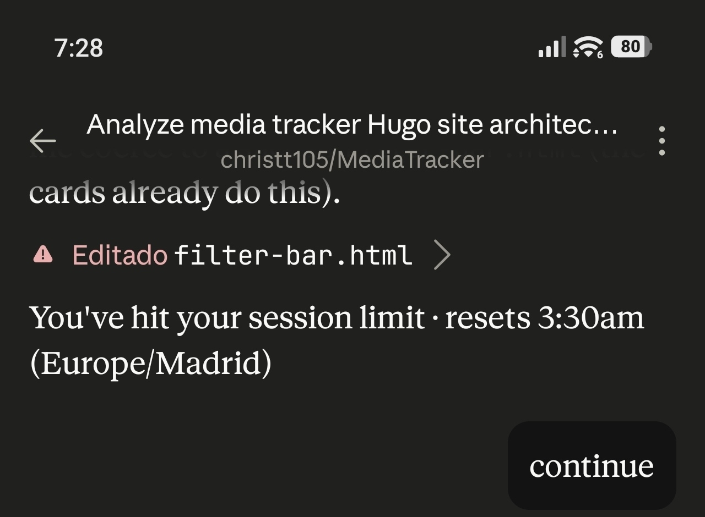
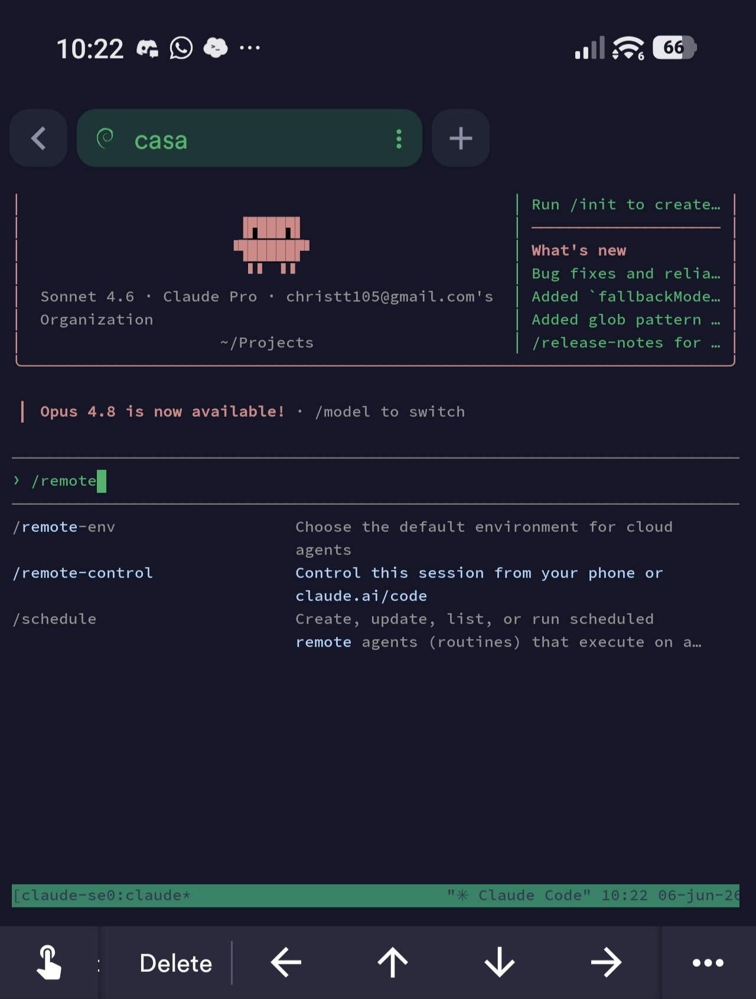

Hola de nou. Avui em sortiré una mica del format habitual. Parlaré d'alguna cosa que fa temps que és el tema de conversa del món de la tecnologia: la intel·ligència artificial. Però des de la meva perspectiva personal, sense grans proclames, simplement explicant el que ha passat aquest últim mes.

## L'any amb Gemini

Al desembre vaig aconseguir un any gratuït de Gemini Pro i la veritat que força content. No només per cosetes de programació personal; a la feina vaig arribar a refer un projecte complet en una altra tecnologia amb la seva ajuda, i va funcionar molt bé, en relativament poc temps. La IA com a segona opinió informada i ràpida és alguna cosa que s'agraeix molt quan estàs ficat en alguna cosa i necessites sortir del bloqueig.

El problema amb Gemini va ser que amb el temps van anar capant funcionalitats i retallant els tokens disponibles. Per a l'ús que li dono segueix funcionant bé, però es nota que han anat apretant les cargoles.

Soc programador, així que la IA és molt present en el meu dia a dia. Ja no concebo treballar sense tenir-ne alguna a prop. Això sí, és important matisar que la IA no em programa per mi; és més com una segona opinió molt ben informada. Quan m'enfronto a un problema ja sé per on atacar-lo, la IA simplement fa que el procés sigui molt més ràpid.

## El salt a Claude

Porto un temps treballant en [Elit3D](https://christt105.github.io/ca/projects/elit3d/), un editor de mapes de tiles en 3D que vaig començar a la universitat. El projecte ha tingut força vides: a la universitat el vaig fer completament en C++, anys més tard el vaig començar a refer a Godot amb GDScript, després vaig decidir passar-lo a C# i, finalment, vaig voler fer-ho molt més professional separant per projectes, de manera que Godot fos únicament la interfície i tota la lògica corrés en projectes de C# estàndard.

Un amic em va comentar per Discord que portava un temps usant Claude i que estava força content. Són 20€ per un mes (espero que aquest comentari no envelleixi molt malament) i vaig pensar que per provar no es perd res. La meva intenció era aprendre de la IA alhora que avançava en els projectes a molta més velocitat de l'habitual.

I la veritat és que va funcionar. En cosa d'una setmana Elit3D va millorar bastant i estic molt a prop de tenir una alfa prou estable per llançar.

La diferència real entre Gemini i Claude tampoc és tan gran. El que va canviar va ser que per fi tenia temps per posar-me amb els projectes, les ganes d'aprendre i, sobretot, una forma de treballar que abans no havia explorat.

## El divendres que no volia malbaratar

Van passar els dies i per coses de la vida vaig estar sense poder programar en el meu temps lliure durant una setmana. Va arribar el divendres a la tarda i em va entrar el remordiment d'estar pagant la subscripció sense aprofitar-la. Així que vaig obrir Claude amb la intenció de fer algun d'aquells projectes que sempre tinc aparcats a la llista de pendents, aquells que mai arriben perquè em falta temps o perquè estan fora del meu camp.

El primer va ser [TeleDonkey](https://christt105.github.io/projects/teledonkey/). La idea era senzilla: un bot de Telegram que es connectés a la meva instància de MLDonkey i que en enviar-li un enllaç el afegís a la cua de descàrregues, a més de tenir algunes comandes útils per gestionar les descàrregues. Mentre li ho comentava al meu amic per Discord i creava el bot a la plataforma, Claude ja l'estava construint. En 20 minuts el tenia funcionant.

Però la part que més em va sorprendre no va ser aquesta. Li vaig dir que el pujés a GitHub. Ho va fer. Després li vaig demanar que entrés per SSH al meu servidor local al mini PC. I simplement ho va fer. Li vaig posar el logo del projecte, li vaig demanar que configurés GitHub Actions i que publiqués la imatge a Docker Hub, que afegís el projecte a la meva pàgina web i que ho commités tot, i en una estona ja estava funcionant. Sense que jo mirés absolutament res de codi; no m'havia donat temps i ja estava bé.

A mi sol fer-ho m'hauria costat bastant. Amb una mica d'idea del que calia fer, en menys de mitja hora ja estava desplegat, a GitHub, a la meva web i funcionant al meu servidor. És un projecte que tenia aparcat sense saber molt bé quan me'n posaria.

## El gos i el Media Tracker

Al cap d'una estona em vaig posar amb un altre projecte pendent: el [Media Tracker](https://christt105.github.io/MediaTracker/). És una web feta amb Hugo que feia temps que volia millorar, però que estava força feta d'aquella manera perquè tampoc sé gaire de programació web.

Aquest mateix amic m'havia comentat el del remote control: deixes l'ordinador encès i des del mòbil vas parlant amb Claude directament. Així que això vaig fer. Vaig obrir el projecte al PC, vaig donar les instruccions i vaig sortir a treure el gos.

Vam fer la planificació de tot el que calia fer i ho vam dividir en fases. Cada fase acabava pujant un commit, i jo mentrestant anava mirant la web des del mòbil per comprovar que tot estigués bé, tot això mentre estava pel carrer amb el gos mirant el mòbil de tant en tant. Va corregir problemes d'estil, va arreglar diversos bugs, va afegir una barra de cerca i filtres, va separar el projecte en contingut i tema, va crear un projecte template perquè qualsevol pogués usar-lo com a punt de partida... i més coses. En una tarda vaig fer el que m'hauria portat setmanes. I ho va fer ell sol, creació, comprovació, commits i deploy.

A la nit li vaig dir que continués amb unes coses més i que quan acabés apagués l'ordinador. Gairebé en acabar em vaig quedar sense tokens i es va pausar, així que l'ordinador es va quedar encès tota la nit. Al matí li vaig dir que continués, va acabar més o menys el que li quedava i va apagar l'ordinador.

## L'endemà

Al matí vaig instal·lar Claude al mini PC. Ara puc iniciar una sessió SSH, activar el remote control i des del mòbil tinc accés a pràcticament tots els meus arxius i projectes. Fa una mica de por, la veritat, però és una passada.

Vaig estar afinant el Media Tracker mentre feia tasques de la llar, tot des del mòbil. Al migdia es van reiniciar els tokens encara que em quedaven bastants.

Em vaig posar amb un altre projecte relacionat amb el Media Tracker. Tot el meu seguiment de pel·lícules, sèries i jocs viu al meu vault d'Obsidian i amb una amalgama de plugins i scripts puc fer moltes coses, però sempre m'ha semblat incòmode tenir-ho tan separat. Mai ho hauria fet jo sol, així que li vaig dir a la IA que agafés els meus scripts i generés un plugin d'Obsidian que fes el mateix de forma integrada. En res ja el tenia funcionant i gairebé sense errors. La funcionalitat ja la tenia feta, això sí, però passar-la a un plugin va resultar ser molt més còmode per al dia a dia.

Em vaig haver d'anar a comprar, així que anava mirant el que feia des del mòbil. Ho vaig provar al carrer, anant afinant des de fora d'una botiga mentre esperava amb el gos. Vaig decidir afegir-li l'API de TheTVDB mentre era allà, i en res ho va fer.



Aquest tipus de processos m'impressionen. El flux de desenvolupament no és el que hauria de ser, perquè al final estic publicant versions sense provar en local, li dic que pugi una release, l'actualitzo al mòbil i provo directament. Però per a aquest tipus de projectes no hi ha cap risc real, i la velocitat a la qual avança compensa amb escreix.

## La part que fa por

I aquí és on em paro a pensar.

El que ha passat amb TeleDonkey o el Media Tracker té un matís important: són projectes on m'importa molt més el resultat que el procés. Projectes pendents que volia tenir funcionant i per als quals no tenia ni temps ni prou experiència en aquestes àrees. Per a això la IA és una eina increïble.

Però Elit3D és una altra història. Allà mai enviaré prompts des del mòbil mentre trec el gos. Aquests projectes els revisaré jo, línia a línia, estant davant de l'ordinador i provant cada canvi. Són projectes on gaudeixo tant del procés com del resultat, i la IA la faig servir com a suport, no com a pilot.

El problema, o el que realment fa por, és un altre. Cada vegada és més a prop el punt en el qual algú sense cap coneixement tècnic pugui fer exactament el mateix que vaig fer jo amb TeleDonkey. El que abans requeria anys d'estudi, ara pot fer-se amb la descripció correcta. Sé que hi ha moltes coses que faig ràpid amb la IA precisament perquè ja m'he enfrontat a aquests problemes i sé per quin flanc atacar-los, però fins a quin punt arribarem.

El que més em dona melancolia és que s'ha perdut alguna cosa del treball artesanal de la programació. Ja no t'encalles tant contra una paret buscant durant hores als fòrums com solucionar alguna cosa, ja no tens aquella petita victòria personal de resoldre alguna cosa difícil tu sol després de molt d'esforç. La IA veu el teu codi, les teves carpetes, el context del projecte, i actua. Cada vegada programarem menys i revisarem més, fins que arribi un punt en què deixem de fer gran cosa, si és que no hem arribat abans a algun tipus de col·lapse.

Però tampoc vull ser catastrofista. La IA ha arribat per quedar-se i el problema, com gairebé sempre, estarà en l'ús que en fem.

## Aquest post també és un experiment

Fins i tot aquest post l'estic provant amb IA. A la nit el vaig escriure des del xat de Claude al mòbil, amb les faltes d'ortografia del cansament i sense rellegir res, i el va generar al mini PC. Ara, l'endemà, estic retocant i afegint coses entre tasca i tasca.

Si estàs llegint això, suposo que no ha quedat tan malament.

La tecnologia i la programació són el meu hobby i la meva feina, i no veig la IA com alguna cosa negativa. Simplement ens està canviant la forma de fer les coses i cal adaptar-se. Seguiré fent projectes, seguiré escrivint posts, i si de tant en tant la IA m'ajuda una mica, benvinguda sigui.

Ens veiem al pròxim post.
