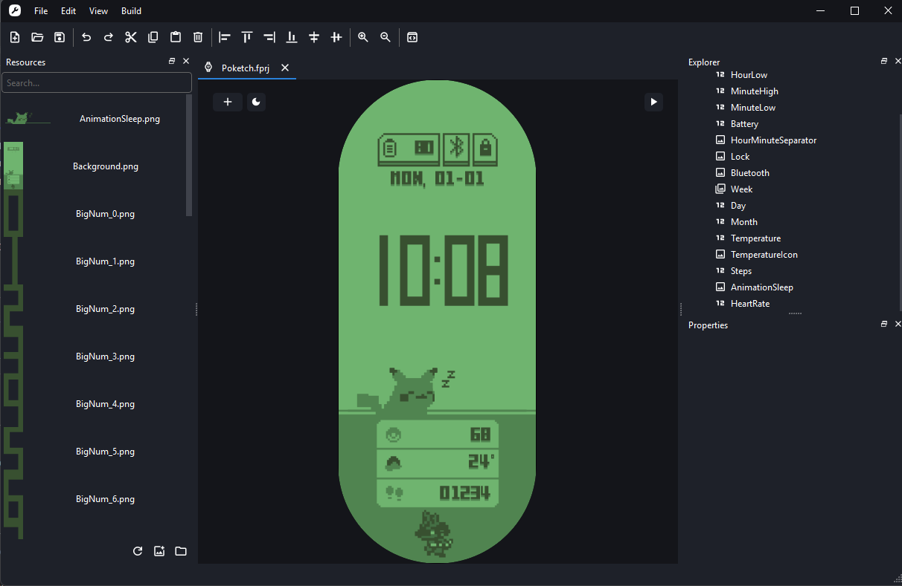
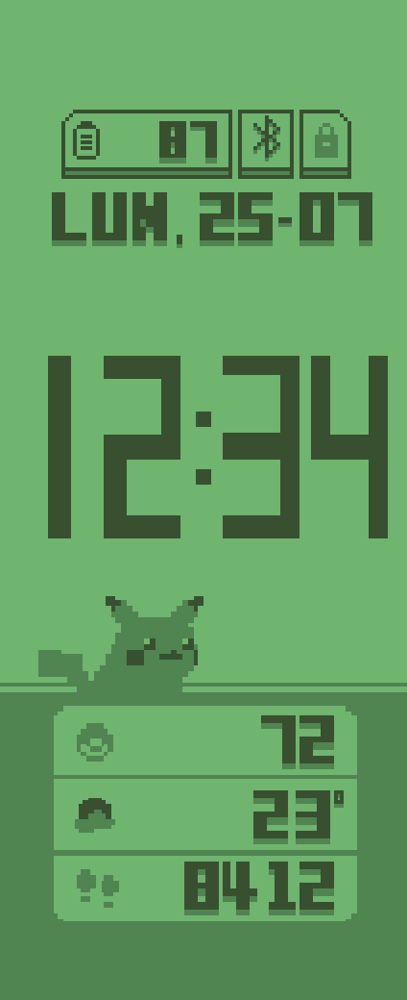
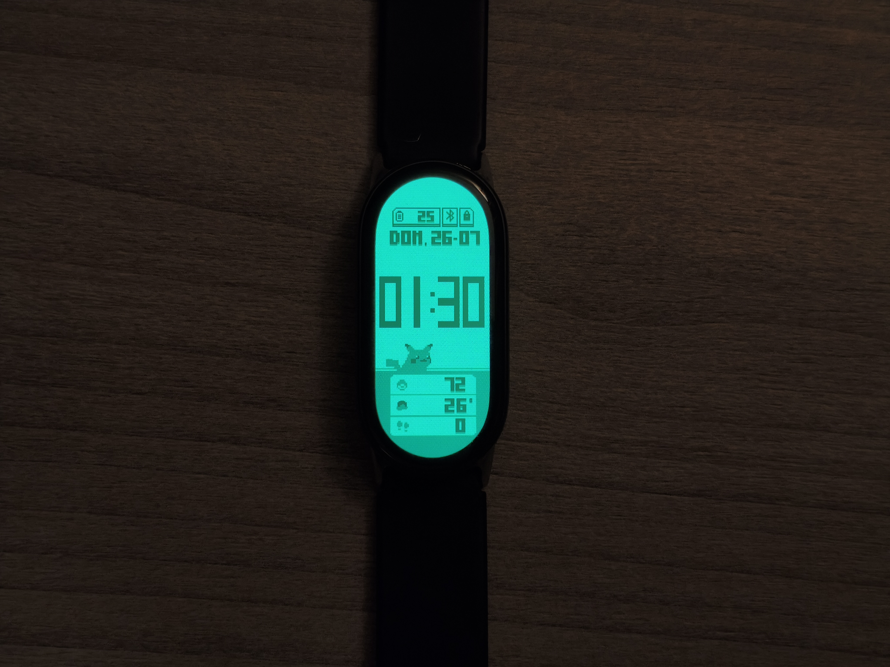

Hola de nuevo. 

Hace pocos meses se me rompió la correa de la Mi Band 4. La correa que suelo comprar cuesta menos de 2€, pero pensé que lo mismo era momento de actualizarla. Realmente no soy mucho de relojes, no soy de mirar mucho la hora (por eso suelo llegar tarde) y principalmente lo uso para ver los pasos. Igualmente me apetecía algo más grande, con mejores sensores y si se pudiera conectar a Strava, mejor. Mi pareja se compró una Mi Band 10 hace poco, así que no lo pensé mucho y compré la misma. 

## Personalización
No suelo tener muchos accesorios, pero los que tengo quiero que sean de cosas que me gustan, que hablen un poco de mí. En la Mi Band 4 tenía un pokereloj bastante guapo. Hay muy pocas skins oficiales y las que hay son muy feas y están en un idioma que no usa el sistema internacional. Al ser muy nueva, muy poca gente ha hecho skins, y por supuesto que no hay una de pokereloj, así que tocaba trabajar un poco.

## Manos a la obra
Realmente es todo muy caótico. Xiaomi no proporciona una forma de personalizar las skins de manera fácil y las que ha hecho la comunidad son un poco ___sus___.

He usado el programa Mi Create, que fue el que más confianza me dio.



Es un programa que te permite crear un proyecto para diferentes relojes, incluida la Mi Band 10. Realmente es un XML con diferentes componentes que bindean datos de la pulsera, como pasos, la hora o la temperatura, a unas imágenes de los números del 0 al 9.

Hace unos años (acabo de mirar que hace 5 años, qué duro) hice el pokereloj en Unity con unos amigos. La verdad que fue un proyecto muy chulo y nos lo pasamos muy bien. La idea era coger los sprites de ese proyecto, pero encontré este proyecto de un [pokereloj para la Mi Band 7](https://amazfitwatchfaces.com/mi-band-7/view/688) que era prácticamente idéntico a lo que necesitaba. Descargué el archivo y lo descomprimí. Era un archivo `.bin`, pero es un zip disfrazado. Contiene todas las imágenes.

Tocaba abrir el Mi Create y crear un nuevo proyecto. No es muy complejo de usar. He ido metiendo las imágenes, adaptando los tamaños y modificando algunas cosas.

Hay algunas cosas que he cambiado. He quitado el Lucario de abajo, he usado un formato de fecha DD-MM, he traducido los nombres de los días y he agrandado todo para que se vea mejor. También he añadido una pequeña animación para que no parezca todo tan estático.

Este ha sido el resultado final:

Realmente los píxeles parecen bastante distorsionados, entiendo que es porque se ha convertido varias veces y se han arrastrado los problemas, igualmente en la pantalla del reloj ni se aprecia.

## ¿Cómo lo paso al reloj?
La pregunta del millón, ya lo tenía todo hecho y parecía que tenía que vender todos mis datos. Según la documentación de Mi Create, tenía que instalar una versión raruna de Mi Fitness, dar mi MAC del reloj a unos servidores rusos, así que no confiaba mucho.

Existe una aplicación open source, [Gadgetbridge](https://gadgetbridge.org/), que te permite hacer varias cosas, pero en las especificaciones ponía que Mi Band 10 no tenía muy buena compatibilidad. Otra opción es [Notify for Xiaomi](https://mibandnotify.com/), que está en Google Play y me da más confianza.

La instalé e hice los pasos para conectarla con el reloj. Me ha dado muchos problemas y he terminado desinstalando la aplicación de Mi Fitness y ya he conseguido conectarla. El proceso es muy fácil, desde Mi Create exportas y desde la aplicación cargas el archivo y se sube automáticamente.

Y ya está, ya tengo mi pokereloj con la Mi Band 10.

## Proyecto

He subido el proyecto a GitHub por si alguien le interesa o por si en algún momento necesito cambiar algo.



También lo he subido a [amazfitwatchfaces](https://amazfitwatchfaces.com/mi-band/view/521), aunque puede que aún no esté disponible.

## Despedida
Y hasta aquí. Proyecto de un día, otra cosa menos que hacer.

Hasta la próxima.