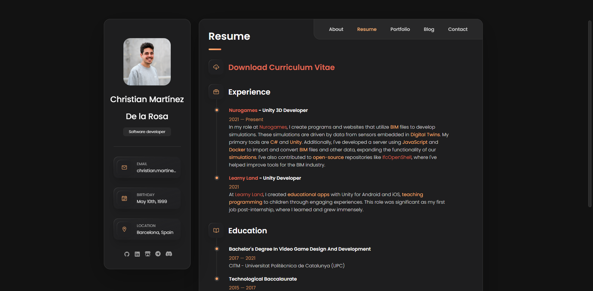
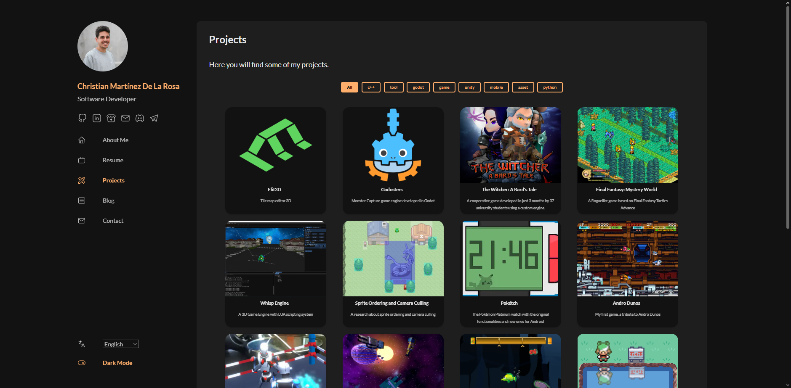

Un altre post més. Aquesta vegada descansem una mica dels projectes principals i ens centrem en desenvolupament web.

## Origen

No sóc desenvolupador web, ni estic aprop, però és un camp on de tant en tant m’agrada trastejar i que considero important si vols mostrar les coses que fas.

Fa uns anys em vaig fer una pàgina web on mostrava una mica el que feia, la meva experiència laboral i alguns projectes. Vaig fer servir la plantilla [vcard-personal-portfolio](https://github.com/codewithsadee/vcard-personal-portfolio), que em va agradar força. Estava feta amb HTML i CSS, i en aquell moment era més que suficient per tenir la web muntada.

Més endavant, vaig veure que algú havia agafat l’estètica de la plantilla i l’havia portada a React, Next.js, Tailwind CSS i TypeScript. La veritat és que solucionava alguns problemes que tenia el projecte original i estava muntada sobre una base molt més moderna i escalable. Vaig passar força temps portant la meva web a aquesta nova base, però al final ho vaig deixar de banda i la web va continuar tal com estava.

Cap al final de l’any passat vaig crear el que ara és *aquest blog* amb [HUGO](https://gohugo.io/). Vaig passar per diverses idees abans d’arribar a HUGO (això donaria per un altre post), però em vaig enamorar de la eina (sí, sóc molt de capficar-me amb coses). Vaig escollir el tema [Stack](https://github.com/CaiJimmy/hugo-theme-stack), que s’assemblava bastant al que ja estava utilitzant. Li vaig canviar els colors per fer-los coincidir amb la meva web actual, vaig fer algunes modificacions, el vaig configurar i vaig escriure el primer post. Finalment vaig afegir un enllaç des de la meva pàgina principal cap al blog.

Amb el temps vaig començar a publicar més posts. Em mirava la web i, en veure-la desactualitzada i amb el contrast visual entre el blog i la web, em va venir la idea de mirar si podia unificar-ho tot a HUGO. No era tan fàcil com copiar i enganxar la informació: hi havia funcionalitats que el tema del blog no tenia, i tampoc és que sigui un expert amb HUGO. Tot i així, vaig decidir intentar-ho. Vaig tenir diversos problemes, però crec que el resultat és bastant decent.

## Canvis

Fem un repàs dels punts clau dels canvis que vaig fer a la web.

### Pàgina principal

 

La pàgina principal és una de les parts més importants de la web, és la pantalla de benvinguda. Jo volia incloure una mica d’informació sobre mi, les tecnologies que utilitzo i una secció de contacte. A la pàgina anterior hi havia massa informació i un calendari de *commits* de GitHub, que m’agradava però no era responsive. Vaig fer tot el possible per incloure’l però al final ho vaig descartar a la nova web.

Amb HUGO vaig aconseguir diverses millores. Ara cada pàgina té el seu endpoint, suport per multillenguatge, mode clar i fosc, i tot està molt més ordenat.

Un canvi important que vaig haver de fer al tema Stack va ser modificar la pantalla principal. Per defecte, el tema mostra els últims posts, però jo volia que mostrés una pàgina pròpia amb contingut, com si fos un post.

### Currículum

 

L’estructura d’aquesta secció és pràcticament la mateixa. Fer-la amb HTML era una tortura: escriure etiquetes, posar negretes i subratllats era molt incòmode. En canvi, amb HUGO tot es pot fer amb el meravellós Markdown i el `front matter`. Per l’experiència laboral vaig crear una carpeta per a cada empresa, i dins de cada arxiu hi ha la informació de cada feina.

```yaml
---
title: "Learny Land"
image: "learnyland_logo.webp"
contractType: full-time
location: "Sallent, Catalunya, Espanya"
locationType: hybrid
jobs:
  - title: "Programador Unity"
    start: 2021-06-01
    end: 2021-07-31
    type: "Híbrid"
    description: "Vaig treballar en el desenvolupament de jocs mòbils educatius per a infants, ..."
    skills: ["Unity", "C#"]
  - title: "Programador Unity (Pràctiques)"
    start: 2021-02-01
    end: 2021-05-31
    type: "Híbrid"
    contractType: internship
    description: "Pràctiques com a desenvolupador Unity, col·laborant en les primeres fases del desenvolupament..."
    skills: ["Unity", "C#"]
---
```

Per cada empresa llegeixo totes les feines i calculo el temps total treballat. Després, HUGO s'encarrega de generar la pàgina amb tota la informació.

Per a la formació vaig fer una cosa semblant però en un únic arxiu, ja que no calia tanta informació per cada element.

Encara falta afegir un botó per descarregar el currículum en PDF, i també vull canviar una mica l’estil perquè no m’acaba de convèncer… però això ho deixaré per més endavant.

### Projectes

  

Aquesta era la secció que més il·lusió em feia fer. A la web antiga hi havia una llista de projectes que en clicar-ne un, s’obria la seva pàgina. No es podia mostrar gaire informació, els filtres només es podien aplicar amb una etiqueta per projecte i afegir-ne de nous era bastant pesat.

Ara hi ha un arxiu per cada projecte amb un munt de variables. Primer tens la pàgina amb la llista de projectes, i després una pàgina individual per cada un amb molta més informació.

Per cada projecte pots definir:

* Títol
* Imatge
* Descripció curta
* Etiquetes per relacionar projectes
* Filtres per agrupar-los
* Enllaç al codi font (GitHub)
* Vídeo demostratiu
* Mostrar o no la secció de descàrregues de GitHub
* Targeta d’Itch.io
* Categories per relacionar amb posts
* Pes per ordenar-los
* Descripció completa (cos en Markdown)

```yaml
---
showTranslations: false
title: "Elit3D"
image: "Elit3DIconTransparent.png"
description: "Editor de mapes de rajoles en 3D"
tags: ["c++", "editor", "3d"]
filters: ["c++", "eina"]
repo: "christt105/elit3d"
video: "b0STL00hSFo"
githubDownload: false
itch:
  user: "christt105"
  project: "elit3d"
  id: "1050498"
  link: "20a446"
categories: 
  - "elit3d"
weight: 10
---
Elit3D és un editor de mapes basat en rajoles en 3D. Compta amb diverses capes de rajoles i objectes 3D, i permet exportar els mapes en diversos formats.
```

Amb això, crear un projecte és molt fàcil i tens tots els elements que calen. Encara hi ha coses a millorar, però estic content amb el resultat.

### Blog


Aquesta secció no té gaire canvi. Simplement s’havia d’enllaçar la pàgina principal del blog dins d’aquesta secció. Em venia de gust donar-li un toc més desenfadat amb una imatge diferent. També era important que tots els posts tinguessin l’adreça sota `/blog`.

### Contacte

 

Aquesta pàgina és simple, igual que abans. Quatre targetes amb canals de contacte i un mapa. Vaig reaprofitar les targetes a la pàgina principal gràcies als *partials* de HUGO.

## Conclusions

Encara queda molta feina i el resultat no és professional, però estic content amb com ha quedat. HUGO és una molt bona eina per perfils com el meu. Et dona total llibertat per fer el que vulguis, però si uses un tema ja fet, tot funciona molt fàcilment. Que tot funcioni amb Markdown és brutal: estic enamorat d’aquest format. Tots els arxius són llegibles, fàcils d’editar i ben organitzats.

Segurament tenir la web i el blog en dos projectes separats seria més correcte, però comporta més feina. A més, així puc relacionar fàcilment projectes amb posts. Ja veurem com escala això si acabo tenint molts posts (cosa que no sé si passarà).

Tot el contingut de la meva web, inclosos els canvis de tema, està disponible públicament al meu repositori de GitHub. Hostatjar la web a GitHub és molt fàcil.

Espero que t’hagi agradat la nova web i tota la informació. L’objectiu era tenir una web i un blog unificats a nivell de disseny, i crec que ja fa el fet. Per ara, la deixaré així i tinc moltes ganes de continuar amb els altres projectes.

Fins la propera!
