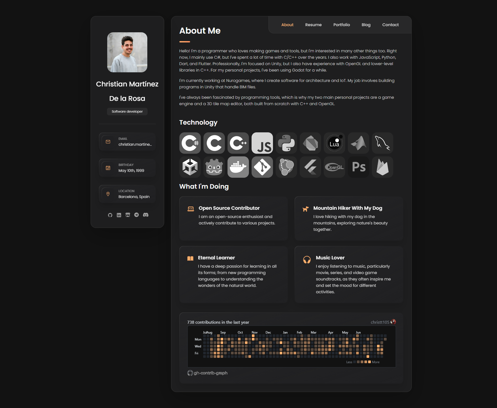
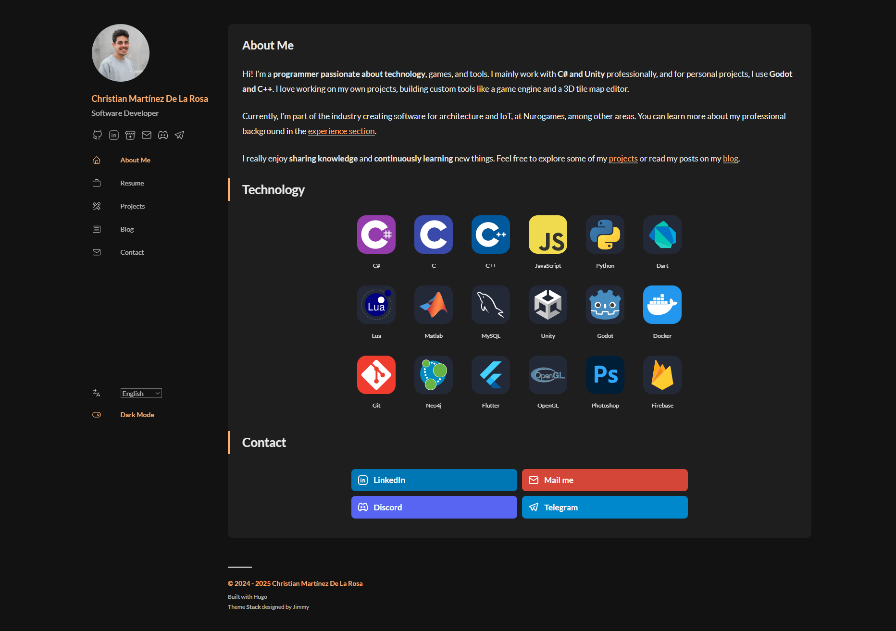
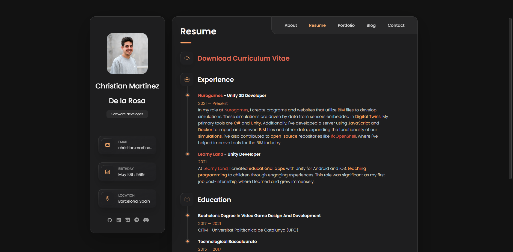
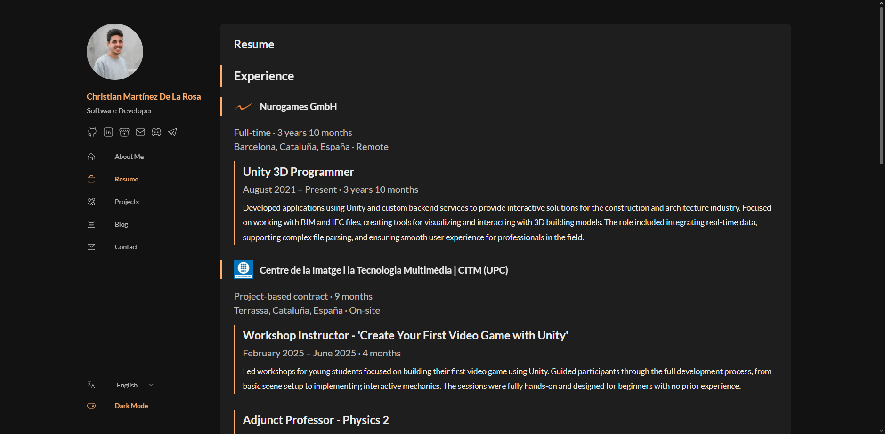
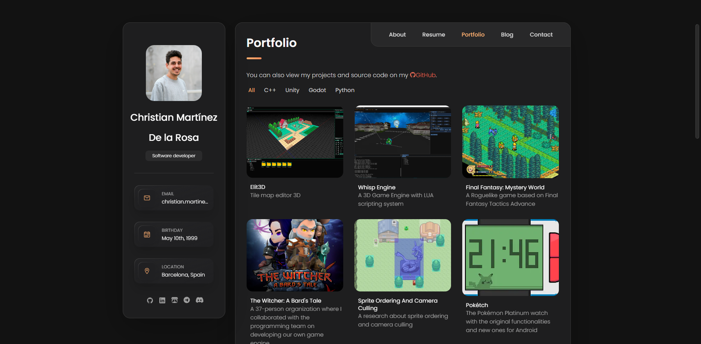
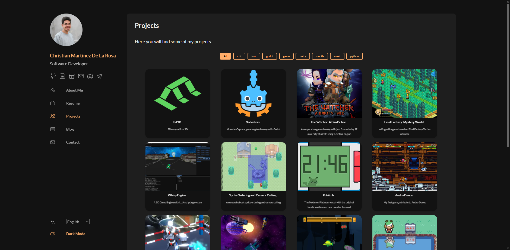
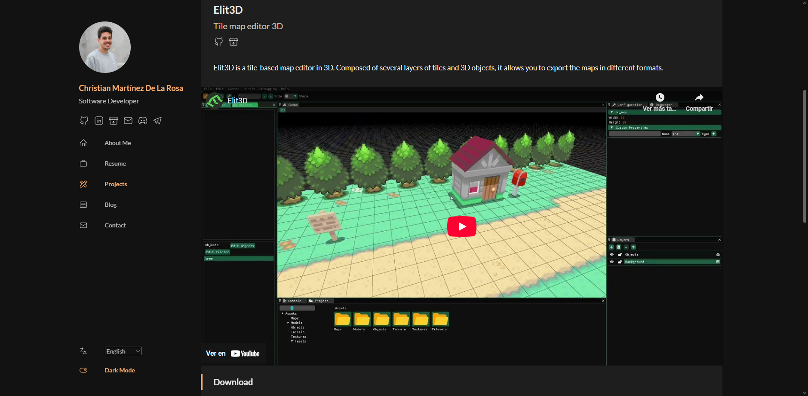
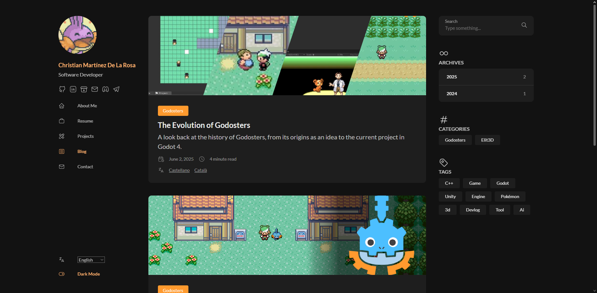
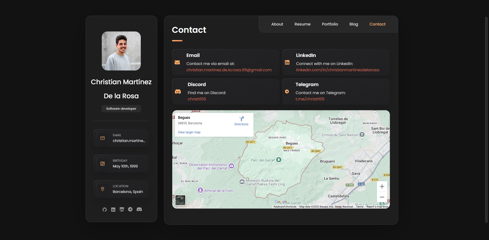
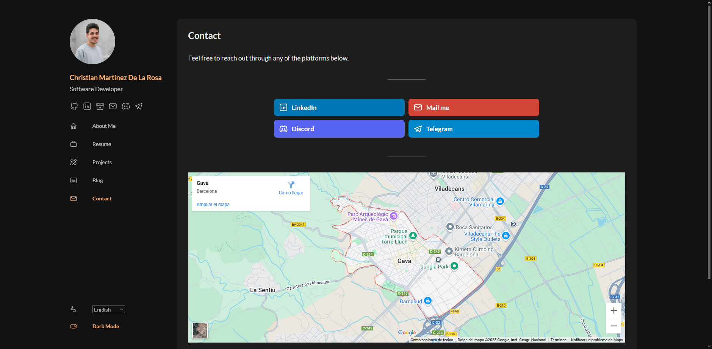

Otro post más. Esta vez vamos a descansar un poco de los proyectos principales y vamos a enfocarnos en desarrollo web.

## Origen

No soy desarrollador web, ni mucho menos, pero es un campo en el que de vez en cuando me gusta trastear y es importante si quieres mostrar cosas.

Hace unos años me hice una página web donde mostraba un poco lo que estaba haciendo, mi experiencia laboral y mis proyectos. Usé la plantilla [vcard-personal-portfolio](https://github.com/codewithsadee/vcard-personal-portfolio) que me gustó bastante. Es una plantilla hecha con html+css, en ese momento era más que suficiente para hacer la web.

Unos años más tarde vi que alguien había cogido la estética de la plantilla y la había porteado a React, Next.js, Tailwind CSS y Typescript. La verdad que solucionaba algunos problemas que tenía el proyecto original y usaba una base mucho más moderna y escalable. Estuve bastante tiempo porteando mi web a esa nueva base pero lo acabé abandonando y la web siguió tal cual estaba.

A finales del año pasado hice lo que ahora es *este blog* con [HUGO](https://gohugo.io/). Pasé por varias ideas antes de encontrar HUGO, que podría dar para otro post, pero la verdad es que me enamoré de HUGO (sí, soy muy de obsesionarme con algo). Cogí el tema de [Stack](https://github.com/CaiJimmy/hugo-theme-stack) que era bastante parecido a lo que ya estaba usando. Le estuve cambiando los colores para que tuviera los mismos que mi página actual, hice algunos cambios, lo configuré y escribí el primer post. Finalmente cree un link en mi página web para redirigir al blog.

Pasaron los meses y me decidí por crear posts. Miraba la web y el verla desactualizada y que se notaba el cambio entre la web y el blog, quería comprobar si podía tenerlo todo junto en HUGO. La verdad que no era tan fácil como copiar y pegar la información, había funcionalidad que obviamente el tema del blog no la tenía y yo tampoco es que sea un experto on HUGO. Igualmente me decidí por intentarlo. Tuve varios problemas pero creo que ha quedado bastante decente. 

## Cambios

Hagamos un repaso de los puntos claves de los cambios en la página web.

### Página principal

 

La página principal es uno de los puntos más importantes de la web, es la pantalla de bienvenida al usuario. Yo quería incluir un poco de información sobre mí, las tecnologías que uso y una sección de contacto. En mi anterior página había demasiada información y un calendario de commits, que me gustaba pero no era responsive, hice todo lo necesario para ponerlo pero lo acabé descartando en la nueva web.

Con HUGO se añadieron varias mejoras. Ahora cada página tenía su endpoint, multilenguaje, modo claro y oscuro y está todo mejor organizado.

Un cambio importante que había que hacer al tema Stack fue el de cambiar la pantalla principal. El tema por defecto muestra los últimos posts, pero ahora era necesario mostrar la página principal como un post con su contenido.

### Currículum

 

La estructura de esta página es prácticamente la misma. Hacer esta sección con html era una pesadilla, estar escribiendo con las etiquetas y poner las negritas y subrallados era bastante incómodo. En cambio con HUGO todo se puede hacer con el maravilloso Markdown y el `front matter`. Para la experiencia laboral creé una estructura donde pones una carpeta por cada empresa y dentro de cada archivo puedes definir cada trabajo.

```yaml
---
title: "Learny Land"
image: "learnyland_logo.webp"
contractType: full-time
location: "Sallent, Cataluña, España"
locationType: hybrid
jobs:
  - title: "Programador Unity"
    start: 2021-06-01
    end: 2021-07-31
    type: "Híbrido"
    description: "Trabajé en el desarrollo de juegos móviles educativos para niños, ..."
    skills: ["Unity", "C#"]
  - title: "Programador Unity (Prácticas)"
    start: 2021-02-01
    end: 2021-05-31
    type: "Híbrido"
    contractType: internship
    description: "Prácticas como desarrollador Unity, contribuyendo a las primeras fases del desarrollo..."
    skills: ["Unity", "C#"]
---
```

Por cada empresa, leo todos los trabajos y calculo el tiempo total por cada empresa. Luego, HUGO se encarga de generar la página con toda la información.

Para la educación hice algo parecido pero en un único archivo, ya que no necesitaba tanta información por elemento.

Falta añadir un botón que descargara el currículum en pdf, pero también he de cambiar el estilo porque no me acaba de convencer, así que ya lo haré más adelante...

### Proyectos

  

Este apartado era el que más ganas tenía de hacer. En la anterior web había una lista de proyectos al que clicabas y se abría la página del proyecto. No podías poner mucha información, la funcionalidad de filtros únicamente se podía hacer con una etiqueta por proyecto y añadir proyectos era incómodo.

Ahora hay un archivo por cada proyecto con muchas variables. Primeramente tenemos la página con la lista de proyectos y por cada proyecto una página individual con más información.

Por cada proyecto puedes definir:
* Título
* Imágen
* Descripción para mostrar como subtítulo
* Etiquetas para relacionar proyectos
* Filtros para agrupar varios proyectos en la lista principal
* Código fuente para añadir un link a GitHub
* Un vídeo mostrando el proyecto
* Decidir si mostrar la sección de descargas de GitHub
* La tarjeta de descarga de Itch.io
* Categoría para relacionar los posts
* Peso del proyecto respecto a los otros
* Descripción del proyecto como cuerpo del archivo Markdown

```yaml
---
showTranslations: false
title: "Elit3D"
image: "Elit3DIconTransparent.png"
description: "Editor de mapas de baldosas en 3D"
tags: ["c++", "editor", "3d"]
filters: ["c++", "herramienta"]
repo: "christt105/elit3d"
video: "b0STL00hSFo"
githubDownload: false
itch:
  user: "christt105"
  project: "elit3d"
  id: "1050498"
  link: "20a446"
categories: 
    - "elit3d"
weight: 10
---
Elit3D es un editor de mapas basado en baldosas en 3D. Compuesto por varias capas de baldosas y objetos 3D, permite exportar los mapas en diferentes formatos.
```

Con esto se puede crear un proyecto muy fácilmente y con todos los elementos necesarios. Hay cosas a mejorar pero estoy contento con el resultado.

### Blog



Esta sección no tiene mucho cambio, básicamente había que poner la página principal del blog en esta sección. Una cosa que me apeteció añadir fue que la sección del blog tuviera una imágen más desenfadada. También era importante cambiar la dirección de los posts para que todos se encuentren dentro de `/blog`.

### Contacto

 

Esta página es simple, igual que la anterior. Cuatro tarjetas con canales de contacto y un mapa. Reaproveché las tarjetas en la página principal gracias a los partials de HUGO.

## Conclusiones

Aun queda mucho trabajo y el resultado no es profesional, pero yo estoy contento tal cual está ahora. Realmente HUGO es una muy buena herramienta para perfiles como el mío. Es totalmente abierta a poder hacer lo que quieras y a la vez, si usas un tema prehecho, es muy sencillo hacerlo todo funcionar. El hecho que todo sea con Markdown es increíble, estoy enamorado de este formato, todo son archivos legibles y fácilmente editables y ordenados.

Seguramente tener la página y el blog separados en dos proyectos distintos sería mejor, pero supone más trabajo y puedo relacionar fácilmente mis proyectos a los posts. Veremos como escala al empezar a tener un tamaño considerable de posts, aunque no estoy seguro si llegaré a tener ese problema.

Todo el contenido de mi página web, incluído los cambios del tema, están públicos en mi repositorio de GitHub. Hostear la web en GitHub es realmente fácil.

Espero que te haya gustado la nueva página web y la información. Mi objetivo era tener una web y un blog unificado en diseño y creo que es suficiente. Por ahora la web se va a quedar así y tengo muchas ganas de seguir con mis otros proyectos.

Hasta la próxima!
