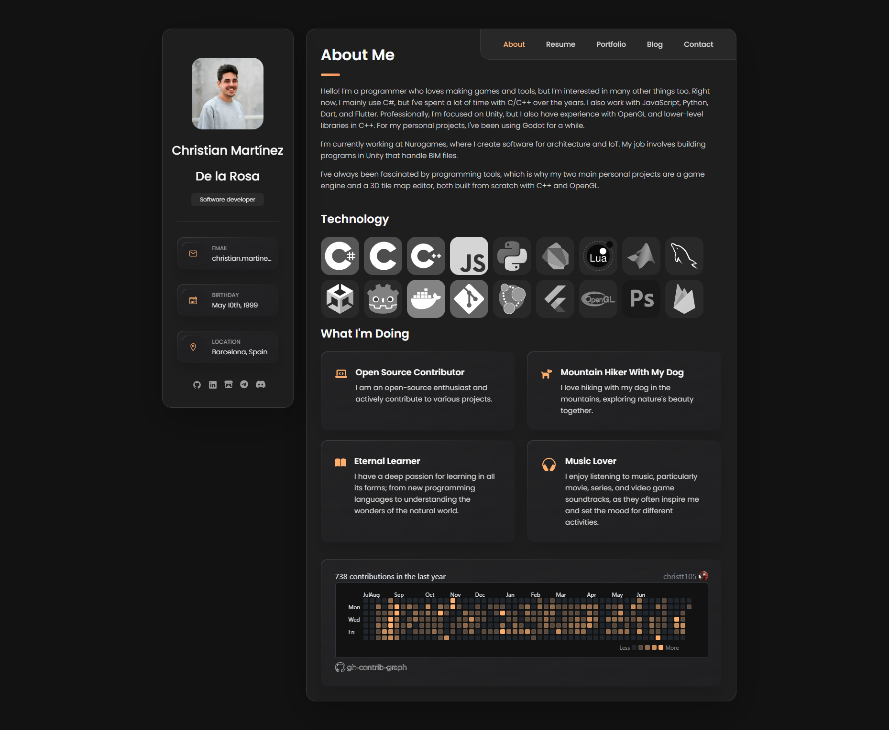
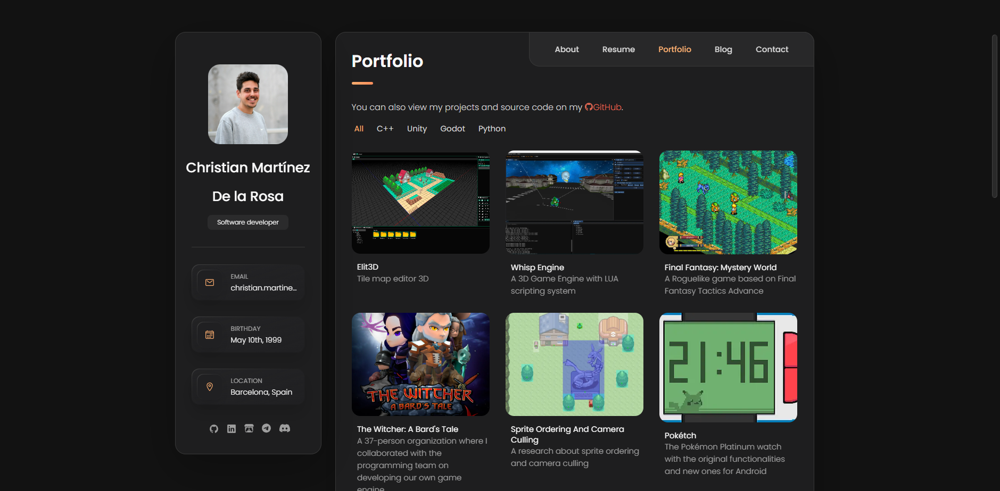

Another post. This time we’re taking a break from the main projects to focus on some web development.

## Background

I'm not a web developer by any means, but it's a field I like to mess around with occasionally, and it's important if you want to showcase things.

A few years ago, I built a personal website to show what I was working on, my work experience, and some projects. I used the [vcard-personal-portfolio](https://github.com/codewithsadee/vcard-personal-portfolio) template, which I really liked. It was built with plain HTML and CSS, and at the time it was more than enough for what I needed.

A couple of years later, I saw someone had taken the aesthetic of that template and ported it to React, Next.js, Tailwind CSS, and TypeScript. Honestly, it solved a few problems the original had, and it was based on a much more modern and scalable stack. I spent quite some time porting my site to this new version but eventually abandoned it, and the site stayed the way it was.

At the end of last year, I built what is now *this blog* using [HUGO](https://gohugo.io/). I went through a few ideas before landing on HUGO, that could be a post on its own, but the truth is, I fell in love with it (yes, I’m the type to get obsessed with something). I used the [Stack theme](https://github.com/CaiJimmy/hugo-theme-stack), which was pretty similar to what I had. I tweaked the colors to match my current site, made some adjustments, set everything up, and published my first post. I then added a link to the blog from my main website.

Months passed, and I decided to start posting more. Every time I looked at the site, it felt outdated, and the design inconsistency between the blog and the website started to bother me. I wanted to see if I could merge everything into HUGO. It wasn’t as simple as copy-pasting stuff, there was functionality the blog theme didn’t support, and I’m no HUGO expert either. Still, I gave it a try. I ran into several issues, but I think the result turned out pretty decent.

## Changes

Here’s a summary of the key changes I made to the website.

### Home Page

 

The home page is one of the most important parts of a site, it’s the welcome screen. I wanted to include a bit about myself, the technologies I use, and a contact section. My previous home page had way too much info and a GitHub commit calendar, which I liked but it wasn’t responsive. I went through the effort of implementing it, but in the new version, I ended up dropping it.

With HUGO, several things improved. Every page has its own endpoint, there's multi-language support, light/dark mode, and the whole thing is better organized.

A big change I had to make to the Stack theme was customizing the home page. By default, it just shows the latest posts, but I wanted a custom homepage with content like a normal post.

### Resume

 

This section kept almost the same structure. Building it with HTML was a pain, writing tags and manually bolding or underlining stuff was super annoying. But with HUGO, everything works with beautiful Markdown and front matter. For work experience, I created a folder for each company and listed the individual jobs inside each file.

```yaml
---
title: "Learny Land"
image: "learnyland_logo.webp"
contractType: full-time
location: "Sallent, Catalonia, Spain"
locationType: hybrid
jobs:
  - title: "Unity Developer"
    start: 2021-06-01
    end: 2021-07-31
    type: "Hybrid"
    description: "Worked on educational mobile games for kids, ..."
    skills: ["Unity", "C#"]
  - title: "Unity Developer (Internship)"
    start: 2021-02-01
    end: 2021-05-31
    type: "Hybrid"
    contractType: internship
    description: "Internship as a Unity developer, contributing to the early stages of development..."
    skills: ["Unity", "C#"]
---
```

For each company, I read all job entries and calculate the total time worked there. Then HUGO generates the final page with all the info.

For education, I did something similar but in a single file since each item didn’t need as much detail.

I still need to add a button to download the resume as a PDF, and update the style because I’m not totally happy with it, but I’ll get to that later...

### Projects

  

This was the section I was most excited about. On the old site, there was a list of projects you could click on to see the details. You couldn’t show much info, filtering only worked with a tag, and adding new projects was a bit of a hassle.

Now, each project has its own file with a bunch of variables. There's a main list page, and each project has its own individual page with detailed content.

For each project you can define:

* Title
* Image
* Short description (subtitle)
* Tags to link related projects
* Filters for grouping in the list
* Source code link (e.g., GitHub)
* Demo video
* Option to show GitHub download section
* Itch.io card
* Categories to link posts
* Weight to sort in list
* Project description (Markdown content)

```yaml
---
showTranslations: false
title: "Elit3D"
image: "Elit3DIconTransparent.png"
description: "3D tile-based map editor"
tags: ["c++", "editor", "3d"]
filters: ["c++", "tool"]
repo: "christt105/elit3d"
video: "b0STL00hSFo"
githubDownload: false
itch:
  user: "christt105"
  project: "elit3d"
  id: "1050498"
  link: "20a446"
categories: 
  - "elit3d"
weight: 10
---
Elit3D is a tile-based 3D map editor. It supports multiple tile layers and 3D objects, and lets you export maps in different formats.
```

With this setup, creating a new project is super easy and complete. There’s room for improvement, but I’m happy with how it turned out.

### Blog


This section didn’t change much, I just had to mount the main blog page into this section. One fun thing I added was a more casual image for the blog area. It was also important to change the post URLs so they’re all under `/blog`.

### Contact

 

This one’s simple, just like before. Four cards with contact links and a map. I reused the same cards on the homepage thanks to HUGO partials.

## Final Thoughts

There’s still a lot of work to do and the result isn’t exactly “professional,” but I’m happy with how it is now. HUGO is honestly a great tool for people like me. It's super flexible if you want to build everything yourself, and super easy if you use a theme. The fact that everything is written in Markdown is amazing, I love the format. It’s all clean, readable files that are easy to edit and organize.

It might technically be better to keep the blog and the website in separate projects, but that would mean more overhead. Right now, I can easily relate projects to posts. We’ll see how this scales once I have a larger number of posts, though I’m not sure I’ll ever reach that point.

All the content on my site, including theme modifications, is public on my GitHub repo. Hosting the site on GitHub is honestly super easy.

Hope you liked the new site and the behind-the-scenes! My goal was to unify the blog and the site visually, and I think I’ve done that. For now, the site will stay like this, and I’m really looking forward to jumping back into my other projects.

See you next time!
