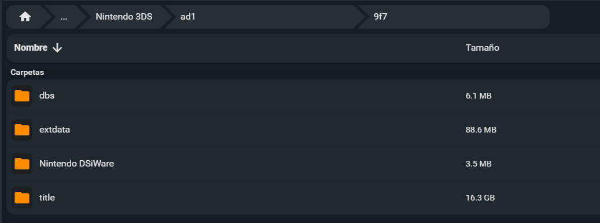
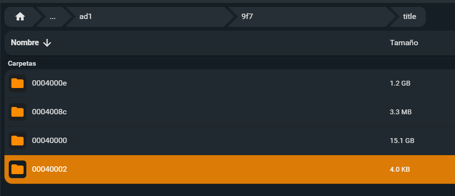
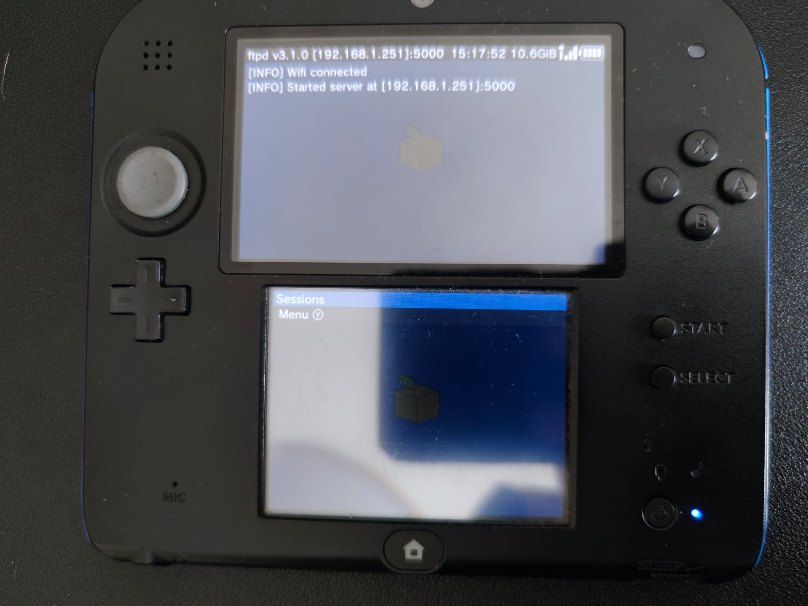
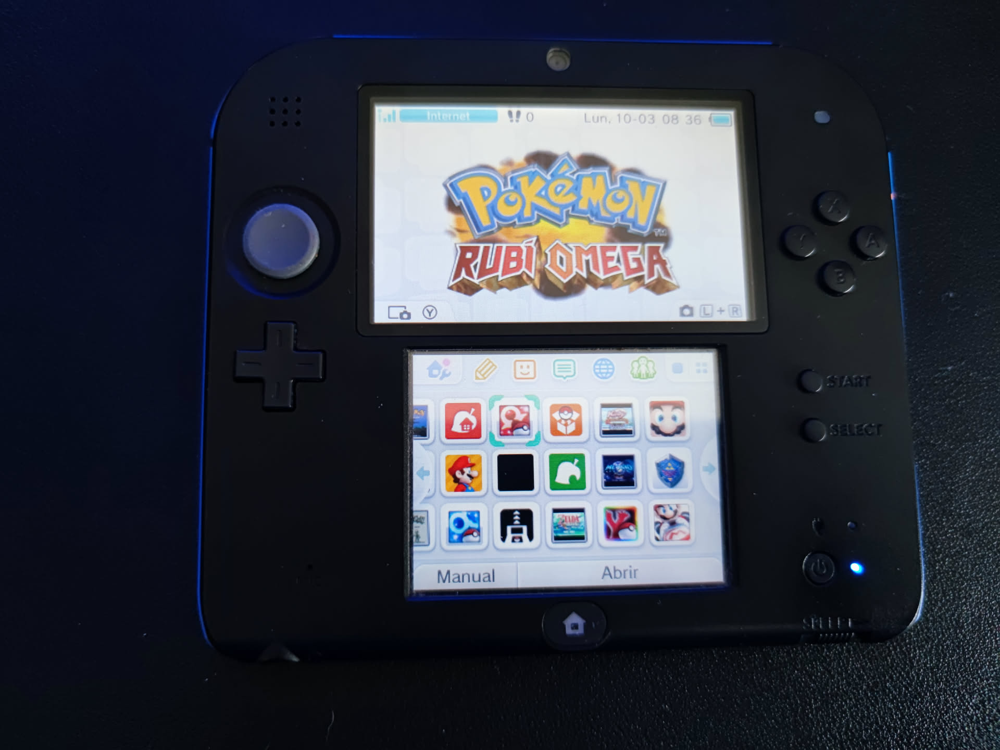
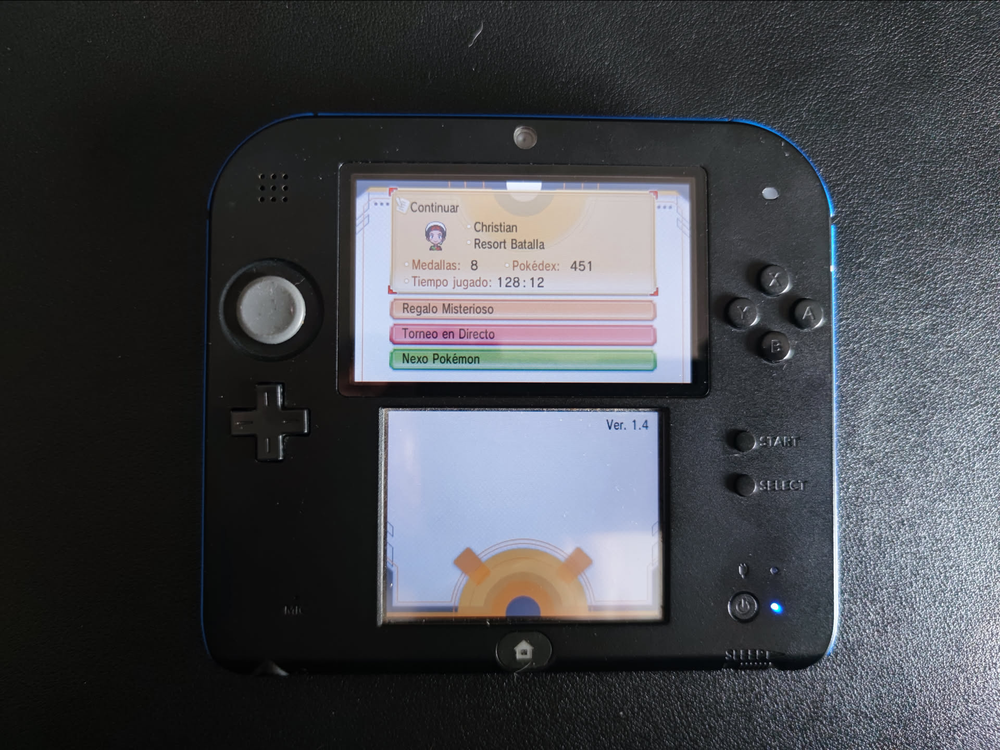
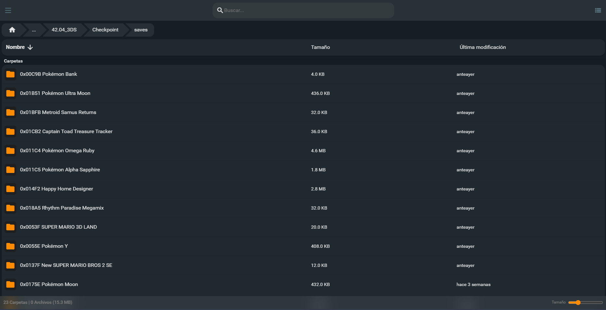

Hola de nou!

He estat fent neteja de discos durs i he trobat una carpeta `Nintendo 3DS/` de 28 GB i se m'ha encès una bombeta a sobre del cap.

Fa uns anys se'm va caure la Nintendo 2DS i se'm va corrompre la targeta SD. Després de diverses hores vaig recuperar alguns fitxers, però estava tot desordenat. Vaig aconseguir recuperar alguna partida d'algun dels jocs de Nintendo DS que estava jugant en aquell moment i amb això em vaig conformar. Més tard em vaig adonar que vaig perdre algunes partides guardades de jocs de 3DS i només conservava les que vaig guardar amb [Checkpoint](https://github.com/BernardoGiordano/Checkpoint) en algun moment.

Durant anys he anat fent còpies de carpetes "per si de cas" es trencava alguna cosa i he acabat amb moltes carpetes duplicades diverses vegades i desordenades. Fins fa pocs dies que vaig decidir ordenar tots els discos durs i muntar un sistema de backups més sòlid i ordenat. M'he trobat moltes carpetes `Nintendo 3DS/`, però la majoria tenien molt poques dades, fins que n'he trobat una amb 28 GB que m'ha intrigat molt.

Al post d'avui us explicaré el procés que he seguit per veure què podia fer amb aquestes dades. Segurament es podria haver fet d'una altra forma, però així és com ho he fet jo.

Òbviament tot això és possible perquè vaig alliberar la meva consola fa un temps. D'una altra manera no hagués pogut conservar les meves partides fora dels cartutxos i ara les partides dels jocs digitals serien irrecuperables. És una cosa que odio de Nintendo: les partides guardades haurien de ser lliures. I és per això que he perdut moltes partides de jocs de quan vaig perdre el cartutx en el seu moment. I és per això que m'agrada tant la Steam Deck, sento que sóc l'amo al 100% de la màquina que he comprat.

## Precabut
"Home precabut val per dos", així que el primer era extreure la targeta SD de la 2DS i fer una còpia de tot el contingut actual a l'ordinador pel que pogués passar. No jugo actualment a la 2DS ja que ara jugo principalment a la Steam Deck, però igualment, no està de més fer una còpia de seguretat.

El primer indici que em va fer preocupar va ser que un dels IDs de la carpeta era diferent de la meva còpia de seguretat antiga. A la SD de la Nintendo 3DS es creen unes carpetes. L'estructura és `Nintendo 3DS/ID0/ID1`, cada ID sent de 32 caràcters hexadecimals. Dins d'aquesta carpeta es troben tots els programes instal·lats juntament amb les dades de guardat. Agafeu això amb pinces, però crec que el primer ID (`ID0`) és l'identificador de la consola, és únic per cada consola i no hauria de canviar a menys que es faci un canvi de placa base. El segon identificador (`ID1`) és la instància específica del sistema de fitxers, que pot canviar si s'ha formatejat la consola o la clau de xifratge ha canviat. Ambdós són necessaris perquè estan vinculats a la clau de xifratge de la consola, és a dir, si mous aquesta carpeta d'una consola a una altra, la nova consola no llegirà els fitxers perquè té una altra clau de xifratge.

## En marxa
Dit això i havent fet la còpia de seguretat de la targeta SD actual de la consola, tocava copiar els fitxers de la còpia de seguretat antiga a la SD. Vaig tenir molts problemes amb la micro SD, anava molt lenta en copiar els fitxers i es desconnectava contínuament. Segurament sigui falsa, ja ni recordo d'on va sortir, però mentre funcioni, per mi ja està bé.

### Memòria justa
Com que ja tenia alguns fitxers, no m'hi cabia tot, així que vaig decidir esborrar-ne alguns. Dins de la carpeta `Nintendo 3DS/ID0/ID1/` hi ha diverses carpetes:

- **dbs** és on hi ha els fitxers de la base de dades amb el mapa de tots els programes, perquè la consola sàpiga què hi ha instal·lat.
- **title** és la carpeta més important. Conté tots els jocs i programes instal·lats.
- **extdata** conté dades extra de partides o fitxers de sistema.
- **Nintendo DSiWare** té els jocs de la generació anterior.



El més important és a la carpeta `title`. Dins d'aquesta carpeta hi ha uns identificadors especials. Cadascun és per a un propòsit diferent:

- **0004000e**: Actualitzacions i parxes dels jocs.
- **0004008c**: DLCs.
- **00040000**: Jocs complets i aplicacions, amb les partides guardades.
- **00040002**: Demos.



La idea és simple: eliminar els jocs dels quals no m'interessava conservar el guardat. Per saber quin joc pertany a cada carpeta existeixen diverses pàgines web per identificar-lo per l'identificador com [3dsdb.com](https://3dsdb.com/) o [hax0kartik.github.io/3dsdb/](https://hax0kartik.github.io/3dsdb/).

He anat una a una buscant cada joc. Alguns no estaven a la base de dades, per la qual cosa entenc que són jocs no oficials o *fangames*. Aquells els he deixat i he esborrat jocs grans que no he jugat o m'és igual perdre.

Abans he dit "Home precabut val per dos", cosa que no s'aplica a mi perquè no he fet còpia de seguretat abans de començar a esborrar jocs. Al final va quedar en uns 17 GB.

### Transferència
Al final vaig decidir transferir els fitxers per FTP fent servir un servei anomenat [FTPD](https://github.com/mtheall/ftpd). El vaig posar a enviar tot el de la carpeta `/Backup/Nintendo 3DS/ID0/ID1_0/` a `/Nintendo 3DS/ID0/ID1_1/`, encara que els `ID1` no coincidissin. Vaig fer servir l'ordre `lftp` per enviar-ho directament.

```bash
lftp -c "open ftp://192.168.1.251:5000; mirror -R --parallel=1 --verbose . '/Nintendo 3DS/{ID0}/{ID1}/'"
```

La transferència era molt lenta, a uns 700 KB/s, per la qual cosa trigaria unes quantes hores a passar-ho tot.



## Aprofitant el temps
Mentrestant la transferència acabava vaig anar preparant els fitxers que probablement necessitaria perquè funcionés. En acabar el procés d'alliberament de la consola, extreus una còpia de la NAND, la memòria interna de la consola, que et permet tenir un resguard per si passa qualsevol cosa. Com que hauré de desencriptar els fitxers dels programes, necessitaré extreure uns quants fitxers que contenen les claus de desencriptació. En el seu moment vaig fer còpia de la NAND i em va retornar un fitxer `.bin` d'1 GB aproximadament. Aquest fitxer és únic a cada consola i és el que em permet desencriptar els fitxers de la meva antiga còpia de seguretat.

Hi havia algunes eines que em demanaven més fitxers, com el `movable.sed` o l'`essential.exefs`. Vaig trobar una eina anomenada [ninfs](https://github.com/ihaveamac/ninfs) que et permet buscar dins la NAND i extreure els fitxers que he esmentat, i així ho vaig fer.

El següent pas va ser muntar amb **ninfs** la carpeta que estava enviant a la Nintendo 2DS, per veure si podia recuperar les partides guardades directament des de l'PC.

## Sustos
Després de muntar la còpia amb **ninfs** i extreure les dades de guardat, vaig comprovar que les dades de l'Animal Crossing pesaven escassos 32 KB, així que em temia el pitjor. Vaig extreure el guardat del Pokémon Rubí Omega, que pesava 1 MB, la qual cosa ja era més normal.

Vaig carregar el joc amb un emulador i vaig intentar carregar el guardat. En carregar el guardat del Pokémon, vaig veure que la partida tenia únicament 7 minuts, cosa que va ser un cop dur.

## Alivi tens
Per sort no em vaig donar per vençut, perquè el que s'estava carregant era una partida de prova que ja tenia a l'ordinador. En passar el guardat rescatat a la partida, em sortia com a corrupte, per la qual cosa no podia provar-ho a l'ordinador, però encara quedava la bala de provar-ho a la consola directament. També vaig trobar un guardat diferent d'Animal Crossing que pesava 10 MB. Així que vaig esperar que es completés la transferència de fitxers.

## Més sustos
Un cop completada la transferència tocava el moment més delicat. Vaig sortir del programa i va passar una cosa previsible: se'm van esborrar tots els programes i el tema instal·lat.

No negaré que no esperés que funcionés a la primera. Al final he reemplaçat una base de dades sencera. Vaig reiniciar la consola i seguia igual, ni programes ni jocs. Vaig anar a opcions de la consola i a les dades de la targeta. La consola m'alertava que les dades estaven danyades i que calia esborrar-ho tot; tot i així, no em vaig rendir.

Vaig reiniciar i vaig entrar en mode GodMode9 i vaig intentar executar un script `Fix CMAC` per veure si es reiniciava la base de dades, però tot seguia igual. Així que li vaig canviar el nom a la carpeta `dbs/` perquè la consola no la trobés, amb l'esperança que la recreés. Seguien sense aparèixer els programes però ara no em deia d'esborrar la base de dades, imagino que perquè no existia, però ja era un pas.

Vaig trobar unes instruccions per [reconstruir la base de dades dels títols](https://wiki.hacks.guide/wiki/3DS:Rebuild_Title_Database), fent servir els fitxers de seguretat que he esmentat abans. Vaig seguir les instruccions bastant simples i, per art de màgia, van aparèixer els jocs i programes.



Vaig obrir el Pokémon i em sortia un missatge d'error dient que les dades no corresponen amb l'últim guardat, cosa que no eren males notícies del tot. Entenc que el joc fa servir el comptador de la consola per comprovar que has creat aquell fitxer de guardat amb la pròpia consola.

## Final feliç
Amb el programa Checkpoint, vaig crear un backup de guardat i el vaig tornar a ficar al joc. I ara sí, la meva partida estava allà, tal com la vaig deixar l'última vegada, amb les 128h i la Pokédex Regional completada, incloent la Living Dex Regional que vaig fer. Ara sí ja podia treure tota la informació de la partida i fer captures per quedar gravat al meu registre a [MediaTracker](https://christt105.github.io/MediaTracker/games/pokémon-rubí-omega/).



Aquesta era la partida que més m'interessava aconseguir. També hi ha la meva partida d'Animal Crossing i la partida completada al 100% de New Super Mario Bros 2. Ara sí, podia crear els backups de tot amb Checkpoint i guardar-ho ordenadament al meu disc dur.



Això ha estat un petit "descans" en el llarg procés d'ordenació de discos durs. Estic intentant deixar els discos durs el més ordenats possible i preparar-me per a qualsevol desgràcia. Tenir les meves partides guardades no és vital, però m'hagués agradat moltíssim conservar les de quan era petit; és una cosa que no podré canviar, però sí prevenir de cara al futur.

Ens veiem al següent post amb més coses!