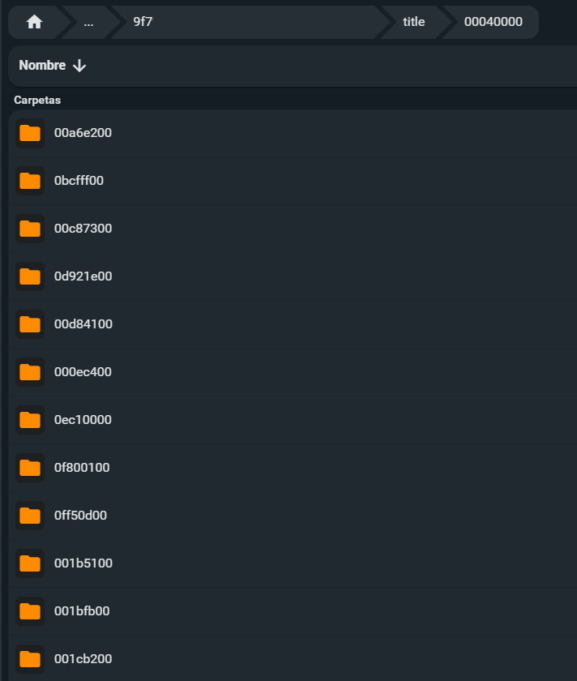

Hola de nuevo!

He estado haciendo limpieza de discos duros y he encontrado una carpeta `Nintendo 3DS/` de 28 GB y se me ha encendido una bombilla encima de la cabeza. 

Hace unos años se me cayó la Nintendo 2DS y se me corrompió la tarjeta SD. Después de varias horas recuperé algunos archivos, pero estaba todo desordenado. Conseguí recuperar algún guardado de alguno de los juegos de Nintendo DS que estaba jugando en aquel momento y con eso me conformé. Más tarde me di cuenta de que perdí algunas partidas guardadas de juegos de 3DS y solo conservaba las partidas que guardé con [Checkpoint](https://github.com/BernardoGiordano/Checkpoint) en algún momento.

Durante años he ido haciendo copias de carpetas "por si acaso" se rompía algo y he acabado con muchas carpetas duplicadas varias veces y desordenadas. Hasta hace pocos días que decidí ordenar todos los discos duros y montar un sistema de backups más sólido y ordenado. Me he encontrado muchas carpetas `Nintendo3DS/`, pero la mayoría tenían muy pocos datos, hasta que he encontrado una con 28 GB que me ha intrigado mucho.

En el post de hoy os voy a explicar el proceso que he seguido para ver que podía hacer con esos datos. Seguramente se podría haber hecho de otra forma, pero así es como lo he hecho yo.

Obviamente todo esto es posible porque liberé mi consola hace un tiempo. De otra forma no hubiera podido conservar mis partidas fuera de los cartuchos y ahora las partidas de los juegos digitales serían irrecuperables. Es algo que odio de Nintendo, las partidas guardadas deberían de ser libres. Y es por eso que he perdido muchas partidas guardadas de juegos que perdí el cartucho en su momento. Y es por eso que me gusta tanto Steam Deck, siento que soy el dueño al 100% de la máquina que he comprado.
## Precavido
"Hombre precavido vale por dos" así que lo primero era extraer la tarjeta SD de la 2DS y hacer una copia de todo el contenido actual al ordenador por lo que pudiera pasar. No juego actualmente a las 2DS ya que ahora juego principalmente en la Steam Deck, pero igualmente, no está de más hacer una copia de seguridad.

Primer indicio que me hizo preocuparme fue que uno de los ids de la carpeta era diferente a mi copia de seguridad antigua. En la SD de la Nintendo 3DS se crean unas carpetas. La estructura es `Nintendo 3DS/ID0/ID1`, cada id siendo de 32 caracteres hexadecimales. Dentro de esta carpeta se encuentran todos los programas instalados junto a los datos de guardado. Coged esto con pinzas, pero creo que el primer id (`ID0`) es el identificador de la consola, es único por cada consola y no debería de cambiar a menos que se haga un cambio de placa base. El segundo identificador (`ID1`) es la instancia específica del sistema de archivos, que puede cambiar si se ha formateado la consola o la llave de cifrado ha cambiado. Ambos son necesarios porque están vinculadas a la llave de cifrado de la consola, es decir, si mueves esta carpeta de una consola a otra, la nueva consola no va a leer los archivos porque tiene otra llave de cifrado.

## En marcha
Dicho esto y habiendo hecho la copia de seguridad de la tarjeta SD actual de la consola, tocaba copiar los archivos de la copia de seguridad antigua a la SD. Tuve muchos problemas con la micro SD, iba muy lenta al copiar los archivos y se desconectaba continuamente. Seguramente sea falsa, ya ni recuerdo de donde salió, pero mientras funcione por mi bien.

### Memoria justa
Como ya tenía algunos archivos, no me cabía todo, así que decidí borrar algunos archivos. Dentro de la carpeta `Nintendo 3DS/ID0/ID1/` hay diversas carpetas:

- **dbs** es donde están los archivos de la base de datos con el mapa de todos los programas, para que la consola sepa qué hay instalado.
- **title** es la carpeta más importante. Contiene todos los juegos y programas instalados.
- **extdata** contiene datos extra de partidas o archivos de sistema.
- **Nintendo DSiWare** tiene los juegos de la generación anterior


Lo más importante está en la carpeta `title`. Dentro de esta carpeta hay unos identificadores especiales. Cada uno es para un propósito diferente:

- **0004000e**: Actualizaciones y parches de los juegos
- **0004008c**: DLCs
- **00040000**: Juegos completos y aplicaciones, con las partidas guardadas.
- **00040002**: Demos


Dicho esto, la carpeta con más datos es la que contiene todos los juegos y programas. Dentro de la carpeta `00040000` tenemos una lista de carpetas con el identificador de cada juego y aplicación.



La idea es simple, eliminar los juegos que no me interesaba conservar su guardado. Para saber qué juego pertenece a cada carpeta existen varias páginas web para identificar el juego por el identificador como https://3dsdb.com/ o https://hax0kartik.github.io/3dsdb/.

He ido una a una buscando cada juego. Algunos no estaban en la base de datos, por lo que entiendo que son juegos no oficiales o fangames. Esos los he dejado y he borrado juegos grandes que no he jugado o me da igual perder.

Antes he dicho "Hombre precavido vale por dos", lo cual no se aplica a mi porque no he hecho copia de seguridad antes de empezar a borrar juegos. Al final quedó en unos 17 GB.
### Transferencia
Al final decidí transferir los archivos por FTP usando un servicio que instalé llamado [FTPD](https://github.com/mtheall/ftpd). Lo puse a enviar todo lo de la carpeta `/Backup/Nintendo 3DS/ID0/ID1_0/` a `/Nintendo 3DS/ID0/ID1_1/`, aunque los `ID1` no coincidieran. Usé el comando `lftp` para enviarlo directamente.

```bash
lftp -c "open ftp://192.168.1.251º:5000; mirror -R --parallel=1 --verbose . '/Nintendo 3DS/{ID0}/{ID1}/'"
```

La transferencia era muy lenta, a unos 700 KB/s, por lo que iba a tardar unas cuantas horas en pasar todo.


## Aprovechando el tiempo
De mientras la transferencia terminaba fui preparando los archivos que probablemente necesitaría para que funcionase. Al acabar el proceso de liberación de la consola, extraes una copia de la NAND, la memoria interna de la consola, que te permite tener un respaldo por si pasa cualquier cosa. Como voy a tener que desencriptar los archivos de los programas, voy a necesitar extraer unos cuantos archivos que contienen las claves de desencriptación. En su momento hice copia de la NAND y me devolvió un archivo `.bin` de 1 GB aproximadamente. Este archivo es único en cada consola y es el que me permite desencriptar los archivos de mi antigua copia de seguridad.

Habían algunas herramientas que me pedían más archivos, como el `movable.sed` o el `essential.exefs`. Encontré una herramienta llamada [ninfs](https://github.com/ihaveamac/ninfs) que te permite rebuscar en la NAND y extraer los archivos que he mencionado, y así lo hice.

El siguiente paso fue montar con **ninfs** la carpeta que estaba enviando a la Nintendo 2DS, para ver si podía recuperar las partidas guardadas directamente desde el PC.

## Sustos
Después de montar la copia con **ninfs** y extraer los datos de guardado, comprobé que los datos del Animal Crossing pesaban escasos 32 KB, así que me temía lo peor. Extraje el guardado del Pokémon Rubí Omega, que pesaba 1 MB, lo cual ya era más normal.

Cargué el juego con un emulador e intenté cargar el guardado. Al cargar el guardado del Pokémon, vi que la partida tenía únicamente 7 minutos, lo cuál fue un duro golpe.

## Alivio tenso
Menos mal que no tiré la toalla porque lo que se estaba cargando era una partida de prueba que ya tenía en el ordenador. Al pasar el guardado rescatado a la partida, me salía como corrupto, por lo que no podía probarlo en el ordenador, pero aún estaba la bala de probarlo en la consola directamente. También encontré un guardado diferente de Animal Crossing que pesaba 10 MB. Así que esperé a que se completara la transferencia de archivos.
## Más sustos
Una vez completada la transferencia tocaba el momento más delicado. Salí del programa y pasó algo predecible: se me borraron todos los programas y el tema instalado que tenía.

No voy a negar que no esperara que funcionara a la primera. Al final he reemplazado una base de datos entera. Reinicié la consola y seguía igual, ni programas ni juegos. Fui a opciones de la consola y a los datos de la tarjeta. La consola me alertaba de que los datos estaban dañados y que era necesario borrarlo todo, aun así no me rendí.

Reinicié y entré en modo GodMode9 e intenté ejecutar un script `Fix CMAC` para ver si se reiniciaba la base de datos, pero todo seguía igual. Así que le cambié el nombre a la carpeta `dbs/` para que la consola no la encontrara, con la esperanza de que la recreara. Seguían sin aparecer los programas pero ahora no me decía de borrar la base de datos, imagino que porque no existía, pero ya era un paso.

Encontré unas instrucciones para [reconstruir la base de datos de los títulos](https://wiki.hacks.guide/wiki/3DS:Rebuild_Title_Database), usando los archivos de seguridad que he mencionado antes. Seguí las intrucciones bastante simples,
y, por arte de magia, aparecieron los juegos y programas.


Abrí el Pokémon y me salía un mensaje de error diciendo que los datos no corresponden con el último guardado, lo cual no eran malas noticias del todo. Entiendo que el juego usa el contador de la consola para comprobar que has creado ese archivo de guardado con la propia consola.

## Final feliz
Con el programa Checkpoint, creé un backup de guardado y lo volví a meter en el juego. Y ahora sí, mi partida estaba ahí, tal cual la dejé la última vez, con las 128h y la Pokédex Regional completada, incluido la Living Dex Regional que hice. Ahora sí ya podía sacar toda la información de la partida y hacer capturas para quedar grabado en mi registro en [https://christt105.github.io/MediaTracker/games/pokémon-rubí-omega/](https://christt105.github.io/MediaTracker/games/pok%C3%A9mon-rub%C3%AD-omega/).


Esta era la partida que más me interesaba conseguir. También está mi partida de Animal Crossing y la partida completada al 100% de New Super Mario Bros 2. Ahora sí, podía crear los backups de todo con Checkpoint y guardarlo ordenadamente en mi disco duro.


Esto ha sido un pequeño "descanso" en el largo proceso de ordenación de discos duros. Estoy intentando dejar los discos duros lo más ordenados posible y prepararme para cualquier desgracia. Tener mis partidas guardadas de mis juegos es algo que realmente no es muy importante, pero me hubiera gustado muchísimo conservar las partidas de los juegos de Pokémon de cuando era pequeño, pero es algo que no voy a poder cambiar, pero si prevenir a futuro.

Nos vemos en el siguiente post con más cosas!