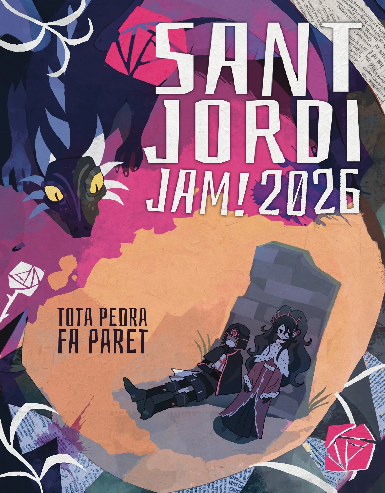

Hola de nuevo!

Convencí a unos amigos para apuntarnos a la [Sant Jordi Game Jam 2026](https://santjordijam.github.io/), una Game Jam con temática de Sant Jordi, una festividad que se hace en Catalunya muy bonita en la que el 23 de abril se regalan rosas y libros.



La Game Jam daba unas tres semanas para desarrollar un videojuego, lo cual nos venía muy bien porque no tenemos mucho tiempo libre. Además del juego también hay que publicar una rosa digital.

Otra cosa que dejamos decidir fue el motor con el que haríamos el juego, aunque no hubo mucho debate. Muchos pensaréis que no hay debate porque elegí Godot, pero mucho más lejos de la realidad. Uno de los integrantes ([oriorii](https://github.com/OriolCS2)) lleva varios años trabajando en un motor de videojuegos 2D: [Comet Engine](https://github.com/OriolCS2/CometEngine). Está a punto de sacar la versión 2.0 con un nuevo sistema de scripting y varias mejoras más y la verdad que era la oportunidad perfecta para probarlo haciendo un juego. Es el primer juego que se va a hacer con Comet Engine.

Hacía mucho tiempo que no participaba en la creación de un videojuego, llevo muchos años haciendo herramientas y webs, y la verdad que ya iba apeteciendo hacer algo más creativo.

El tema de la Game Jam es:

> Toda piedra hace pared

Tuvimos varias reuniones de brainstorming. Hubieron muchas ideas, algunas más locas 1ue otras. En un momento quise darle un giro a la idea y en catalán la tercera persona singular del presente del verbo "hacer" y la nota musical "fa", son la misma palabra, y se me ocurrió hacerla más alargada y con un toque musical. A Marc le hizo gracia la idea y la liamos. Diseñamos un sistema bastante complejo donde el jugador iba a crear una canción para derrotar al dragón. Y empezamos a trabajar en el juego.

Ori y Marc hicieron bastantes avances pero a los dos días tuvimos otra idea para darle un giro a la idea y se nos ocurrió mezclar un bullet hell con un juego rítmico al estilo OSU. En el medio estaría el dragón tirando las bolas de fuego y el personaje se movería a la vez que clicaría sobre los círculos al ritmo de la música.

Marc y Ori volvieron a darle duro. Marc hizo un sistema de ritmo con combos y pudiendo personalizar la música. Ori hizo el sistema de las bolas de fuego del dragón, a la vez que iba arreglando y mejorando el motor. Se añadió Dídac al proyecto e hizo el movimiento del personaje. Yo, como siempre, propongo las cosas pero nunca hago nada, aunque llevo un mes bastante ajetreado. Cuando se calmó la cosa, yo empecé a hacer las piedras que caían del cielo e iban a funcionar como bloqueadores de las bolas de fuego (de ahí el tema "Toda piedra hace pared"...). También me encargué de testear el motor en Linux y un Windows con gráfica integrada, iba razonablemente bien.

Hubo un tiempo que nadie hizo nada. Yo seguía peleándome con las piedras y el Ori iba mejorando y arreglando el motor. Hasta que llegó el último día y había que entregar.

Ni de coña llegábamos. Además Marc estaba liado con otros temas y el Ori no podía porque jugaba el Barça... Decidí sacar la tijera y recortar y simplificarlo todo al máximo. Se me ocurrió que sólo te pudieras mover si hacías el juego del ritmo, así era más emocionante para esquivar. Puse un temporizador de minuto y medio y me puse a hacer releases e ir arreglando cosas. Comet dió algún problema para exportar pero se acabó solucionando solo. Se puede exportar a web para jugar dede Itch.io, igual que con Unity y Godot.

Faltaba la rosa. Mi idea era hacer un shader que dibujase una rosa constantemente, pero no había tiempo. Pasé por Discord una rosa dibujada con mi móvil, pero quería algo diferente. Se me ocurrió que fuera una rosa dibujada con texto, así que pasé la imagen por un convertidor a ASCII y quedó decente:

```
```

Entregamos justos y el juego es bastante feo, pero es jugable. La verdad que trabajar en un videojuego con un motor propio ha sido una experiencia bastante divertida.

Para quien quiera probarlo:

https://christt105.itch.io/sant-jordi-the-stone-song

Esto ha sido una pequeña pausa, se vienen muchas más cosas.

Hasta la próxima y Feliç Sant Jordi!