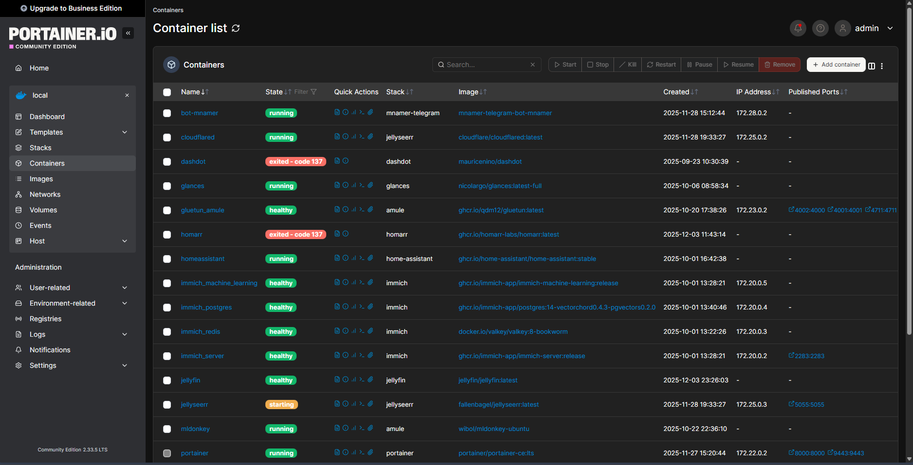
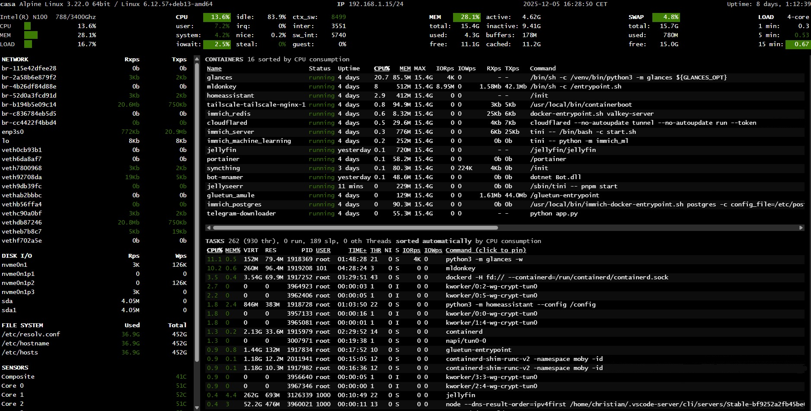
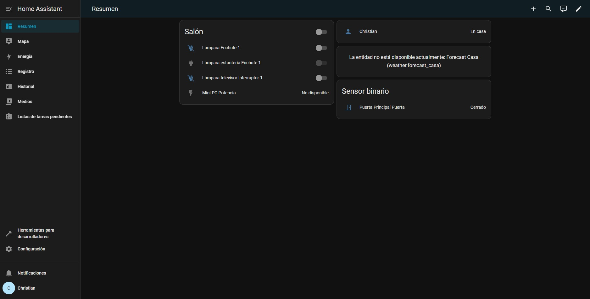
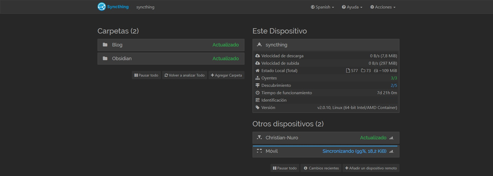
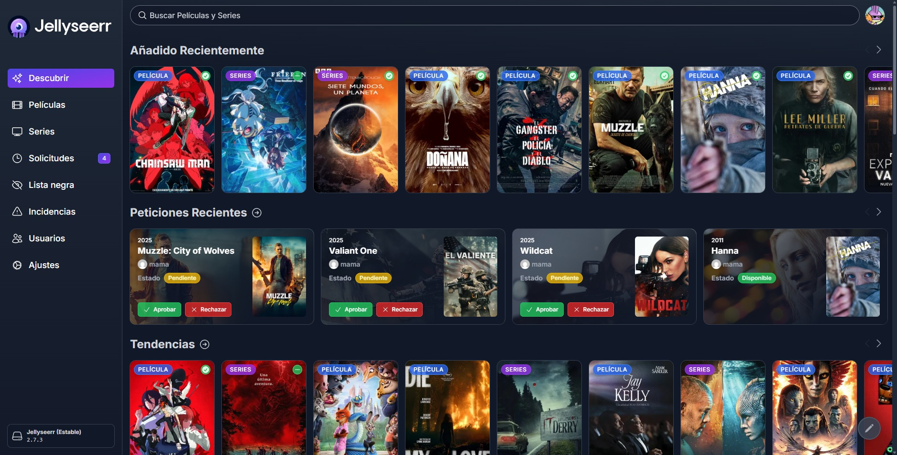

Hello again. It had been a while since I wrote a new post. I had to force myself to stop and write this so I could clear the way to continue with other pending projects. And that is partly the subject I'm going to write about today. Let me give you some context.

> Important
> 
> This is a post about my experience as a newbie. I am not an expert on the subject, nor do I pretend to be. I simply want to share my experiences entering the world of home servers. I probably do many things wrong and make mistakes in some aspects.

## The Trigger

A little over six months ago, my partner gifted me a mini PC for my birthday (a grave mistake on her part). Specifically, it's the GMKtec g3. It features an N100 processor, 16 GB of RAM, and 512 GB of internal storage. I chose this one simply because it had many USB 3 ports, as my idea was to connect several drives to it. It was relatively cheap (~€100) and I didn't need much power. There are many ranges of mini PCs; depending on the use you are going to give it, one or another might interest you. The use I wanted to give it was for simple tasks, for it to be always on and able to handle simple home server tasks.

I wasn't really sure why I wanted a server. There was always something I wanted to do and I thought: "if I had a home server, I could do it," but nothing was that relevant.

Since then, I've tinkered with it a lot, installed various things, messed up a few times, and above all, I've learned quite a bit along the way—I've been quite entertained.

## The Journey

During all these months things have been changing to where we are now, but it will change a lot in the future. I like the idea of doing a retrospective of everything that has changed.

### Beginnings

When it arrived, I plugged it into the TV and tested that everything was decent. What worried me most was a comment on Aliexpress saying that the HDMIs didn't transmit audio, which I found strange. Obviously, everything was fine; the HDMIs played audio perfectly. Audio doesn't matter for a home server, but back then I had a very old TV with an old Chromecast connected and my idea was to use the mini PC as a media center.

#### Choosing the Operating System

It came with Windows 11 pre-installed, which lasted very little. I have very little respect for that operating system, although not as little as Microsoft has for it. I spent quite some time debating with myself about which Linux distribution to install. As I said, my idea was to use it as a media center, so I needed stability and the ability to use it with a graphical environment. On the stability side, it was quite clear: I needed a distro based on Debian or Ubuntu. In the end, I settled on Debian 12. I'm no expert on the subject, so I went with my gut.

Another possible choice was Proxmox, but honestly, I saw it as complicated to get into and I wanted something simple, especially to start with. I don't rule out installing it in the future, but I wanted to start easy.

After that, I spent several odd days tinkering. I didn't have much time because I had just finished moving, so there were still errands to run and I had complications with work, but I kept adding interesting things to it.

I took an abandoned 1 TB hard drive from my parents' house and connected it. The hard drive is quite old, uses external power, and makes some noise. Honestly, for starting out, it served me well. I had to learn how to mount drives in Linux, but it was quite easy.

#### The Mishap
At one point I messed up by typing a command I shouldn't have executed. Primarily, I have everything with Docker, so I can have everything running without having to configure much. The problem is that sometimes the file owner changes and switches to a container user. Usually, doing `sudo chown -R christian:christian /path/to/drive` solves the problem on my external drive, unless you accidentally put the root. Instead of putting `./`, I put `/`, which changed the permissions of many system files. Nothing serious, since those files were my "property" and I still had access to all my other files, but fixing it was more costly than reinstalling. So I made a backup (I forgot to back up a repository so I lost some work, but nothing serious) and did a clean install.

#### Reinstallation
Upon installing, I saw that Debian 13 had been released, so I took the opportunity and installed it. I was about to install Proxmox, but I was quite busy, so I decided to keep everything as I had it before.

I was going to do this new installation differently. During the months the server was running, I never had the need to use the desktop or anything video-related. So this time I installed it without a graphical environment. Hacker mode activated: I set a static IP and installed SSH directly, and thus it was ready to have everything running again.

Another thing I did was take the mini PC to the office. The poor thing spent a rather hot summer inside a cabinet. Now it is on a shelf, much cooler.

## Services running on my local server
Let's get to the interesting part: what I have running inside the server. The truth is that over all these months I have been adding and removing things. Let's list everything.

### SSH
I don't know if I should create a section for this, but it is practically indispensable, as it allows you to control the server from any device. It is a console for executing commands remotely. On my computers, I have VS Code installed with the SSH extension, so I have access to a server console and files very comfortably. I can also execute whatever I want from my mobile; I use JuiceSSH and it is quite comfortable if I don't have access to a computer nearby.

### Samba
Another indispensable service is Samba. It is a program that allows you to share files between devices. That is, I now put my files on the server and can access those files from any device. It is a way to centralize files, avoiding the problem of having each file on a different device.

### Portainer
We enter the realm of Docker and services. [Portainer](https://www.portainer.io/) is a service that lists all the Docker containers you have, and you can control them. I don't really use it much. I only use it if I need to visually see what is running and check the logs if something fails.

### Tailscale
Indispensable service. [Tailscale](https://tailscale.com/) is a VPN. It is quite simple to install and allows you to access your local network from anywhere in the world. I have it installed on my mobile and have given access to my family. This way I can access all my services, even if I'm not at home, in a very secure way.

### Glances
[Glances](https://nicolargo.github.io/glances/) is a service that shows the server status, CPU and memory usage, uptime, processes, and running containers. It seems you can configure it with [Grafana](https://grafana.com/) to view it better, but I haven't dedicated time to that.

### TDL
[TDL](https://docs.iyear.me/tdl/) is a program made in Go that allows you to do various things with Telegram from a command console. I practically use it to upload files in folders to Telegram. Files can also be downloaded very quickly. I have pending to use it to automate backups and file uploads/downloads.

### Immich
[Immich](https://immich.app/) is an open-source program that allows you to organize your photos and videos. Basically, it's a Google Photos storing everything on your equipment. I have it configured so that photos and videos from my mobile upload to the server, and I have access from any device. It has a user system that allows creating multiple accounts, creating albums, and sharing them between users. It also has a face recognition and location management system. All local.

I set it up back then, and since then I've been uploading the photos I take every day. I still need to gather all the photos I have scattered across hard drives and unify everything.

### mnamer
[mnamer](https://github.com/jkwill87/mnamer) is a console program that attempts to guess the movie or series from the content of a file by its name, and renames and moves it according to your configuration. It misses more often than a stormtrooper, but it speeds up file renaming a lot, especially for long series. It searches for movies on [The Movie Database](https://www.themoviedb.org) and series on [TheTVDB](https://www.thetvdb.com/), so the data sources are different. I have it in a Docker container and execute it directly in the command console. I have several aliases to run a test and provide the tmdb or tvdb id directly.

### mnamer-telegram
Having mnamer to run in the console is great, but using the command line is somewhat annoying. So I created a simple Telegram bot that detects new files in a folder, runs a test with mnamer, and sends the result as a message via Telegram. The message has a button that executes the action of moving and renaming the file.

Surprisingly, mnamer works better inside the bot than in the Docker container. I have it half-finished; it still lacks key functionalities and bug fixes. If mnamer finds it on the first try, it's perfect because with one click it moves directly and always follows the same naming format, but if it doesn't find it or there are many files, I have to do it by command directly. When it's decent, I'll make it open source.

### Home Assistant

[Home Assistant](https://www.home-assistant.io/) is one of the most famous home automation projects. It is practically a program that acts as the brain of your smart home. You can connect all devices to Home Assistant and manage them from a single unified place. You can create automations with different sensors and actions.

Honestly, I haven't used it much. I don't have many smart devices and haven't looked into automations I might need.

### Syncthing

[Syncthing](https://syncthing.net/) allows you to synchronize files between various devices. This is one of the latest services I've added to the server. Basically, you have to install Syncthing on each of the devices you want and select a folder to share. Every change you make will sync with the other devices. Since the server is always active, changes will always sync regardless of who modifies them.

I am using it to sync my notes from [Obsidian](https://obsidian.md/), which I have started using seriously recently; it is my new obsession. I have two synced folders: my entire personal Obsidian vault and my blog posts. This way I can access my files and edit them from any device. I can add and modify Obsidian notes or write this post from my mobile, continue from the tower computer, and finish writing it on the laptop. I have a pending post about how I have it set up.

### telegram-downloader

I'm using a Telegram bot that, when I send it files, downloads them to the mini PC. It also downloads YouTube videos, but I prefer using [yt-dlp](https://github.com/yt-dlp/yt-dlp) via console.

It is a bit confusing because I was using the image [jsavargas/telethon_downloader](https://hub.docker.com/r/jsavargas/telethon_downloader) which is open source and can be found in [this repository](https://github.com/jsavargas/telethon_downloader), but after a while I switched it for this other image [jsavargas/telegram-downloader](https://hub.docker.com/r/jsavargas/telegram-downloader) which is from the same person but the code doesn't seem to be publicly accessible. I'll see what I do because I've seen that he updated the image on GitHub, so I might go back to that one; anyway, for now, it works for me.

### Jellyfin
The jewel in the crown. [Jellyfin](https://jellyfin.org/) is an open-source service that turns your computer into a media center. It is capable of reading your files, downloading metadata, and streaming it to any device on your network. It is basically like a Netflix with your local files. You have to own all the files. With a user system, no ads, no abusive fees, and available from all your devices. You can watch an episode on your mobile and then when you are on the TV, the next one will appear for you to watch.

You can install plugins made by the community. For example, I have the [Simkl](https://simkl.com) plugin installed, and when I finish an episode or movie, it automatically marks it as watched on my account.

You could say it is the service I have used the most. I also installed it on my mother's television along with Tailscale.

It is the open-source counterpart to Plex. I haven't actually used Plex, but Jellyfin works for me. The big drawback is that it isn't in all TV app stores. The issue of TV operating systems is a separate topic. When I bought the TV, I looked only for those that had Google TV, which are the most open. Another solution was to buy a Xiaomi TV Box, but that made the purchase more expensive. For my mother, I had to put Jellyfin and Tailscale on a Fire TV.

### Jellyseerr

Jellyseerr (now I think it's called "Serr") is a content request service. You can connect it to your Jellyfin instance so that existing content appears. You can create users or use the Jellyfin ones, and each user can make requests for any movie or series, and I get a message to a Telegram bot with the request.

It is the only service I have open to the internet via Cloudflare tunnels.

### MLDonkey

Honestly, I didn't imagine it was still alive, but [eMule](https://www.emule-project.com) is still giving it its all in 2025. This P2P client, although quite old, still works in a more than decent way. Being so old, it hasn't been updated as much as torrent clients have.

It works quite well on Windows, but I needed a solution to run it on Linux, and if it could be with Docker, even better. On Linux, there is aMule, which is the cross-platform version of eMule, although its performance is somewhat inferior. There are some popular Docker images like [ngosang/docker-amule](https://github.com/ngosang/docker-amule), but passing it through the VPN with [gluetun](https://gluetun.com/) didn't work well for me at all. I was investigating and found MLDonkey, which is another somewhat more complete P2P client. I got the [wibol/mldonkey-docker](https://github.com/Wibol/mldonkey-docker) image running and it worked decently, much better than aMule. After a while, I tried the image by [carlonluca](https://hub.docker.com/r/carlonluca/mldonkey), which seems to update more constantly and has a new interface. It didn't go well because I couldn't get it to work through the VPN. Adding to that the fact that the new interface is less usable, I stuck with Wibol's version.

### Media Stack

I configured a large Docker Compose with the typical media stack. I put [qBittorrent](https://www.qbittorrent.org/) as the torrent client, [Prowlarr](https://prowlarr.com/) and [Jackett](https://github.com/Jackett/Jackett) as indexers, [Sonarr](https://sonarr.tv/) and [Radarr](https://radarr.video/).

Honestly, I don't normally have it active since I don't usually use it much. I've tried torrents and they don't give me very good results. For consuming content in the original version, I think it works better.

### JDownloader

Finally, I put up a Docker image of [JDownloader](https://jdownloader.org) since I've sometimes needed to download several files via direct download. Similarly, I usually have it turned off because it is set up with a graphical interface that consumes quite a bit. I want to try installing it without a graphical interface, to see how it works.

## Services I used to have

And that's all the services I have on my server. Although I would also like to name some services that I have had at some point.

### Panabot (Hollow Knight)

I made a small Discord bot that sent a message every day with the countdown to the release of Hollow Knight Silksong.

### Calibre Web

I am not a big reader, but my partner is, so I wanted to give another use to the server. My partner has a large collection of books, both physical and digital, and owns a Kobo Libra 2. She organizes her digital library with Calibre and has a web version. I managed to sync it with the Kobo, but when transferring and converting the books, they didn't look right on the device and I ended up giving up before messing it up.

### Dash

Before using Glances, I used [Dash](https://getdashdot.com/), a device monitoring service. Since it is somewhat simpler than Glances, I ended up removing it.

### Homarr

Having many services running on your server can make it difficult to remember all the ports for each one; [Homarr](https://homarr.dev/) allows you to create a dashboard with your services and plugins to show information about them. The main problem is that it was using almost 1 GB of RAM, so I removed it and will try some alternative.

### AdGuard

One of the services I was most looking forward to putting on my server was [AdGuard](https://adguard.com), a DNS blocker. I must not have configured it very well because it caused some applications not to work properly, so I removed it until I had time to dedicate to it. I was also thinking about using [Pi-hole](https://pi-hole.net/), which I used in a job I had and it worked decently.

## Future

The truth is that reviewing everything, a lot has happened. I am actually happy with the current state and I would like not to dedicate as much time as I have dedicated all this time and continue with other projects.

Having a local server at home is an experience that I am liking a lot. Having the possibility of having storage available from any device is very comfortable. The fact of being able to execute services created by the community and small programs that I create to improve my digital life is something I like. Being able to make my own bots and have them always available is also nice.

For it to be perfect, I still have to make some automatic backup system. My initial idea was to have a NAS but for now, I'm saved by the fact that hard drives are still quite expensive. I would also like to keep developing the bots I have half-finished.

This is a good summary of the local server topic; I hope to have more updates on this subject in a while. I have more things in hand that I would like to advance and talk about on the blog.

I'll leave it here, as I think it has become quite long, and I'll see you in the next post.