Hola de nuevo. Hoy os traigo un tema bastante técnico y un poco friki, pero que llevaba mucho tiempo queriendo investigar. Si alguna vez habéis jugado a Pokémon a partir de Rubí, Zafiro o Esmeralda, seguro que os habéis cruzado con Spinda, el Pokémon panda de los patrones infinitos.

La verdad es que este monstruo de bolsillo es una auténtica pesadilla a nivel técnico para cualquier desarrollador que intente hacer un fangame o clon. De la misma manera me parece una mecánica muy interesante que enriquece el mundo de estas criaturas. Hoy vamos a destripar cómo funciona internamente en los juegos originales, cómo lo han resuelto en otras herramientas y, finalmente, cómo lo he implementado yo en Godosters.

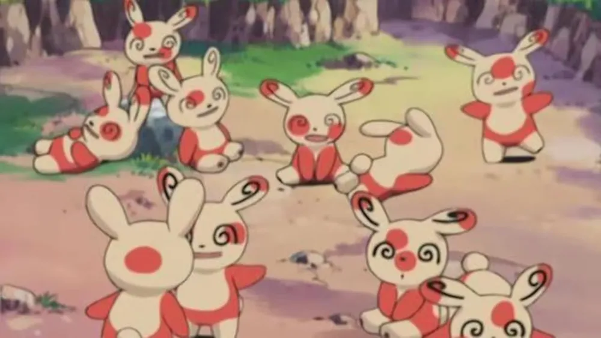

## ¿Qué tiene de especial Spinda?

Para los que no lo sepáis, Spinda es un Pokémon introducido en la tercera generación que tiene una mecánica única: sus manchas nunca son iguales. 

Internamente, el juego utiliza el Personality Value (PID), un número de 32 bits único para cada Pokémon, para determinar las coordenadas exactas de 4 manchas en su cara. Esto significa que hay nada más y nada menos que 4.294.967.296 combinaciones posibles.

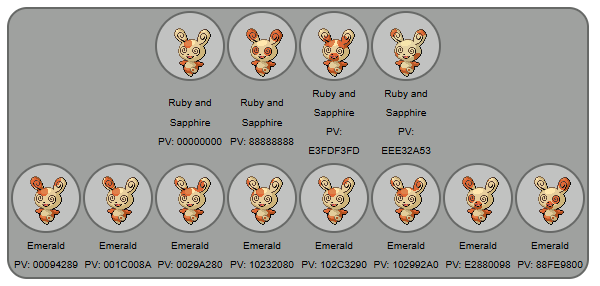

Pero, ¿cómo se dibuja esto en pantalla sin tener 4 mil millones de imágenes guardadas? Vamos a verlo.

## La solución original: Pokémon Esmeralda (Game Boy Advance)

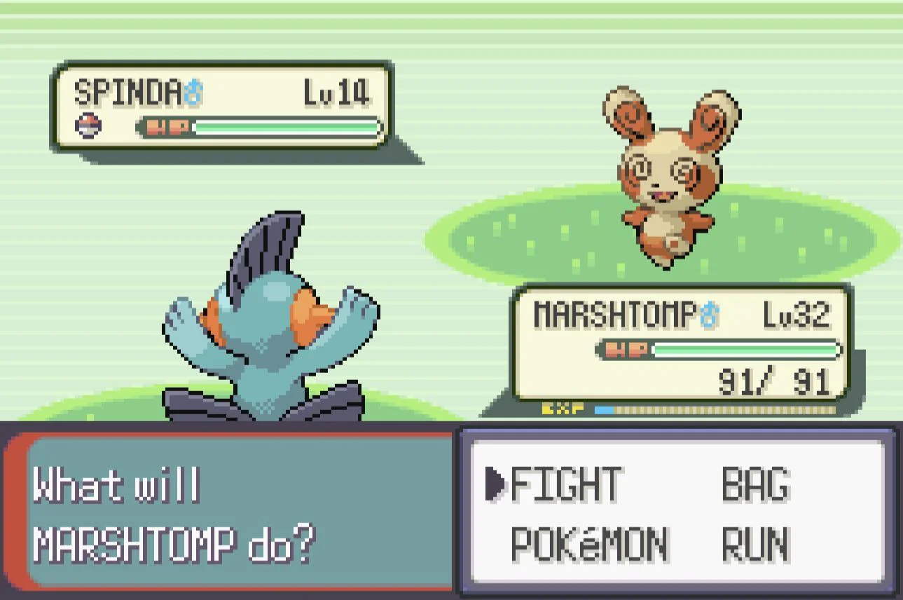

Me puse a bucear por el código descompilado de `pokeemerald` en GitHub para entender cómo lo hacían en 2004 con los recursos limitados de la GBA.

Lejos de usar polígonos o rotaciones raras, las 4 manchas son simples imágenes binarias de 16x16 píxeles (1 bit por píxel). 

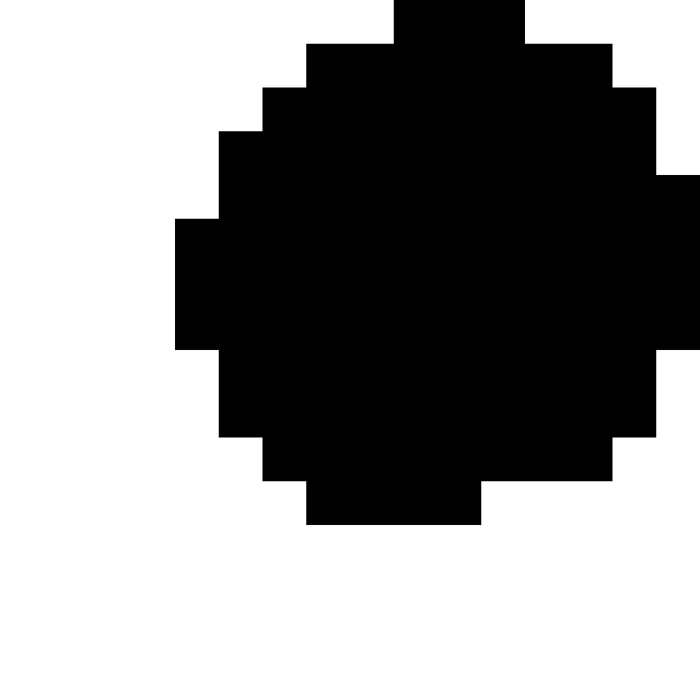 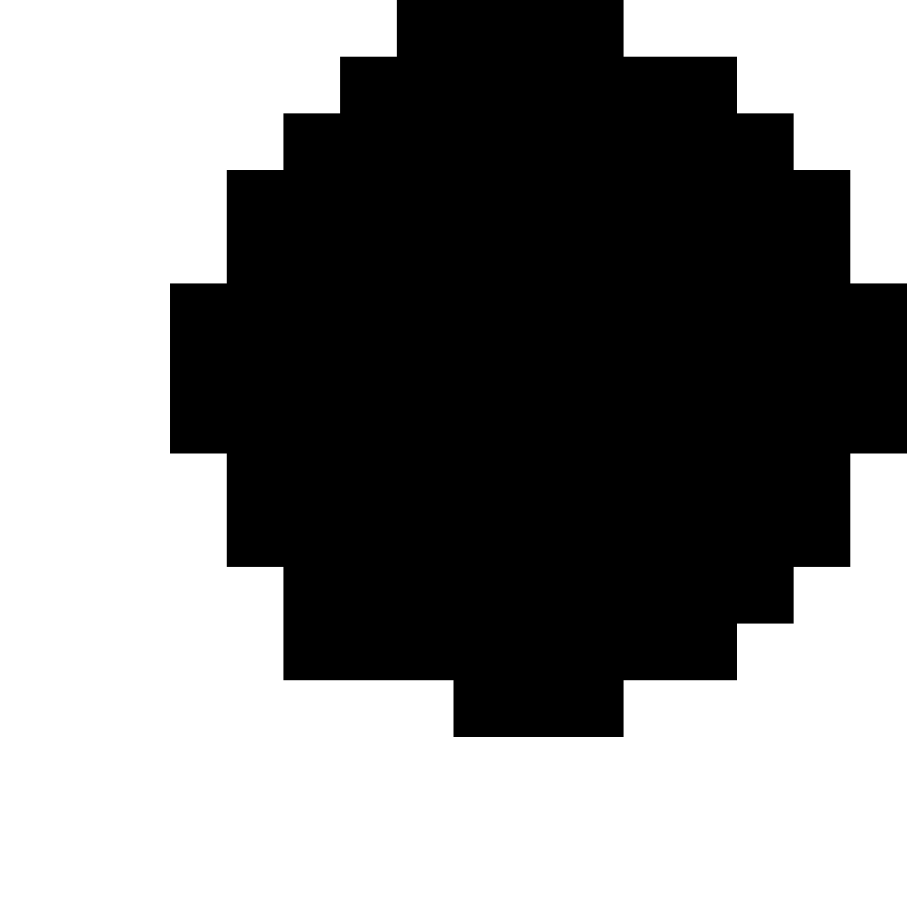 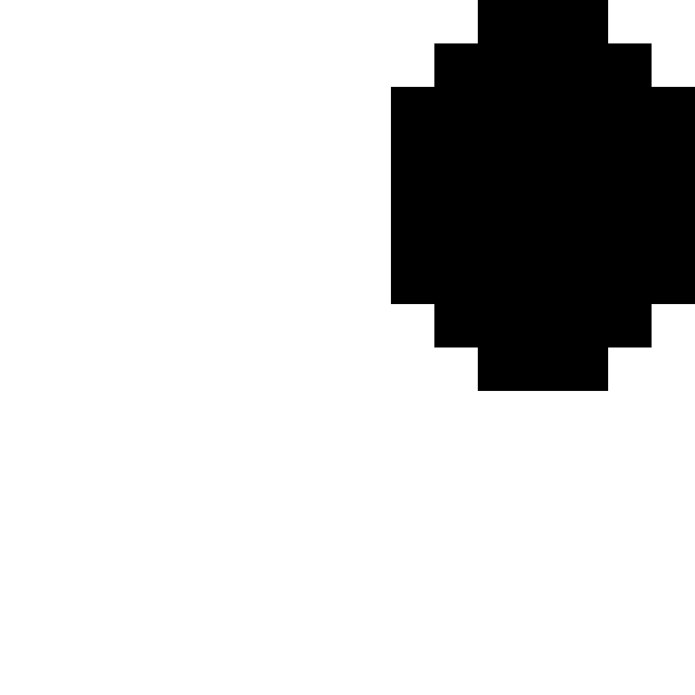 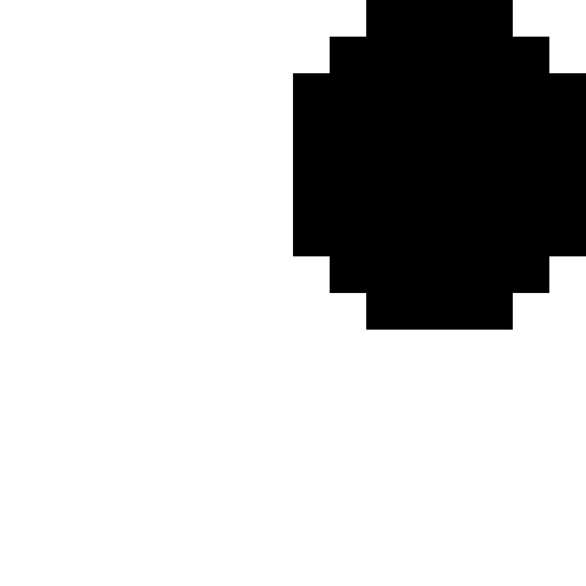

*(Arriba: Las 4 texturas binarias originales extraídas de pokeemerald)*

El juego coge los 32 bits del PID y los divide en 4 bloques de 8 bits. Para cada mancha, usa los primeros 4 bits para calcular el desplazamiento X (entre -8 y +7 píxeles de su base) y los otros 4 bits para el Y.

Para ponerlo todo en perspectiva, aquí tenéis la función principal casi completa que hace toda la magia ([ver en GitHub](https://github.com/pret/pokeemerald/blob/master/src/pokemon.c#L5749-L5787)) *(Nota: lo he adaptado de una macro de C a una función normal para que sea más fácil de leer)*:

```c
void draw_spinda_spots(u32 personality, u8 *dest) 
{
    for (int i = 0; i < 4; i++) 
    {
        u8 x = gSpindaSpotGraphics[i].x + ((personality & 0x0F) - 8);
        u8 y = gSpindaSpotGraphics[i].y + (((personality & 0xF0) >> 4) - 8);

        for (int row = 0; row < SPINDA_SPOT_HEIGHT; row++)
        {
            s32 spotPixelRow = gSpindaSpotGraphics[i].image[row];
            for (int column = x; column < x + SPINDA_SPOT_WIDTH; column++)
            {
                u8 *destPixels = dest + /* ... 
                 ... */;
                if (spotPixelRow & (1 << (column - x)))
                {
                    try_draw_spot_pixel(destPixels, shift);
                }
            }
            y++;
        }
        personality >>= 8;
    }
}
```

Explicado por encima, esto es el paso a paso de lo que hace este bloque:
1. **Recorre las 4 manchas** en un bucle.
2. **`gSpindaSpotGraphics`** es simplemente un Array de datos predefinido que guarda las coordenadas iniciales base de la cara de Spinda y el dibujo binario de las 4 texturas de manchas que hemos visto antes.
3. **Calcula la coordenada final `x` e `y`** sumándole el desplazamiento aleatorio extraído del `personality` (el PID) a esa coordenada base.
4. Con unos bucles `for` que recorren cada fila y columna del cuadrado de la mancha de 16x16, el código en C hace magia con mis queridos punteros para buscar qué dirección exacta de la memoria RAM de la consola (`destPixels`) le corresponde a ese píxel del sprite base.
5. Comprueba la máscara binaria de la textura de la mancha (`if (spotPixelRow & ...)`), y si en ese píxel hay dibujo, llama a la macro final `TRY_DRAW_SPOT_PIXEL` para colorearlo.
6. Finalmente, empuja el número del PID 8 bits hacia la derecha (`personality >>= 8`) para poder leer las posiciones pseudoaleatorias de la siguiente mancha en la siguiente vuelta del bucle.

Sin embargo, como podéis imaginar, el juego no colorea ese píxel a lo loco dentro de `TRY_DRAW_SPOT_PIXEL`; primero se asegura de que el destino pertenezca a la piel de Spinda, para evitar manchar los contornos negros o el fondo transparente.

Aquí tenéis el sprite base vacío al que se aplican estos cálculos en la memoria:

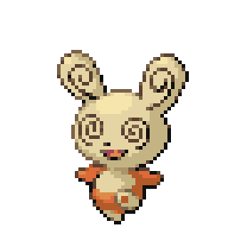

Para pintar la mancha respetando los límites del cuerpo, utiliza la siguiente macro en [`src/pokemon.c`](https://github.com/pret/pokeemerald/blob/master/src/pokemon.c#L5744-L5747). Aquí os explico línea por línea la magia detrás de la comprobación:

```c
// Draw spot pixel if this is Spinda's body color
void try_draw_spot_pixel(u8 *pixels, int shift) 
{
    if (((*(pixels) & (0xF << (shift))) >= (FIRST_SPOT_COLOR << (shift))) 
     && ((*(pixels) & (0xF << (shift))) <= (LAST_SPOT_COLOR << (shift)))) 
    { 
        *(pixels) += (SPOT_COLOR_ADJUSTMENT << (shift)); 
    }
}
```

* `if (((*(pixels) & (0xF << (shift))) >= (FIRST_SPOT_COLOR << (shift)))`: Esta línea mira el valor del color actual del píxel en la RAM y comprueba si es "mayor o igual" al color más claro de la paleta que corresponde al cuerpo de Spinda (`FIRST_SPOT_COLOR`). La variable `shift` se utiliza porque los píxeles en GBA (que son de 4 bits por píxel) a veces están agrupados de dos en dos en un mismo byte.
* `&& ((*(pixels) & (0xF << (shift))) <= (LAST_SPOT_COLOR << (shift))))`: Y además, comprueba si es "menor o igual" al color más oscuro del cuerpo de Spinda (`LAST_SPOT_COLOR`). Esto garantiza al 100% que el píxel que vamos a pintar pertenece exclusivamente a la piel de Spinda, y no a sus ojos o contornos negros.
* `*(pixels) += (SPOT_COLOR_ADJUSTMENT << (shift));`: Si se cumplen las condiciones de arriba, entra en la instrucción final, donde al color del píxel se le suma un ajuste matemático (`SPOT_COLOR_ADJUSTMENT`) en la paleta, transformándolo mágicamente al color rojizo de la mancha.

Para asegurarme de que lo había entendido bien, estuve haciendo algunas pruebas. Decidí alterar la ROM original, borrando justamente esa misma comprobación condicional para obligar al juego a dibujar las manchas ignorando los límites del cuerpo:

```diff
 // Draw spot pixel if this is Spinda's body color
 void try_draw_spot_pixel(u8 *pixels, int shift) 
 {
-    if (((*(pixels) & (0xF << (shift))) >= (FIRST_SPOT_COLOR << (shift))) 
-     && ((*(pixels) & (0xF << (shift))) <= (LAST_SPOT_COLOR << (shift)))) 
-    { 
         *(pixels) += (SPOT_COLOR_ADJUSTMENT << (shift)); 
     }
 }
```

Recompilé el juego modificado, y como podéis observar en esta captura final tomada de mi consola original :), las manchas ahora flotan libremente sobre el fondo y se pintan por encima de los ojos o los bordes negros porque ya no están limitadas a dibujarse sólo sobre el color principal del cuerpo:

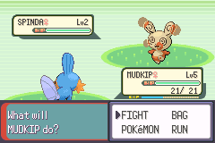

## La solución en Pokémon Essentials (RPG Maker)

Saltamos al mundo del fangame clásico. En Pokémon Essentials (basado en Ruby y RPG Maker), la solución es mucho más tosca porque el motor no está pensado para esto. Analizamos el código que está contenido en [001_FormHandlers.rb#L41-L140](https://github.com/Maruno17/pokemon-essentials/blob/master/Data/Scripts/014_Pokemon/001_Pokemon-related/001_FormHandlers.rb#L41-L140).

En vez de tocar memoria directamente, tienen matrices bidimensionales en código que dibujan las manchas usando la función `set_pixel` del motor, píxel a píxel, por software. Lo han de multiplicar por 2 por como funciona RPG Maker XP.

```rb
def drawSpot(bitmap, spotpattern, x, y, red, green, blue)
  height = spotpattern.length
  width  = spotpattern[0].length
  height.times do |yy|
    spot = spotpattern[yy]
    width.times do |xx|
      next if spot[xx] != 1
      xOrg = (x + xx) * 2
      yOrg = (y + yy) * 2
      color = bitmap.get_pixel(xOrg, yOrg)
      r = color.red + red
      g = color.green + green
      b = color.blue + blue
      color.red   = [[r, 0].max, 255].min
      color.green = [[g, 0].max, 255].min
      color.blue  = [[b, 0].max, 255].min
      bitmap.set_pixel(xOrg, yOrg, color)
      bitmap.set_pixel(xOrg + 1, yOrg, color)
      bitmap.set_pixel(xOrg, yOrg + 1, color)
      bitmap.set_pixel(xOrg + 1, yOrg + 1, color)
    end
  end
end

def pbSpindaSpots(pkmn, bitmap)
  # NOTE: These spots are doubled in size when drawing them.
  spot1 = [
    [0, 0, 1, 1, 1, 1, 0, 0],
    [0, 1, 1, 1, 1, 1, 1, 0],
    [1, 1, 1, 1, 1, 1, 1, 1],
    [1, 1, 1, 1, 1, 1, 1, 1],
    [1, 1, 1, 1, 1, 1, 1, 1],
    [1, 1, 1, 1, 1, 1, 1, 1],
    [1, 1, 1, 1, 1, 1, 1, 1],
    [0, 1, 1, 1, 1, 1, 1, 0],
    [0, 0, 1, 1, 1, 1, 0, 0]
  ]
  spot2 = [
    [0, 0, 1, 1, 1, 0, 0],
    [0, 1, 1, 1, 1, 1, 0],
    [1, 1, 1, 1, 1, 1, 1],
    [1, 1, 1, 1, 1, 1, 1],
    [1, 1, 1, 1, 1, 1, 1],
    [1, 1, 1, 1, 1, 1, 1],
    [1, 1, 1, 1, 1, 1, 1],
    [0, 1, 1, 1, 1, 1, 0],
    [0, 0, 1, 1, 1, 0, 0]
  ]
  spot3 = [
    [0, 0, 0, 0, 0, 1, 1, 1, 1, 0, 0, 0, 0],
    [0, 0, 0, 1, 1, 1, 1, 1, 1, 1, 0, 0, 0],
    [0, 0, 1, 1, 1, 1, 1, 1, 1, 1, 1, 0, 0],
    [0, 1, 1, 1, 1, 1, 1, 1, 1, 1, 1, 1, 0],
    [0, 1, 1, 1, 1, 1, 1, 1, 1, 1, 1, 1, 0],
    [1, 1, 1, 1, 1, 1, 1, 1, 1, 1, 1, 1, 1],
    [1, 1, 1, 1, 1, 1, 1, 1, 1, 1, 1, 1, 1],
    [1, 1, 1, 1, 1, 1, 1, 1, 1, 1, 1, 1, 1],
    [0, 1, 1, 1, 1, 1, 1, 1, 1, 1, 1, 1, 0],
    [0, 1, 1, 1, 1, 1, 1, 1, 1, 1, 1, 1, 0],
    [0, 0, 1, 1, 1, 1, 1, 1, 1, 1, 1, 0, 0],
    [0, 0, 0, 1, 1, 1, 1, 1, 1, 1, 0, 0, 0],
    [0, 0, 0, 0, 0, 1, 1, 1, 0, 0, 0, 0, 0]
  ]
  spot4 = [
    [0, 0, 0, 0, 1, 1, 1, 0, 0, 0, 0, 0],
    [0, 0, 1, 1, 1, 1, 1, 1, 1, 0, 0, 0],
    [0, 1, 1, 1, 1, 1, 1, 1, 1, 1, 0, 0],
    [0, 1, 1, 1, 1, 1, 1, 1, 1, 1, 1, 0],
    [1, 1, 1, 1, 1, 1, 1, 1, 1, 1, 1, 0],
    [1, 1, 1, 1, 1, 1, 1, 1, 1, 1, 1, 1],
    [1, 1, 1, 1, 1, 1, 1, 1, 1, 1, 1, 1],
    [1, 1, 1, 1, 1, 1, 1, 1, 1, 1, 1, 1],
    [1, 1, 1, 1, 1, 1, 1, 1, 1, 1, 1, 0],
    [0, 1, 1, 1, 1, 1, 1, 1, 1, 1, 1, 0],
    [0, 0, 1, 1, 1, 1, 1, 1, 1, 1, 0, 0],
    [0, 0, 0, 0, 1, 1, 1, 1, 1, 0, 0, 0]
  ]
  id = pkmn.personalID
  h = (id >> 28) & 15
  g = (id >> 24) & 15
  f = (id >> 20) & 15
  e = (id >> 16) & 15
  d = (id >> 12) & 15
  c = (id >> 8) & 15
  b = (id >> 4) & 15
  a = (id) & 15
  # NOTE: The coordinates below (b + 33, a + 25 and so on) are doubled when
  #       drawing the spot.
  if pkmn.shiny?
    drawSpot(bitmap, spot1, b + 33, a + 25, -75, -10, -150)
    drawSpot(bitmap, spot2, d + 21, c + 24, -75, -10, -150)
    drawSpot(bitmap, spot3, f + 39, e + 7, -75, -10, -150)
    drawSpot(bitmap, spot4, h + 15, g + 6, -75, -10, -150)
  else
    drawSpot(bitmap, spot1, b + 33, a + 25, 0, -115, -75)
    drawSpot(bitmap, spot2, d + 21, c + 24, 0, -115, -75)
    drawSpot(bitmap, spot3, f + 39, e + 7, 0, -115, -75)
    drawSpot(bitmap, spot4, h + 15, g + 6, 0, -115, -75)
  end
end
```

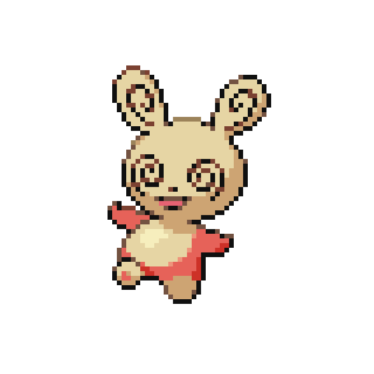
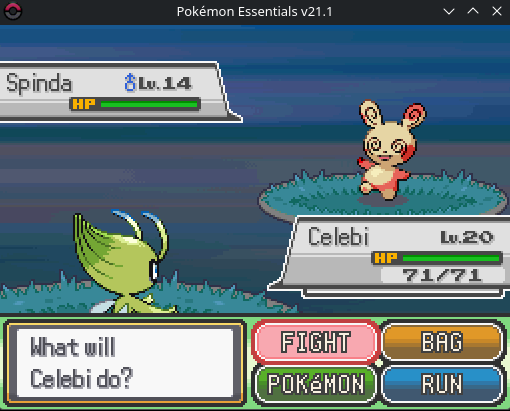

Funciona bien para imágenes estáticas, pero es terriblemente ineficiente. El gran problema llega cuando intentas animar el sprite. Si Spinda mueve la cabeza, las manchas se quedan flotando en el sitio porque se pintan sobre coordenadas estáticas.

## Deluxe Battle Kit al rescate (Essentials)

Para solucionar este problema de la animación dentro del mismo motor de Essentials, el plugin Deluxe Battle Kit usa una aproximación bastante ingeniosa, aunque poco óptima.

El código escanea el sprite en tiempo de ejecución frame a frame, buscando el color exacto de la boca de Spinda `(230, 99, 115)`. Mide cuántos píxeles se ha movido la boca horizontal y verticalmente desde el frame anterior y le aplica esa diferencia a las coordenadas de las manchas. Muy inteligente para anclar las manchas a la cara, pero hacer escaneo de píxeles por CPU constantemente no es lo mejor para el rendimiento. Para no hacer el post demasiado largo y complejo, voy a omitir el código de esta sección, es algo complejo.


## YAPU (Unity)

YAPU (Yet Another Pokémon Unity) introduce un cambio de paradigma gigante, ya que trabaja en Unity y utiliza shaders en la GPU. Además, las animaciones aquí son secuencias de 52 frames donde la cabeza rota y cambia de perspectiva, por lo que un desplazamiento estático se descuadraría enseguida.

Para solucionarlo, el desarrollador de YAPU creó una herramienta externa en C# que precalcula una textura enorme de datos (Data Texture o LUT). Esta imagen no es para verla, sino que almacena datos matemáticos en sus colores. Curiosamente, esta es la misma técnica que utilizo en [Elit3D](/projects/elit3d/) para enviar en una imagen los datos de los tiles de cada capa y que la GPU pueda procesar rápidamente.

En el caso de YAPU, la imagen tiene 52x4 píxeles (52 frames y 4 manchas). En los canales rojo y verde de cada píxel, guarda la coordenada base exacta donde debe ir anclada cada mancha en ese frame específico. Luego, el Shader Graph de Unity simplemente lee esos colores, le suma el desplazamiento aleatorio del PID, y dibuja la mancha. Súper rápido de ejecutar, pero muy complejo y rígido a la hora de mantener si decides cambiar un fotograma de la animación.

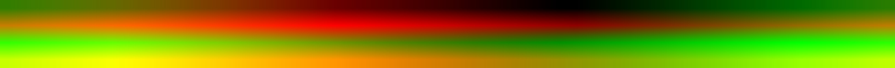
> Poner a punto YAPU es algo complejo porque pide los assets que no están públicos y varios plugins de pago que no tengo. Todo el análisis lo he hecho sin poder comprobarlo y el LUT lo he generado con un script que replica pero no es el mismo.
## Cómo lo he hecho en Godosters (Godot 4)

Después de analizar todo esto, me tocó pensar cómo hacerlo en mi proyecto. Quería algo intermedio: huir del escaneo por CPU del Battle Kit y evitar la complejidad de la herramienta externa de datos de YAPU.

Por suerte, Godot 4 es increíble con los shaders. Son muy parecidos a glsl, simples de hacer, me gustan mucho. Mi solución actual es un enfoque híbrido:

1. Utilizo las matrices de Essentials en código GDScript, pero en lugar de dibujar en pantalla con `set_pixel`, las convierto una sola vez en una `ImageTexture` en memoria (creando una máscara que le paso a la GPU).
2. El script en GDScript calcula las matemáticas del PID (los desplazamientos) y se los pasa como parámetros (`uniforms`) al shader.
3. El Fragment Shader se encarga de todo lo demás. Revisa si el píxel actual cae dentro de la máscara de la mancha y le aplica el tintado matemático de color. 

Vamos paso por paso. Primero el script:

Para implementar esto en mi proyecto, opté por un sistema híbrido que toma lo mejor de ambos mundos: la facilidad de uso de las matrices de Essentials y el altísimo rendimiento de los shaders.

He creado una clase `SpindaAppearanceModifier` que hereda de nuestro sistema base de modificadores visuales. Esta clase cuenta con una función principal, `apply()`, que recibe la instancia del Pokémon y el sprite que se va a renderizar.

La estrategia es la siguiente:
1. **Definir los patrones**: Reutilizo las mismas matrices binarias de Essentials para dar forma a las manchas.
2. **Crear máscaras eficientes**: En lugar de dibujar la mancha píxel a píxel en la CPU, convierto esas matrices en una textura (`ImageTexture`) utilizando un `PackedByteArray`. Esta es una técnica súper optimizada en Godot que permite construir la imagen de golpe, evitando iteraciones lentas.
3. **Colores precisos**: Extraje los colores exactos del sprite original (tanto para la luz como para la sombra). El script asigna los colores normales por defecto y los reemplaza solo si el Pokémon es shiny, manteniendo un código muy limpio.
4. **Calcular coordenadas**: Usando el PID, leemos grupos de 4 bits para extraer el desplazamiento de cada mancha (entre 0 y 15 píxeles), imitando exactamente las matemáticas de la GBA.
5. **Enviar al Shader**: Por último, creamos una instancia única del material (para evitar que distintos Spindas compartan las mismas posiciones) y pasamos todas estas variables al shader.

```gd
class_name SpindaAppearanceModifier

extends AppearanceModifier

const SPOT1: Array = [ # Bottom-Right
	[0, 0, 1, 1, 1, 1, 0, 0],
	[0, 1, 1, 1, 1, 1, 1, 0],
	[1, 1, 1, 1, 1, 1, 1, 1],
	[1, 1, 1, 1, 1, 1, 1, 1],
	[1, 1, 1, 1, 1, 1, 1, 1],
	[1, 1, 1, 1, 1, 1, 1, 1],
	[1, 1, 1, 1, 1, 1, 1, 1],
	[0, 1, 1, 1, 1, 1, 1, 0],
	[0, 0, 1, 1, 1, 1, 0, 0],
]
const SPOT2: Array = [ # Bottom-Left
	[0, 0, 1, 1, 1, 0, 0],
	[0, 1, 1, 1, 1, 1, 0],
	[1, 1, 1, 1, 1, 1, 1],
	[1, 1, 1, 1, 1, 1, 1],
	[1, 1, 1, 1, 1, 1, 1],
	[1, 1, 1, 1, 1, 1, 1],
	[1, 1, 1, 1, 1, 1, 1],
	[0, 1, 1, 1, 1, 1, 0],
	[0, 0, 1, 1, 1, 0, 0],
]
const SPOT3: Array = [ # Top-Right
	[0, 0, 0, 0, 0, 1, 1, 1, 1, 0, 0, 0, 0],
	[0, 0, 0, 1, 1, 1, 1, 1, 1, 1, 0, 0, 0],
	[0, 0, 1, 1, 1, 1, 1, 1, 1, 1, 1, 0, 0],
	[0, 1, 1, 1, 1, 1, 1, 1, 1, 1, 1, 1, 0],
	[0, 1, 1, 1, 1, 1, 1, 1, 1, 1, 1, 1, 0],
	[1, 1, 1, 1, 1, 1, 1, 1, 1, 1, 1, 1, 1],
	[1, 1, 1, 1, 1, 1, 1, 1, 1, 1, 1, 1, 1],
	[1, 1, 1, 1, 1, 1, 1, 1, 1, 1, 1, 1, 1],
	[0, 1, 1, 1, 1, 1, 1, 1, 1, 1, 1, 1, 0],
	[0, 1, 1, 1, 1, 1, 1, 1, 1, 1, 1, 1, 0],
	[0, 0, 1, 1, 1, 1, 1, 1, 1, 1, 1, 0, 0],
	[0, 0, 0, 1, 1, 1, 1, 1, 1, 1, 0, 0, 0],
	[0, 0, 0, 0, 0, 1, 1, 1, 0, 0, 0, 0, 0],
]
const SPOT4: Array = [ # Top-Left
	[0, 0, 0, 0, 1, 1, 1, 0, 0, 0, 0, 0],
	[0, 0, 1, 1, 1, 1, 1, 1, 1, 0, 0, 0],
	[0, 1, 1, 1, 1, 1, 1, 1, 1, 1, 0, 0],
	[0, 1, 1, 1, 1, 1, 1, 1, 1, 1, 1, 0],
	[1, 1, 1, 1, 1, 1, 1, 1, 1, 1, 1, 0],
	[1, 1, 1, 1, 1, 1, 1, 1, 1, 1, 1, 1],
	[1, 1, 1, 1, 1, 1, 1, 1, 1, 1, 1, 1],
	[1, 1, 1, 1, 1, 1, 1, 1, 1, 1, 1, 1],
	[1, 1, 1, 1, 1, 1, 1, 1, 1, 1, 1, 0],
	[0, 1, 1, 1, 1, 1, 1, 1, 1, 1, 1, 0],
	[0, 0, 1, 1, 1, 1, 1, 1, 1, 1, 0, 0],
	[0, 0, 0, 0, 1, 1, 1, 1, 1, 0, 0, 0],
]

static var _masks: Array[ImageTexture]

@export var shader: Shader = preload("uid://ck1uhn0oiwgaa")

@export var spot1_base := Vector2(38, 34)
@export var spot2_base := Vector2(26, 33)
@export var spot3_base := Vector2(45, 14)
@export var spot4_base := Vector2(21, 14)

@export var debug_mode: bool = false
@export_group("Colors")
@export var spot_color_normal := Color(238.0 / 255.0, 82.0 / 255.0, 74.0 / 255.0)
@export var spot_shade_color_normal := Color(189.0 / 255.0, 74.0 / 255.0, 49.0 / 255.0)
@export var body_color_normal := Color(230.0 / 255.0, 213.0 / 255.0, 164.0 / 255.0)
@export var body_shade_color_normal := Color(205.0 / 255.0, 164.0 / 255.0, 115.0 / 255.0)

@export var spot_color_shiny := Color(164.0 / 255.0, 205.0 / 255.0, 16.0 / 255.0)
@export var spot_shade_color_shiny := Color(130.0 / 255.0, 170.0 / 255.0, 10.0 / 255.0)
@export var body_color_shiny := Color(184.0 / 255.0, 216.0 / 255.0, 168.0 / 255.0)
@export var body_shade_color_shiny := Color(128.0 / 255.0, 184.0 / 255.0, 112.0 / 255.0)


func apply(monster: Monster, sprite: CanvasItem, context: AppearanceModifier.SpriteContext) -> void:
	# Spots only make sense on the front-facing art.
	if context != AppearanceModifier.SpriteContext.FRONT:
		return

	var id := monster.pid._get_id()
	var x4 := (id) & 15
	var y4 := (id >> 4) & 15
	var x3 := (id >> 8) & 15
	var y3 := (id >> 12) & 15
	var x2 := (id >> 16) & 15
	var y2 := (id >> 20) & 15
	var x1 := (id >> 24) & 15
	var y1 := (id >> 28) & 15

	var masks := _get_masks()
	var mat := ShaderMaterial.new()
	mat.shader = shader

	mat.set_shader_parameter("spot1_tex", masks[0])
	mat.set_shader_parameter("spot2_tex", masks[1])
	mat.set_shader_parameter("spot3_tex", masks[2])
	mat.set_shader_parameter("spot4_tex", masks[3])

	mat.set_shader_parameter("spot1_offset", (spot1_base + Vector2(x1, y1)))
	mat.set_shader_parameter("spot2_offset", (spot2_base + Vector2(x2, y2)))
	mat.set_shader_parameter("spot3_offset", (spot3_base + Vector2(x3, y3)))
	mat.set_shader_parameter("spot4_offset", (spot4_base + Vector2(x4, y4)))

	var spot_color := spot_color_normal
	var spot_shade_color := spot_shade_color_normal
	var body_color := body_color_normal
	var body_shade_color := body_shade_color_normal
	
	if monster.is_shiny:
		spot_color = spot_color_shiny
		spot_shade_color = spot_shade_color_shiny
		body_color = body_color_shiny
		body_shade_color = body_shade_color_shiny
	
	var delta := Vector3(
		spot_color.r - body_color.r,
		spot_color.g - body_color.g,
		spot_color.b - body_color.b
	)
	var shade_delta := Vector3(
		spot_shade_color.r - body_shade_color.r,
		spot_shade_color.g - body_shade_color.g,
		spot_shade_color.b - body_shade_color.b
	)
		
	mat.set_shader_parameter("color_delta", delta)
	mat.set_shader_parameter("shade_delta", shade_delta)
	mat.set_shader_parameter("body_color", Vector3(body_color.r, body_color.g, body_color.b))
	mat.set_shader_parameter("body_shade_color", Vector3(body_shade_color.r, body_shade_color.g, body_shade_color.b))
	mat.set_shader_parameter("debug_mode", debug_mode)

	sprite.material = mat


static func _get_masks() -> Array[ImageTexture]:
	if _masks.is_empty():
		_masks.resize(4)
		_masks[0] = _make_mask(SPOT1)
		_masks[1] = _make_mask(SPOT2)
		_masks[2] = _make_mask(SPOT3)
		_masks[3] = _make_mask(SPOT4)
	return _masks


static func _make_mask(pattern: Array) -> ImageTexture:
	var height := pattern.size()
	var width: int = pattern[0].size()
	
	var data := PackedByteArray()
	data.resize(width * height)
	
	var i := 0
	for y in height:
		for x in width:
			data[i] = pattern[y][x] * 255
			i += 1
			
	var img := Image.create_from_data(width, height, false, Image.FORMAT_L8, data)
	return ImageTexture.create_from_image(img)
```

Ahora vamos al shader. El shader recibe todos los datos y únicamente modifica el `fragment`. Primero lee el color del píxel de la textura de Spinda y comprueba que no sea transparente. Si no lo es, evalúa cada una de las cuatro manchas. Por cada mancha, revisa que la coordenada caiga dentro de su área correspondiente y, acto seguido, lee el valor exacto de esa máscara para saber si ahí toca dibujar.

Si toca mancha, el shader no la pinta a lo bruto. Primero compara el color original del píxel con los tonos de piel crema de Spinda. Usando una mezcla matemática inteligente, decide qué hacer: si el píxel es piel, lo tiñe de rojo al 100% respetando perfectamente si estaba iluminado o en la sombra. Pero si el píxel forma parte de un rasgo facial, como las líneas oscuras de los ojos o la boca, lo deja intacto. De esta forma logramos que las manchas se integren con un suavizado perfecto sobre el cuerpo sin borrarle la cara al Pokémon.
```glsl
shader_type canvas_item;

uniform sampler2D spot1_tex : filter_nearest, repeat_disable;
uniform sampler2D spot2_tex : filter_nearest, repeat_disable;
uniform sampler2D spot3_tex : filter_nearest, repeat_disable;
uniform sampler2D spot4_tex : filter_nearest, repeat_disable;

uniform vec2 spot1_offset = vec2(0.0);
uniform vec2 spot2_offset = vec2(0.0);
uniform vec2 spot3_offset = vec2(0.0);
uniform vec2 spot4_offset = vec2(0.0);

uniform vec3 color_delta = vec3(0.0);
uniform vec3 shade_delta = vec3(0.0);
uniform vec3 body_color = vec3(0.878, 0.815, 0.627);
uniform vec3 body_shade_color = vec3(0.784, 0.690, 0.501);
uniform float color_tolerance = 0.2;
uniform bool debug_mode = false;


vec3 apply_spot(vec3 col, sampler2D mask, vec2 px, vec2 offset) {
	vec2 rel = px - offset;
	if (rel.x < 0.0 || rel.y < 0.0) {
		return col;
	}
	ivec2 idx = ivec2(rel);
	ivec2 size = textureSize(mask, 0);
	if (idx.x >= size.x || idx.y >= size.y) {
		return col;
	}
	if (texelFetch(mask, idx, 0).r > 0.5) {
		if (debug_mode) {
			col = clamp(col + color_delta, vec3(0.0), vec3(1.0));
		} else {
			float dist_base = distance(col, body_color);
			float dist_shade = distance(col, body_shade_color);
			
			float blend_base = 1.0 - smoothstep(color_tolerance * 0.5, color_tolerance, dist_base);
			float blend_shade = 1.0 - smoothstep(color_tolerance * 0.5, color_tolerance, dist_shade);
			
			if (blend_base > 0.0 || blend_shade > 0.0) {
				if (blend_base > blend_shade) {
					col = mix(col, clamp(col + color_delta, vec3(0.0), vec3(1.0)), blend_base);
				} else {
					col = mix(col, clamp(col + shade_delta, vec3(0.0), vec3(1.0)), blend_shade);
				}
			}
		}
	}
	return col;
}

void fragment() {
	COLOR = texture(TEXTURE, UV);
	if (COLOR.a != 0.0 || debug_mode) {	
		if (debug_mode && COLOR.a == 0.0) {
			COLOR = vec4(0.2, 0.2, 0.2, 0.3);
		}
		vec2 px = floor(UV / TEXTURE_PIXEL_SIZE);
		COLOR.rgb = apply_spot(COLOR.rgb, spot1_tex, px, spot1_offset);
		COLOR.rgb = apply_spot(COLOR.rgb, spot2_tex, px, spot2_offset);
		COLOR.rgb = apply_spot(COLOR.rgb, spot3_tex, px, spot3_offset);
		COLOR.rgb = apply_spot(COLOR.rgb, spot4_tex, px, spot4_offset);
	}
}

```

Es rapidísimo porque el trabajo pesado se ejecuta en paralelo en la tarjeta gráfica y soluciona el problema de base del pintado estático.
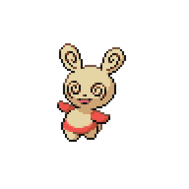

Creé una escena en Godot donde podía visualizar cada uno de los monstruos que hay en la base de datos. Hice un caso especial que si el Pokémon tenía dentro del array de `AppearanceModifiers`, añadiera unos controles para poder editar el origen de los puntos. De esta forma podía ver exactamente la posición de los puntos para comprobar os cambios que iba haciendo.
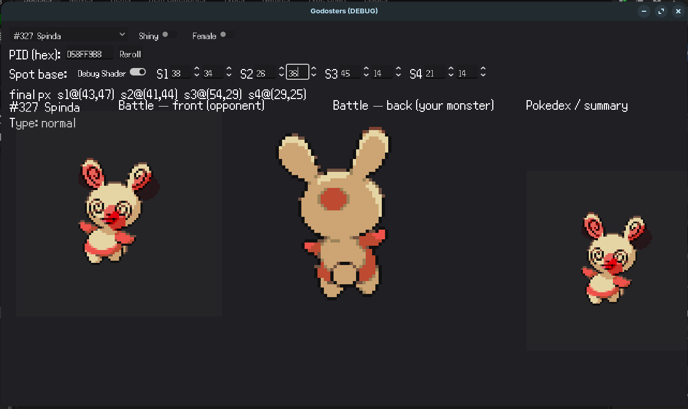

### El futuro: Animaciones Nativas en Godot

La verdad que con la solución actual estoy bastante contento, pero todavía hereda un problema: si añado un sprite animado, las manchas se van a quedar fijas igual que pasaba en Essentials.

Tampoco es que sea un experto, pero dándole vueltas, creo que la mejor solución posible es aprovechar la propia arquitectura de Godot y el nodo `AnimationPlayer`. Mi idea para el futuro es dividir el desplazamiento en dos partes dentro del shader:
* `spot1_base`: La posición original de la mancha en el cuerpo de Spinda.
* `spot1_pid_offset`: El desplazamiento aleatorio generado por el PID.

El script solo calculará el `pid_offset` una sola vez al instanciar al Pokémon. Para la animación, simplemente usaré el `AnimationPlayer` de Godot para crear una pista que mueva el valor del `spot1_base` frame a frame directamente desde la línea de tiempo del editor. Así, las manchas se moverán con la cabeza de forma nativa, todo por GPU y sin herramientas externas raras.

Incluso podría hacer un script que escanee los colores de la boca (como hace el Deluxe Battle Kit) dentro del editor, y que me genere automáticamente los keyframes del `AnimationPlayer` para no tener que hacerlo a mano fotograma a fotograma. Lo mejor de ambos mundos y con un rendimiento perfecto en el juego final.

Otra opción técnicamente impecable sería huir de los spritesheets y hacer las animaciones por partes con esqueletos 2D (como hacían en la Generación 5). De esta forma, la cabeza de Spinda sería un nodo independiente de Godot y el shader se aplicaría solo a esa pieza. Al animar y rotar la cabeza, las manchas girarían perfectamente clavadas a ella de forma nativa. Pero siendo sinceros, animar, trocear y riggear a casi mil bichos a mano es una auténtica ida de olla. Así que me quedaré con la animación por frames; aunque toque programar apaños, es infinitamente más rápido a nivel de producción porque los assets ya están todos listos en internet.

### ¿Y en los juegos actuales en 3D?

Aunque el 3D está totalmente *out of scope* para Godosters (no para los mapas, por eso nació Elit3D), es curioso pensar en cómo solucionó Game Freak este mismo problema a partir de Pokémon X e Y. Con modelos 3D, el problema simplemente desaparece: Spinda tiene una malla 3D asociada a un esqueleto. Las manchas se calculan pasando el PID al shader del material, que dibuja las manchas directamente sobre las UVs de la cabeza. Al moverse el esqueleto 3D en cualquier animación, la textura y las UVs se mueven con el modelo de forma 100% nativa.

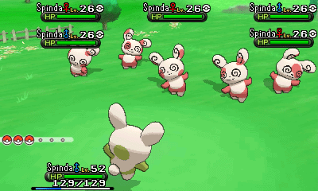

### El curioso caso de Pokémon Diamante Brillante y Perla Reluciente (ILCA)

Para cerrar, merece la pena mencionar el desastre que ocurrió con Spinda en los remakes de Diamante y Perla desarrollados por ILCA. 

Al replicar esta mecánica en Unity, el estudio cometió un error de *Endianness* (el orden de los bytes) al leer el PID. Como el resto de la saga usa *Little Endian* y ellos asumieron *Big Endian*, acabaron leyendo los 32 bits literalmente al revés. Por ejemplo, un valor hexadecimal del PID como `12 34 56 78` lo leían como `78 56 34 12`.

El resultado visual era catastrófico: el patrón de manchas generado en BDSP era completamente distinto al que ese mismo número produciría en cualquier otro juego. Esto provocó un choque crítico con *Pokémon HOME* (curiosamente también desarrollado por ILCA), que sí leía el PID correctamente. Si transferías un Spinda de un juego a otro, sus manchas se recolocaban mágicamente.

Como arreglar el bug a posteriori habría alterado los Spindas que los jugadores ya tenían en sus partidas, la solución fue drástica: **prohibieron por completo transferir a Spinda**. Hoy en día, cualquier Spinda capturado en BDSP está atrapado en ese juego para siempre por culpa de leer 4 bytes en el orden equivocado.

En la siguiente imagen (cortesía de @Atrius97) podéis ver la demostración: han generado dos Spindas con los bytes de su PID invertidos a propósito para comprobar cómo chocan las versiones generadas en Pokémon Esmeralda (correcto) frente a BDSP (error de lectura).

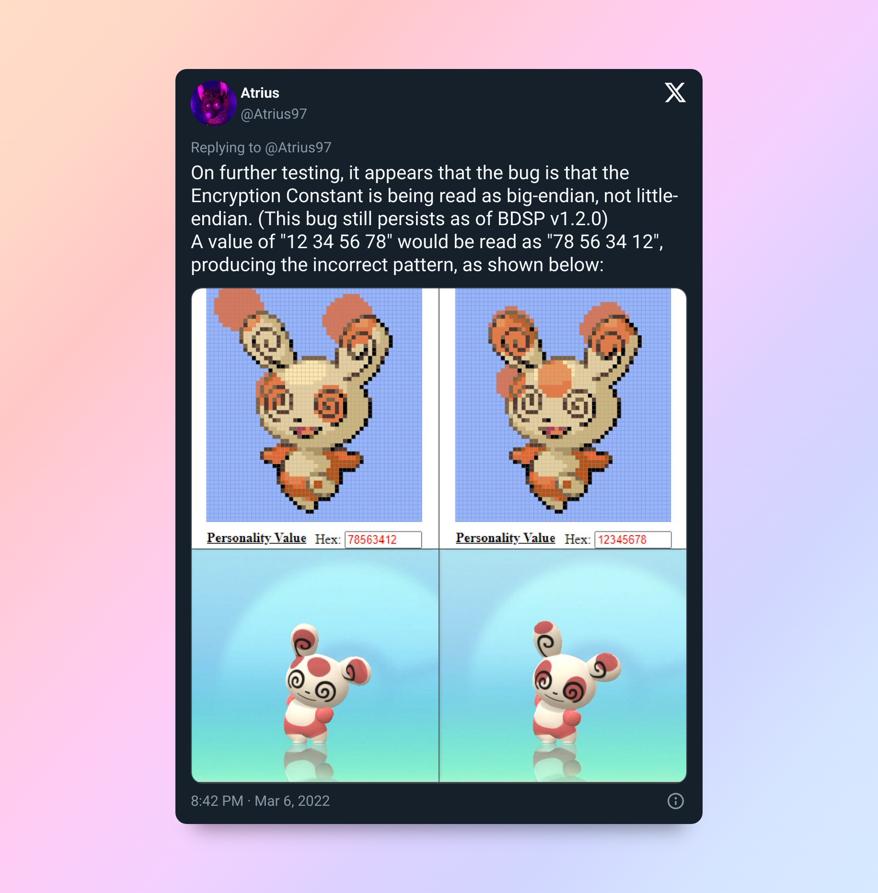

---

Por cierto, si os ha picado la curiosidad y queréis trastear con las manchas de Spinda sin tener que tocar código, os recomiendo echarle un ojo a [Spinda Painter](https://wokann.github.io/Tool/Spinda_Painter/Spinda%20Painter%201.3.2.htm). Es una herramienta web genial que te permite pintar y visualizar el patrón de cualquier Spinda sabiendo su PID y viceversa. Me ha servido bastante durante toda esta investigación para ir comprobando cosas.

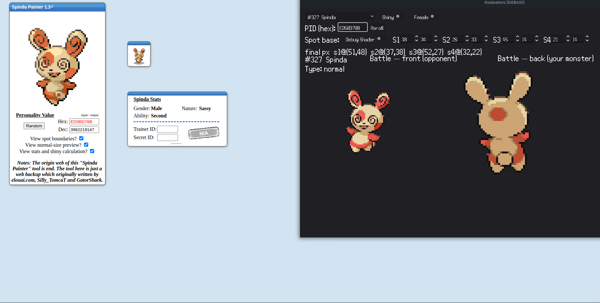
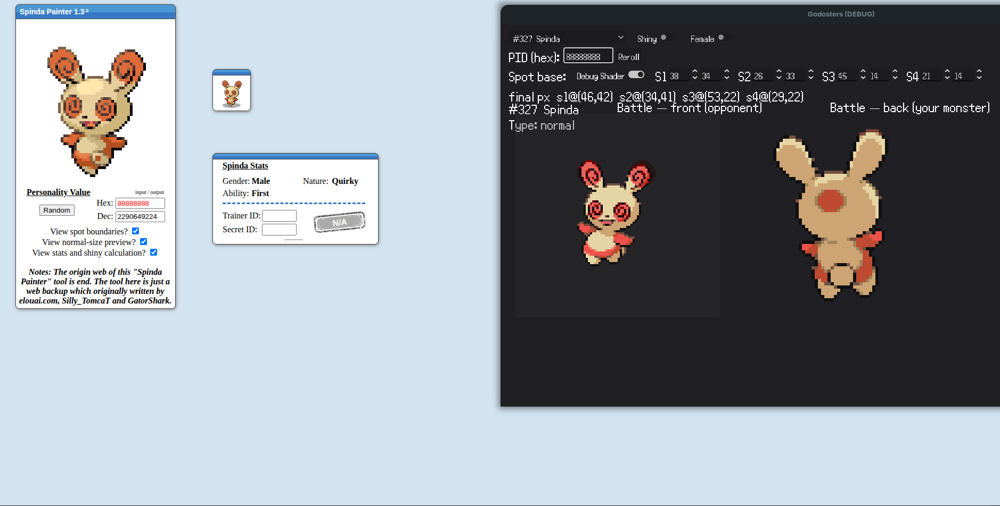

Y eso es todo por hoy. Ha sido un post un poco más denso de lo normal, pero me apetecía dejar documentada toda esta investigación porque me parece fascinante cómo la comunidad ha ido resolviendo este problema de diseño a lo largo de los años.

Cambiando un poco de tema, la verdad es que he estado trabajando bastante en Godosters últimamente y he avanzado un montón. Eso sí, el proyecto todavía es muy inestable por dentro y quiero asegurarme de que esté bien antes de publicarlo y enseñarlo oficialmente. Pronto os enseñaré en detalle los nuevos sistemas que he integrado y cuál es el panorama actual de todo esto.

Espero que os resulte útil. Dejar un like, un emoji o un comentario por ahí abajo se agradece un montón.

¡Hasta la próxima!