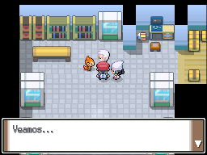
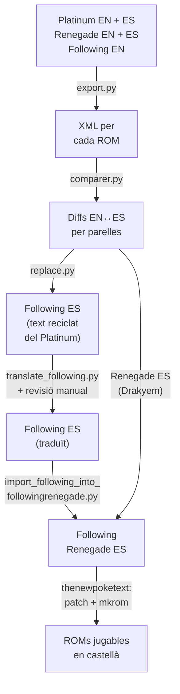
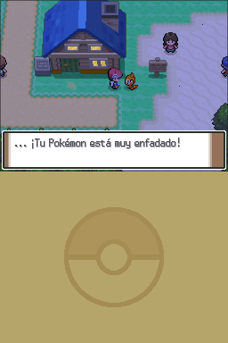
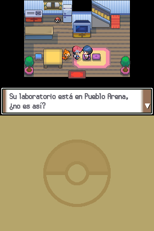
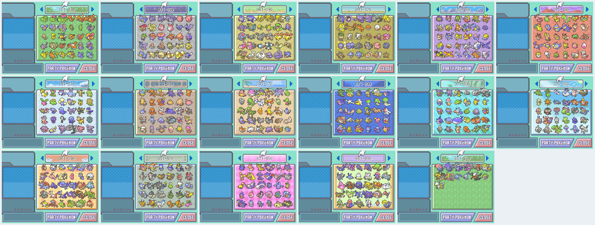
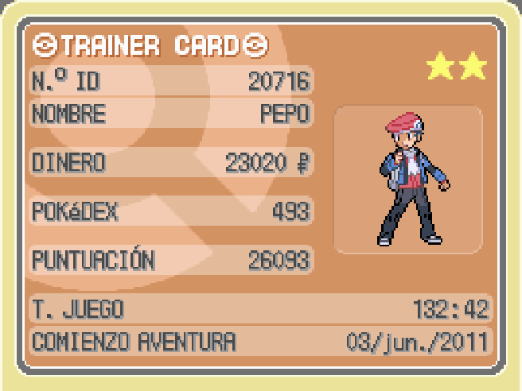
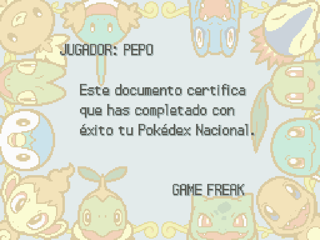

Anem a recuperar un projecte de fa uns quants anys del qual estic força orgullós.

## Com va començar tot

Em venia de gust jugar a la quarta generació de Pokémon, però volia que fos una mica diferent i amb mecàniques de qualitat de vida. Investigant vaig trobar Pokémon Renegade Platinum, una modificació de Pokémon Platí amb més dificultat i moltes més millores, feta per Drayano. També vaig trobar un projecte de dos espanyols, Mikelan98 i AdAstra, anomenat Pokémon Following Platinum, una modificació de Pokémon Platí que afegia la mecànica tan característica de Pokémon HeartGold i SoulSilver que els Pokémon et segueixen pel món. També afegia alguna millora com el tipus fada i una mica més. Finalment, hi havia algú que havia ajuntat els dos pedaços i havia fet un pedaç que incloïa els Pokémon que et segueixen al Renegade Platinum. Jo volia això. Hi havia un problema: estava en anglès i em feia molta mandra jugar-hi amb els atacs en anglès.

El Pokémon Renegade Platinum el va traduir Drakyem, va fer una feina excel·lent. D'altra banda, tot i que els que van fer el Pokémon Following Platinum són espanyols, el van treure únicament en anglès. Així que em vaig proposar traduir el Following Platinum i després combinar les dues traduccions al Pokémon Following Renegade Platinum, sense tenir ni idea de per on començar.

Vaig trobar un programa força antic i amagat que exportava tots els diàlegs d'una ROM. Després els podies editar i tornar-los a introduir al joc. Flux completat, podia començar. La meva idea era senzilla: extreure els diàlegs d'una ROM del Pokémon Platí en espanyol i anglès, fer coincidir tots els diàlegs, extreure els fitxers del Following Platinum i sobreescriure'ls amb els del joc original en espanyol, traduir els pocs diàlegs que tenia el Following Platinum i finalment, agafar els del Renegade Platinum en castellà, sobreescriure'ls al Following Renegade Platinum i afegir-hi els del Following Platinum. Això em donaria una ROM amb les traduccions de Drakyem i la meva. Mans a l'obra.

## El procés de traducció

Aquí és on volia arribar, amb els diàlegs ja en espanyol i el Pokémon seguint-me pel mapa:



Abans de res tocava muntar totes les ROMs que necessitaria: Pokémon Platí en anglès i espanyol, Pokémon Renegade Platinum en anglès i espanyol (pedaçades amb el hack de Drayano) i Pokémon Following Platinum, que només existia en anglès, així que en vaig fer una còpia per treballar-hi en espanyol. Tot això amb thenewpoketext, l'eina que exporta i importa els textos de les ROMs de Pokémon de DS. Vaig anar escrivint un script de Python per a cada pas del procés, així que explicaré què feia cadascun.

Amb tantes ROMs i scripts movent-se alhora, així és com encaixava tot el procés:



### Exportar i comparar els diàlegs

El primer pas era treure el text de dins les ROMs. `export.py` cridava thenewpoketext per bolcar els diàlegs de cada ROM a un XML, i de pas feia servir `msg_name_changer.py` per renombrar un parell d'arxius `.narc` de missatges que al Platí surten mal ordenats si no es toquen a mà. Em va costar força trobar aquesta informació en el seu moment.

Amb tot en XML, entrava `comparer.py`. Aquest script agafava parelles de ROMs (Platí anglès contra Platí espanyol, Renegade anglès contra Renegade espanyol, Following anglès contra Following Renegade anglès, etc.) i, recolzant-se en `xml_parser.py` per llegir cada XML a un diccionari, comparava diàleg a diàleg pel seu id. El resultat el desava en dos formats de JSON: un amb tots els canvis junts i un altre separat en tres blocs, els textos que canvien entre les dues ROMs, els que falten a la primera i els que falten a la segona. Aquesta comparació és la base de tot el projecte: em permetia saber exactament quin diàleg en anglès corresponia a quin diàleg en espanyol, i quins diàlegs eren nous i no existien al joc original.

Així és, més o menys, la part que fa el repartiment en aquests tres blocs:

```python
def compare_files_split(files_dict1, files_dict2):
    result = {
        "changed": {},
        "missing_in_1": {},
        "missing_in_2": {}
    }

    for file_id, texts_dict1 in files_dict1.items():
        if file_id not in files_dict2:
            for text_id, text1 in texts_dict1.items():
                result["missing_in_2"].setdefault(file_id, {})[text_id] = {
                    "text1": text1,
                    "text2": None
                }
            continue

        texts_dict2 = files_dict2[file_id]

        for text_id, text1 in texts_dict1.items():
            if text_id not in texts_dict2:
                result["missing_in_2"].setdefault(file_id, {})[text_id] = {
                    "text1": text1,
                    "text2": None
                }
                continue

            text2 = texts_dict2[text_id]
            if text1 != text2:
                result["changed"].setdefault(file_id, {})[text_id] = {
                    "text1": text1,
                    "text2": text2
                }

    # ... i el mateix bucle a la inversa per omplir "missing_in_1"

    return result
```

També vaig fer un parell d'scripts de suport per revisar tot això a ull: `export_csv.py`, que bolca tots els XML a una única taula en CSV amb una columna per ROM per poder comparar ràpid, i `check_max_newline.py`, que recorre els diàlegs originals per calcular quants caràcters caben en una línia del quadre de text abans que el joc hi posi un salt de línia automàtic.

### Reaprofitar la traducció de Pokémon Platí

Amb la comparació feta, `replace.py` agafava els textos en anglès de Following Platinum i Following Renegade Platinum i, allà on coincidien amb un diàleg del Platí o Renegade Platinum original, els substituïa pel seu equivalent en espanyol. El resultat era una ROM gairebé completament en espanyol, tret dels diàlegs nous que Mikelan98 i AdAstra havien escrit per al Following Platinum, que no existien al joc original i per tant no tenien cap traducció amb què fer coincidència.

### Traduir el contingut nou del Following Platinum

Aquests diàlegs nous estaven pràcticament tots concentrats en un únic arxiu, el 724. No recordo si aleshores ja existia alguna IA com ChatGPT, m'imagino que sí però ni de lluny al nivell d'ara, així que tot això va ser força artesanal. La meva idea des del principi era escriure els scripts necessaris per traduir les dues ROMs sense haver-ho de fer tot a mà, així que vaig recórrer a la traducció automàtica de tota la vida: `translate_following.py` recorria aquell arxiu amb la llibreria `deep_translator`, que no és més que un embolcall en Python de traductors com Google Translate o MyMemory, i generava un CSV amb el text original i la seva traducció. Abans d'enviar cada text a traduir havia de substituir variables com el nom del jugador o d'un Pokémon per text de farciment, si no el traductor es menjava o deformava aquestes marques.

Així de senzill era el CSV que en sortia, amb l'id del diàleg dins l'arxiu 724, el text original i la traducció automàtica (la línia 5 és, de fet, la mateixa frase que surt en una de les captures de més avall):

```csv
id;original;translated
2;......\nYour Pokémon won’t look you in the eye.;...... Tu Pokémon no te mira a los ojos.
5;...Your Pokémon is so very angry!;... ¡Tu Pokémon está muy enfadado!
20;Your Pokémon is dancing with you!;¡Tu Pokémon está bailando contigo!
```

Aquell CSV el vaig repassar entrada per entrada a mà per polir la traducció automàtica, que per a diàlegs curts de videojoc s'equivocava força. Amb `import_translation_following.py` tornava a ficar aquell CSV ja revisat dins l'XML, desfent el farciment de les variables, retallant les línies massa llargues perquè no sortissin del quadre de text i traduint a mà un grapat de textos que quedaven fora de l'arxiu 724 i que no valia la pena automatitzar.

### Combinar Following Platinum amb Renegade Platinum

Amb el Following Platinum ja traduït, vaig passar al Following Renegade Platinum. Aquí no calia traduir res de nou: els diàlegs del Renegade Platinum ja estaven traduïts per Drakyem, i els del Following Platinum els acabava de traduir jo, només calia combinar-los. `import_following_into_followingrenegade.py` agafava la comparació entre Renegade Platinum anglès i Following Platinum anglès per saber exactament quins diàlegs afegia aquest últim, i per cadascun copiava la seva traducció ja feta des de l'XML del Following Platinum espanyol al del Following Renegade Platinum espanyol. El resultat era l'XML complet del Following Renegade Platinum en espanyol.

### Tornar a ficar-ho tot a la ROM

L'últim pas, per a les tres ROMs, era tornar a ficar l'XML traduït dins el joc amb thenewpoketext, pedaçant la ROM i reordenant altre cop aquells arxius `.narc` de missatges. Amb això ja tenia les ROMs jugables en espanyol. Pel camí vaig anar trobant algun bug curiós, com el diàleg de Regigigas trencat, que també vaig arreglar i vaig deixar documentat al mateix repositori.

Va quedar alguna cosa sense traduir, com els textos que van ficats dins d'imatges en comptes de diàlegs, per exemple el nom dels tipus de Pokémon en alguna pantalla, però són detalls menors que no afecten jugar al joc en espanyol.

Mirant els commits, tampoc vaig trigar tant. El primer és del 19 de febrer de 2023, el pedaç del Following Platinum el vaig publicar el 13 de març i el del Following Renegade Platinum va arribar tot just tres dies després, el 16 de març, perquè ja tenia tota la traducció feta i només calia combinar-la. No van ser tres setmanes seguides dedicant-hi tots els dies, hi va haver parades de diversos dies entre commits, però per a l'artesanal que era el procés, es va fer força ràpid.



## Classic Mode i ràtio de shiny

El repositori no es va quedar aturat el 2023. Més endavant vaig afegir variants del pedaç de Following Renegade Platinum sense tocar res del procés de traducció: unes "Classic", que reverteixen el canvi de tipus que introdueix Drayano al Renegade Platinum per a qui prefereixi els tipus originals de cada Pokémon, i unes altres que canvien la ràtio d'aparició de shiny a 1/4096 o 1/512 en comptes de l'1/8192 de base, combinables entre elles. Sincerament, la de la modificació de la ràtio de shiny no l'he sabut testejar bé, no tinc una manera fiable de comprovar la probabilitat real sense jugar milers d'hores o fer força bruta amb un emulador, així que la vaig publicar confiant en el canvi dels valors i sense poder-ho confirmar del tot.

## Com li ha anat

Més exemples del resultat final:




Comptant només les descàrregues de GitHub, sense comptar el formulari de Google ni les pàgines de tercers on ha acabat pujat, el pedaç de Following Platinum té més de 3700 descàrregues entre el pedaç i la ROM ja pedaçada, i el de Following Renegade Platinum gairebé 2900 comptant totes les seves variants (normal, Classic Mode i shiny). Més de 6500 descàrregues entre els dos, per a un projecte que vaig fer pensant únicament en mi mateix.

Estic content perquè molta gent ho ha gaudit, jo inclòs, els meus amics i la meva germana. En realitat l'ha descarregat més gent del que reflecteixen aquestes xifres, perquè ha acabat pujat en pàgines de tercers, on en alguns casos no han donat crèdits. Ho van arribar a jugar Xamork i Folagor, tot i que cap dels dos va donar crèdits i van publicar la descàrrega directa ells mateixos. Jo hi vaig jugar i me'l vaig passar amb un equip monotype psíquic.


No vaig posar la descàrrega directa de la ROM perquè em feia una mica de por i tinc molt d'apreci pel meu compte de GitHub. Igualment es pot descarregar el pedaç des del repositori o directament en [aquest formulari](https://forms.gle/YwseURAufk9wccrJ9).

He gaudit molt fent-ho i que més gent ho hagi gaudit. És un gra de sorra que he aportat a la comunitat d'aquesta franquícia que tant em va marcar de petit.

La meva germana se'l va passar al 100%, completant una Living Dex.





*A la targeta d'entrenadora posa que va començar l'aventura el 2011, però això és perquè no va canviar la data de la consola, els qui heu jugat a Animal Crossing ho entendreu.*

I fins aquí el post d'avui. Estic molt content que hi hagi gent, a part de mi, que gaudeixi del que faig. Fins la propera!
