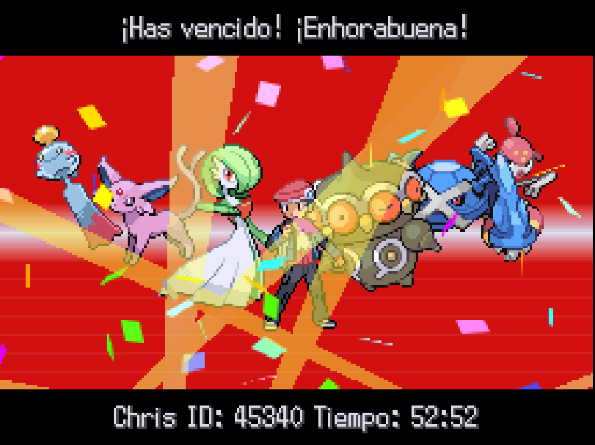

Vamos a recuperar un proyecto de hace varios años del que estoy bastante orgulloso.

Me apetecía jugar a la cuarta generación de Pokémon pero quería que fuera algo diferente y con mecánicas de calidad de vida. Investigando me encontré con Pokémon Renegade Platinum, una modificación de Pokémon Platino con más dificultad y muchas más mejoras, hecha por Drayano. También encontré un proyecto de dos españoles, Mikelan98 y AdAstra, llamado Pokémon Following Platinum, una modificación de Pokémon Platino que añadía la mecánica tan característica de Pokémon HeartGold y SoulSilver de que te siguen los Pokémon en el mundo. También añadía alguna mejora como el tipo hada y un poco más. Finalmente, había una persona que había juntado ambos parches y había hecho un parche que incluía los Pokémon que te siguen en el Renegade Platinum. Yo quería eso. Había un problema, estaba en inglés y me daba mucha pereza jugarlo con los ataques en inglés.

El Pokémon Renegade Platinum lo tradujo Drakyem, hizo un trabajo excelente. Por otro lado, aunque los que hicieron el Pokémon Following Platinum son españoles, lo sacaron únicamente en inglés. Así que me propuse traducir el Following Platinum y luego combinar ambas traducciones en el Pokémon Following Renegade Platinum, sin tener ni idea por dónde empezar. 

Encontré un programa bastante antiguo y escondido que recordaba absolutamente todos los diálogos de una ROM. Luego los podías editar y volver a introducir en el juego. Flujo completado, podía empezar. Mi idea era simple: extraer los diálogos de una ROM del Pokémon Platino en español e inglés, hacer el match de todos los diálogos, extraer los ficheros del Following Platinum y sobrescribirlos con los del juego original en español, traducir los pocos diálogos que tenía el Following Platinum y finalmente, coger los del Renegade Platinum en castellano, sobrescribirlos en el Following Renegade Platinum y añadir los del Following Platinum. Esto me daría una ROM con las traducciones de Drakyem y la mía. Manos a la obra.

## El proceso de traducción

Antes de nada tocaba montar todas las ROMs que iba a necesitar: Pokémon Platino en inglés y en español, Pokémon Renegade Platinum en inglés y en español (parcheadas con el hack de Drayano) y Pokémon Following Platinum, que solo existía en inglés, así que hice una copia para trabajar sobre ella en español. Todo esto con thenewpoketext, la herramienta que exporta e importa los textos de las ROMs de Pokémon de DS.

El primer paso fue exportar todos los diálogos de cada ROM a XML. Con eso ya tenía en texto plano tanto la versión en inglés como en español de Pokémon Platino, y podía comparar diálogo a diálogo para saber qué frase en inglés correspondía a qué frase en español. Esa comparación es la base de todo el proyecto: me permitía coger cualquier ROM basada en Platino y sustituir sus textos en inglés por los del Platino original en español, sin traducir nada a mano.

Con eso hecho, tocaba coger los textos de Following Platinum en inglés y, allá donde coincidían con un diálogo del Platino original, sustituirlos por su equivalente en español. El resultado era una ROM casi completamente en español, salvo los diálogos nuevos que Mikelan98 y AdAstra habían escrito para Following Platinum, que no existían en el juego original y por tanto no tenían ninguna traducción con la que hacer match.

Esos diálogos nuevos estaban prácticamente todos concentrados en un único archivo, el 724. Hice un script que recorría ese archivo y lo traducía automáticamente, generando un csv que después repasé entrada por entrada a mano para pulir la traducción. Los pocos textos que quedaban fuera de ese archivo los fui traduciendo manualmente aparte.

Con Following Platinum ya traducido, pasé a por Following Renegade Platinum. Aquí no hacía falta traducir nada nuevo: los diálogos de Renegade Platinum ya estaban traducidos por Drakyem, y los de Following Platinum los acababa de traducir yo, solo tenía que combinarlos. Comparando la ROM de Renegade Platinum en inglés con la de Following Platinum en inglés (que es Renegade Platinum con la mecánica de seguimiento añadida) pude sacar exactamente qué había cambiado uno respecto al otro. Con esa diferencia cogí el XML de Renegade Platinum ya traducido al español y le apliqué encima los cambios de Following Platinum, también en español. El resultado era el XML completo de Following Renegade Platinum en español.

El último paso, para las tres ROMs, era volver a meter el XML traducido dentro del juego con thenewpoketext, parcheando la ROM y reordenando un par de archivos narc de mensajes que la herramienta deja mal colocados al tratarse de Platino. Con eso ya tenía las ROMs jugables en español. Por el camino fui encontrando algún bug curioso, como el diálogo de Regigigas roto, que también arreglé y dejé documentado en el propio repositorio.



## Cómo le ha ido

Contando solo las descargas de GitHub, sin contar el formulario de Google ni las páginas de terceros donde ha acabado subido, el parche de Following Platinum tiene más de 3700 descargas entre el patch y la ROM ya parcheada, y el de Following Renegade Platinum casi 2900 contando todas sus variantes (normal, Classic Mode y shiny). Más de 6500 descargas entre los dos, para un proyecto que hice pensando únicamente en mí mismo.

- Contento porque lo ha disfrutado mucha gente, incluido yo, mis amigos y mi hermana.
- Realmente lo ha descargado más gente de lo que reflejan esas cifras, porque ha acabado subido en páginas de terceros, donde en algunos casos no han dado créditos.
- Lo llegó a jugar Xamork y Folagor, aunque no dieron créditos ninguno de los dos y publicaron la descarga directa ellos mismos.
- Lo jugué y me lo pasé con un equipo mono-tipo psíquico.

- No puse la descarga directa de la ROM porque me daba algo de miedo y le tengo mucho aprecio a mi cuenta de GitHub. Igualmente se puede descargar el parche desde el repositorio o directamente en este formulario https://forms.gle/YwseURAufk9wccrJ9

He disfrutado mucho de hacerlo y de que más gente lo haya disfrutado. Pero es un grano de arena que he aportado a la comunidad de esta franquicia que tanto me ha marcado de pequeño.

- https://whackahack.com/foro/threads/pokemon-following-renegade-platinum-espanol.68016/
- https://github.com/christt105/PokemonFollowingRenegadePlatinumTranslation
