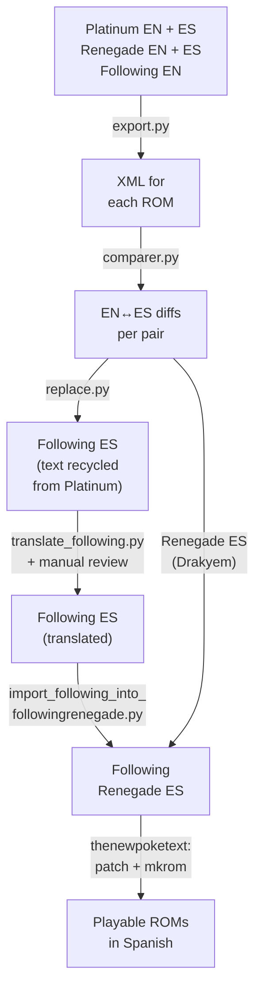

Let's bring back a project from several years ago that I'm quite proud of.

## How it all started

I felt like playing the fourth generation of Pokémon, but I wanted something different, with quality-of-life mechanics. While looking into it I found Pokémon Renegade Platinum, a Pokémon Platinum hack with more difficulty and lots of improvements, made by Drayano. I also found a project by two Spaniards, Mikelan98 and AdAstra, called Pokémon Following Platinum, a Pokémon Platinum hack that added the characteristic Pokémon HeartGold and SoulSilver mechanic of Pokémon following you around the overworld. It also added a few improvements, like the Fairy type and a bit more. Finally, there was someone who had merged both patches into one that included the following Pokémon in Renegade Platinum. That's what I wanted. There was a problem: it was in English, and I really didn't feel like playing it with the moves in English.

Pokémon Renegade Platinum was translated by Drakyem, who did an excellent job. On the other hand, even though the people behind Pokémon Following Platinum are Spanish, they only released it in English. So I set out to translate Following Platinum and then combine both translations into Pokémon Following Renegade Platinum, with no idea where to start.

I found a fairly old, obscure program that exported all the dialogue from a ROM. You could then edit it and load it back into the game. Workflow sorted, I could get started. My idea was simple: extract the dialogue from an English and a Spanish Pokémon Platinum ROM, match up all the dialogue, extract the Following Platinum files and overwrite them with the ones from the original Spanish game, translate the few dialogue lines that Following Platinum added, and finally take the Spanish Renegade Platinum lines, overwrite them into Following Renegade Platinum, and add the Following Platinum ones on top. That would give me a ROM with Drakyem's translation and mine. Time to get to work.

## The translation process

This is what I wanted to get to, with the dialogue already in Spanish and a Pokémon following me around the map:


Before anything else, I had to build all the ROMs I'd need: Pokémon Platinum in English and Spanish, Pokémon Renegade Platinum in English and Spanish (patched with Drayano's hack), and Pokémon Following Platinum, which only existed in English, so I made a copy to work on in Spanish. All of this with thenewpoketext, the tool that exports and imports text from Nintendo DS Pokémon ROMs. I wrote a Python script for each step of the process, so let me walk through what each one did.

With so many ROMs and scripts moving around at once, here's how the whole process fit together:



### Exporting and comparing the dialogue

The first step was pulling the text out of the ROMs. `export.py` called thenewpoketext to dump each ROM's dialogue into an XML file, and along the way used `msg_name_changer.py` to rename a couple of message `.narc` files that come out misordered in Platinum unless you fix them by hand. Finding that out in the first place took me a while.

With everything in XML, `comparer.py` came in. This script took pairs of ROMs (English Platinum vs. Spanish Platinum, English Renegade vs. Spanish Renegade, English Following vs. English Following Renegade, etc.) and, relying on `xml_parser.py` to read each XML into a dictionary, compared dialogue line by line by id. It saved the result in two JSON formats: one with all the changes together, and another split into three blocks — text that changes between the two ROMs, text missing from the first, and text missing from the second. This comparison is the backbone of the whole project: it let me know exactly which English line matched which Spanish line, and which lines were new and didn't exist in the original game.

This is, roughly, the part that splits things into those three blocks:

```python
def compare_files_split(files_dict1, files_dict2):
    result = {
        "changed": {},
        "missing_in_1": {},
        "missing_in_2": {}
    }

    for file_id, texts_dict1 in files_dict1.items():
        if file_id not in files_dict2:
            for text_id, text1 in texts_dict1.items():
                result["missing_in_2"].setdefault(file_id, {})[text_id] = {
                    "text1": text1,
                    "text2": None
                }
            continue

        texts_dict2 = files_dict2[file_id]

        for text_id, text1 in texts_dict1.items():
            if text_id not in texts_dict2:
                result["missing_in_2"].setdefault(file_id, {})[text_id] = {
                    "text1": text1,
                    "text2": None
                }
                continue

            text2 = texts_dict2[text_id]
            if text1 != text2:
                result["changed"].setdefault(file_id, {})[text_id] = {
                    "text1": text1,
                    "text2": text2
                }

    # ... and the same loop in reverse to fill in "missing_in_1"

    return result
```

I also wrote a couple of support scripts to eyeball all of this: `export_csv.py`, which dumps every XML into a single CSV table with one column per ROM so I could compare things quickly, and `check_max_newline.py`, which goes through the original dialogue to work out how many characters fit on a line of the text box before the game inserts an automatic line break.

### Reusing the Pokémon Platinum translation

With the comparison done, `replace.py` took the English text from Following Platinum and Following Renegade Platinum and, wherever it matched a line from the original Platinum or Renegade Platinum, swapped it for the Spanish equivalent. The result was a ROM almost entirely in Spanish, except for the new dialogue that Mikelan98 and AdAstra had written for Following Platinum, which didn't exist in the original game and so had no translation to match against.

### Translating the new Following Platinum content

Those new lines were almost all concentrated in a single file, 724. I don't remember whether an AI like ChatGPT already existed at the time — I imagine it did, but nowhere near today's level — so all of this was pretty handmade. My idea from the start was to write the scripts needed to translate both ROMs without having to do everything by hand, so I fell back on good old machine translation: `translate_following.py` went through that file with the `deep_translator` library, which is just a Python wrapper around translators like Google Translate or MyMemory, and produced a CSV with the original text and its translation. Before sending each line off to be translated I had to swap out variables like the player's name or a Pokémon's name for placeholder text, otherwise the translator would eat or mangle those tags.

This is roughly what the resulting CSV looked like, with the dialogue id inside file 724, the original text, and the machine translation (line 5 is, in fact, the same line that shows up in one of the screenshots further down):

```csv
id;original;translated
2;......\nYour Pokémon won’t look you in the eye.;...... Tu Pokémon no te mira a los ojos.
5;...Your Pokémon is so very angry!;... ¡Tu Pokémon está muy enfadado!
20;Your Pokémon is dancing with you!;¡Tu Pokémon está bailando contigo!
```

I went through that CSV entry by entry by hand to polish the machine translation, which got things wrong quite a bit for short video game lines. `import_translation_following.py` fed that reviewed CSV back into the XML, undoing the variable placeholders, trimming lines that were too long to fit the text box, and hand-translating a handful of texts that fell outside file 724 and weren't worth automating.

### Merging Following Platinum with Renegade Platinum

With Following Platinum translated, I moved on to Following Renegade Platinum. There was nothing new to translate here: Renegade Platinum's dialogue was already translated by Drakyem, and Following Platinum's had just been translated by me — I just had to merge them. `import_following_into_followingrenegade.py` used the comparison between English Renegade Platinum and English Following Platinum to know exactly which lines the latter added, and for each of them copied the already-done translation from the Spanish Following Platinum XML into the Spanish Following Renegade Platinum XML. The result was the complete Following Renegade Platinum XML in Spanish.

### Putting it all back into the ROM

The last step, for all three ROMs, was loading the translated XML back into the game with thenewpoketext, patching the ROM and reordering those message `.narc` files again. That gave me playable ROMs in Spanish. Along the way I ran into the odd curious bug, like a broken Regigigas dialogue line, which I also fixed and documented in the repository itself.

A few things were left untranslated, like text baked into images rather than dialogue — the names of Pokémon types on some screen, for example — but those are minor details that don't get in the way of playing the game in Spanish.

Looking at the commits, it didn't actually take that long. The first one is from February 19, 2023, I published the Following Platinum patch on March 13, and Following Renegade Platinum arrived just three days later, on March 16, since the translation was already done and it just needed merging. It wasn't three straight weeks of working on it every day — there were gaps of several days between commits — but for how handmade the process was, it came together pretty fast.



## Classic Mode and shiny odds

The repository didn't stay still after 2023. Later on I added variants of the Following Renegade Platinum patch without touching anything in the translation process: "Classic" ones, which revert the type changes Drayano introduces in Renegade Platinum for anyone who prefers each Pokémon's original types, and others that change the shiny encounter rate to 1/4096 or 1/512 instead of the base 1/8192, which can be combined with each other. Honestly, I haven't been able to properly test the shiny rate change — I don't have a reliable way to check the real odds without playing thousands of hours or brute-forcing it with an emulator, so I published it trusting the value change without being able to fully confirm it.

## How it's gone

More examples of the final result:


Counting only GitHub downloads, not the Google form or third-party sites it's ended up on, the Following Platinum patch has more than 3700 downloads between the patch and the already-patched ROM, and Following Renegade Platinum has almost 2900 counting all its variants (normal, Classic Mode, and shiny). More than 6500 downloads between the two, for a project I made purely for myself.

I'm happy that so many people have enjoyed it, myself, my friends, and my sister included. It's actually been downloaded by more people than those numbers show, since it's ended up on third-party sites, some of which didn't give credit. Xamork and Folagor both played it, though neither credited it and posted the direct download themselves. I played it and beat it with an all-Psychic team.


I didn't post a direct ROM download because it made me a bit nervous and I care a lot about my GitHub account. You can still download the patch from the repository or directly from [this form](https://forms.gle/YwseURAufk9wccrJ9).

I've really enjoyed making this and having other people enjoy it too. It's a small contribution to the community of a franchise that meant so much to me growing up.

My sister 100%'d it, completing a Living Dex.


*The trainer card says the adventure started in 2011, but that's just because she never changed the console's date — anyone who's played Animal Crossing will understand.*

And that's today's post. I'm really glad there's people, besides me, enjoying what I make. See you next time!
