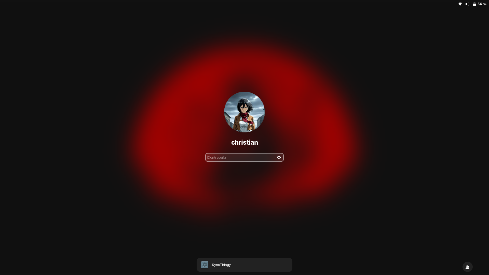
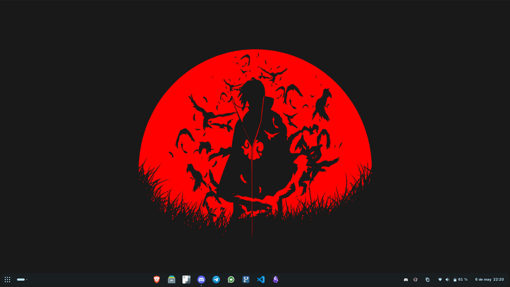
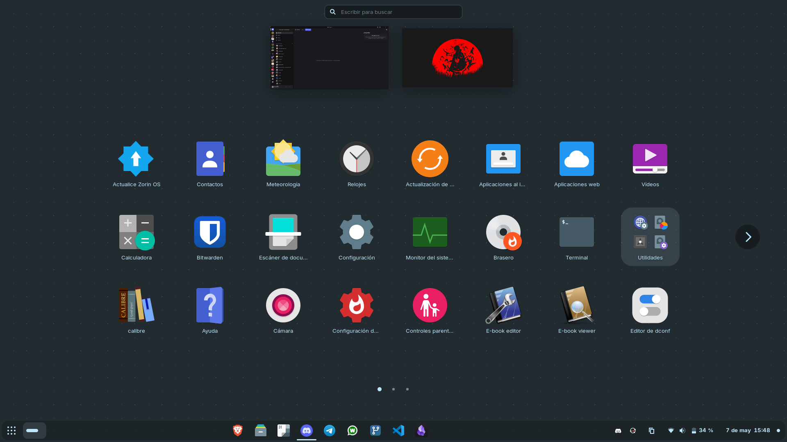
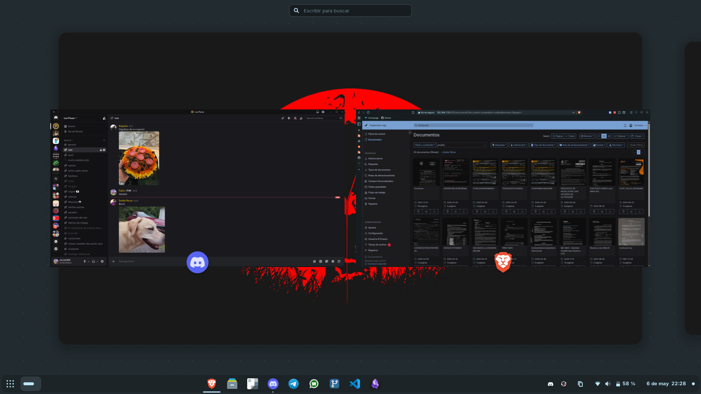

Hola de nou!

Avui us porto un post un poc diferent, centrat en sistemes operatius i en com de vegades intentes fer un favor instal·lant Linux a la teva família i la cosa no surt com esperaves. Sí, avui toca parlar d'un petit fracàs.

Li vaig instal·lar Zorin OS al meu padrastre perquè no es recordava de la contrasenya del seu Windows i, per a l'ús que li donaria, sinceramente Linux li havia d'anar bé.

Estava bastant cansat de Microsoft, així que també el vaig instal·lar al portàtil de la meva parella. Jo ja portava molt de temps amb Kubuntu al meu ordinador de sobretaula però, sincerament, gairebé no el feia servir; quan acabava de treballar, simplement continuava fent servir l'ordinador de la feina per a les meves coses. Ella fa servir el portàtil només per a Calibre i jo per trastejar mentre estic al sofà: gestionar el servidor casolà, projectes de programació, etc. Amb Windows 11, el portàtil de la meva parella anava bastant malament i, com que només teníem un usuari, estava tot barrejat: si clicava en un enllaç s'obria Opera quan jo faig servir Brave. Necessitàvem usuaris diferents i una cosa molt més lleugera.

## Zorin OS al rescat

Primerament vaig instal·lar Zorin OS a l'ordinador del meu padrastre, ja que havia llegit en diverses ocasions que tenia moltíssimes descàrregues i que la gent estava molt contenta perquè s'assemblava molt a Windows. Com que volia el mínim de fricció, li vaig ficar la distro i llest.

Només engegar-lo vaig tenir algun problema, amb el wifi si no recordo malament. El problema és que la targeta wifi és una mica moderna i incompatible, en concret una MediaTek MT7902. Ho vaig aconseguir solucionar amb un *workaround* d'algú que havia fet un script, i des de llavors me'n vaig desentendre.

Em va agradar molt el *look* que tenia i, un dia que la meva parella no hi era, vaig instal·lar Zorin OS també. Crec que per a un portàtil Gnome se sent molt bé i, com que és una distro basada en Ubuntu, sol funcionar sense problemes per al gruix de la gent. Ho vaig configurar tot, vaig crear els dos usuaris i vaig instal·lar Calibre, Telegram, WhatsApp, Discord, Obsidian, Syncthing, VS Code i un client de Git. Vaig afegir la meva clau SSH per al mini PC i ja estava tot funcionant.

A la meva parella no li va fer molta gràcia al principi, pero com que gairebé no toca el portàtil, així està millor ordenat. A més, el puc mantenir molt més còmodament; ella no actualitza mai res, i amb el gestor de paquets de Linux i la botiga d'aplicacions tot és comodíssim.

## Els petits problemes del dia a dia

Jo el vaig estar provant uns quants dies després. Si bé és cierto que triga més a engegar-se (perquè Windows mai arriba a apagar-se del tot de forma directa), tota la resta va molt fluid. Els gestos del trackpad anaven fins i el podia fer servir còmodament. Això sí, vaig tenir algun que altre problema, no tot va ser perfecte.

El desplaçament amb el trackpad era massa ràpid. Desplaçaves una mica amb dos dits i la pantalla avançava moltíssim. Al final ho vaig solucionar tocant un parell de configuracions.

D'altra banda, intentant debugar un projecte que tinc entre mans, se'm congelava l'ordinador i s'acabava reiniciant. El problema és que el portàtil té 8 GB de RAM (que avui dia sembla gairebé una relíquia) i es queda molt curt per a segons quines tasques i la quantitat de pestanyes que acostumo a tenir obertes. Això, sumat al fet que la mida de la partició *swap* era d'únicament 2 GB, feia que el sistema col·lapsés i no sabés què fer. Li vaig augmentar el swap i a partir d'aquí tot va funcionar molt bé.

Per últim, la distribució del teclat a LibreOffice em va donar algun que altre petit problema, pero res inusable. I la meva parella es queixa que vol iniciar sessió amb el lector d'empremtes, però simplement no es pot perquè no hi ha *drivers* per a aquest lector a Linux.

## La caiguda

Arribem fins a l'altre dia, quan el meu padrastre em va trucar dient que no li anava internet. I, efectivament, no apareixia per enlloc la icona del wifi. No sé què va passar, perquè jo li ho vaig deixar tot funcionant perfectament; no sé si alguna actualització automàtica va trencar el *workaround* del script del wifi.

Investigant un poc vaig descobrir que ya havien tret un *driver* oficial per a aquesta targeta, però per a la versió 7.1 del kernel de Linux, mentre que Zorin OS encara segueix a la versió 6.

Ara em penedeixo un poc d'haver instal·lat Zorin OS en lloc de Fedora, que hauria estat similar però amb un kernel molt més actualitzat que segurament ja donaria suport al wifi. Com que no volia perdre més temps ni causar-li més mals de cap al meu padrastre, els vaig dir als meus germans que li instal·lessin Windows 11 de nou i em vaig treure de maldecaps.

Vaig preparar un USB amb Windows 11 per a instal·lar-lo un altre cop a l'ordinador de la meva parella, ja que havia fet alguns comentaris donant a entendre que no li agradava. Ho anava a fer, però em vaig esperar a que hi fos ella per a preguntar-li i em va dir que no, que de moment ho mantinguéssim i que ja veuríem. Així que, per aquesta part, sembla una victòria.

## Conclusions

Dit això, és una petita derrota, però la prefereixo abans que fer passar la família per males experiències amb Linux.

Jo, per la meva part, m'he canviat a PikaOS a l'ordinador de sobretaula i estic molt content, tot i que potser em passi a la versió amb KDE en lloc de la de Gnome. Pel que fa al portàtil, probablement acabaré provant Fedora, que em dona bastant de confiança.

La veritat és que estic content amb l'estat actual dels meus dispositius a casa. Sé que Linux no és perfecte ni jo sóc cap expert en la matèria, però m'encanta l'ecosistema i la filosofia de l'*open source*. A casa ja tinc el portàtil, el servidor casolà, la Steam Deck i el de sobretaula amb Linux, enfront del portàtil de la feina i el de l'antiga feina amb Windows. És un bon ràtio.

Ja faré un altre post aprofundint en com tinc configurat PikaOS, que és una distro bastant simpàtica.

Ens veiem en el proper post!