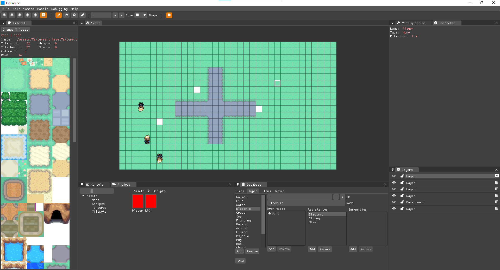

Hola otra vez más. Esta vez voy a hacer un repaso de la trayectoria que ha tenido Godosters, desde su origen hasta ahora.

El contenido de este post iba a estar en el anterior, pero ya era suficientemente largo y no tan importante como para incluirlo.

## Origen

Desde que empecé a aprender a programar he tenido la idea de crear un proyecto base para crear juegos al estilo Pokémon. La idea viene de Pokémon Essentials, un proyecto base que está hecho en RPG Maker XP, un software muy antiguo. Me gustaba la idea de hacer lo mismo pero con una base más moderna.

Es un proyecto que pensé hace mucho tiempo, y la idea era hacer un motor de juegos de Pokémon para mi trabajo de final del grado universitario. Pero al final decidí reducir la carga y hacer solo un aspecto del motor, y así nació [Elit3D](https://christt105.itch.io/elit3d), un editor de mapas por tiles en 3D.

La idea era ir ampliando el proyecto hasta hacer toda la base en C++, pero desde que acabé la universidad he estado trabajando a jornada completa y no he podido dedicar mucho tiempo a mis proyectos personales. He ido trabajando de forma intermitente tanto en Elit3D como en Godosters y otros proyectos.

## Evolución

Godosters no ha sido un proyecto empezado en Godot 4 directamente, sino que ha tenido varios predecesores.

### Kip Engine

Poco tiempo después de "acabar" Elit3D, hice un fork privado de Elit3D y le puse el módulo de scripting en Lua de [mi motor de videojuegos](https://empty-whisper.github.io/WhispEngine/). La idea era empezar la idea original de donde surgió Elit3D: un motor de juegos de monstruos de bolsillo en 2.5D, mezclando modelos 3D con pixel art.

Estuve trabajando unos meses hasta que, por falta de tiempo, lo dejé de lado. No llegué a hacer gran cosa: un movimiento simple para el jugador, un par de NPCs y el comienzo de la base de datos de los tipos de Pokémon.

### Pokémon Esmeralda Godot 3

La verdad que el desarrollo de este proyecto ha sido una montaña rusa. Descarté la idea de seguir usando C++ por la complejidad que añade y decidí hacer una prueba en 2022 con Godot. Empecé usando Godot 3, ya que Godot 4 aún no había salido oficialmente (creo recordar).

La idea era probar Godot a ver qué podía ofrecer. Estuve un mes aprendiendo y desarrollando un prototipo del Pokémon Esmeralda. Hice cosas muy básicas: el movimiento del jugador, un par de NPCs y el principio del sistema de diálogo. Se puede ver en este vídeo:



### Kip Unity Framework

Unos días después empecé lo que llamé Kip Unity Framework, lo que iba a ser un proyecto de Unity para hacer juegos de Pokémon. No recuerdo muy bien por qué cambié de Godot a Unity, creo que lo vi verde y decidí profundizar más en Unity y C#, que es lo que usaba a diario.

En este proyecto hice bastantes avances. Básicamente lo empecé para aprender a hacer shaders en Unity y fui añadiéndole más cosas. Estas son algunas de las cosas que hice:

- Un shader para renderizar un fondo infinito  
- Un sistema de tiles temporales como las huellas en la arena  
- Un shader que imita el reflejo en el agua del Pokémon Esmeralda  
- El principio de la introducción con todas sus animaciones y efectos  
- Un sistema de scripting por nodos, con el que hice la introducción del profesor Abedul  

Para quien le interese, estuve subiendo los vídeos en esta lista de reproducción: [Pokémon Emerald Unity por christt105](https://youtube.com/playlist?list=PL9EieIseZRQD4dVf_MWqubnc0_0wV6vZj&si=mtHnbZRdVdDaFLJU)



Estuve trabajando de forma intermitente durante un año aproximadamente, hasta que en septiembre de 2023 ocurrió la problemática de Unity con sus nuevas tarifas. Habiendo salido ya Godot 4, decidí volver a probar otra vez Godot.

### Godosters

Ahora sí, me enamoré de Godot. Creé un nuevo proyecto en Godot 4 y la idea ha sido ir replicando lo que tenía en Kip Unity Framework mientras iba probando el motor.

Empecé creando el movimiento del personaje. Estaba (y estoy) aprendiendo, así que hay muchas cosas que he ido cambiando y tendré que cambiar en el futuro. La idea es hacer toda la base en 2D y, gracias a la versatilidad de Godot, crear también una versión en 2.5D con los mapas de Elit3D (que dudo que llegue tan lejos, pero es la idea).

Este fue el primer vídeo que tengo del proyecto de Godosters:

---

Y eso es todo por ahora. Me hacía ilusión repasar la historia del proyecto, porque a veces parece que no hemos avanzado mucho... pero mirando atrás, en realidad ha habido muchos intentos y aprendizajes.

Si te interesa ver las funcionalidades actuales del proyecto, te recomiendo echar un vistazo al [post anterior](https://christt105.github.io/blog/es/p/godosters-devlog-0/), donde hablo más en detalle de cómo está actualmente Godosters.

¡Nos vemos en la próxima entrada!
