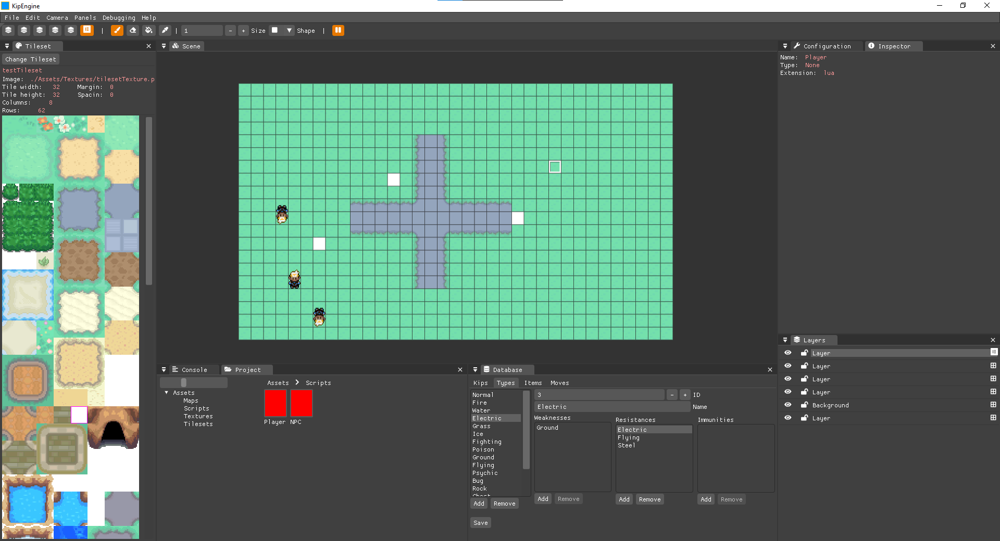

Hi again. This time I want to go over the journey that Godosters has taken, from its origin to where it is now.

This post was originally going to be part of the previous one, but it was already long enough and this content wasn't essential to include there.

## Origin

Ever since I started learning to program, I’ve had the idea of creating a base project to make Pokémon-style games. The idea came from Pokémon Essentials, a base project made in RPG Maker XP, a very old piece of software. I liked the idea of doing the same thing but with a more modern foundation.

It’s a project I thought about a long time ago, and originally I wanted to make a Pokémon game engine for my final university thesis. But in the end, I decided to reduce the scope and focus on one aspect of the engine. That’s how [Elit3D](https://christt105.itch.io/elit3d) was born—a 3D tile-based map editor.

The idea was to keep expanding the project until I had the full base built in C++, but ever since finishing university I’ve been working full-time and haven’t been able to dedicate much time to personal projects. I’ve worked on Elit3D, Godosters, and other projects on and off.

## Evolution

Godosters didn’t start as a Godot 4 project. It has had several predecessors.

### Kip Engine

Shortly after "finishing" Elit3D, I made a private fork and added the Lua scripting module from [my game engine](https://empty-whisper.github.io/WhispEngine/). The goal was to revive the original idea behind Elit3D—a 2.5D monster-taming engine mixing 3D models with pixel art.

I worked on it for a few months until I had to set it aside due to lack of time. I didn’t get very far—basic player movement, a couple of NPCs, and the start of the Pokémon type database.

### Pokémon Emerald Godot 3

This project's development has been a real rollercoaster. I abandoned C++ due to its complexity and decided to try Godot in 2022. I started with Godot 3, since Godot 4 hadn’t been officially released yet (as far as I remember).

The idea was to test out Godot and see what it could offer. I spent a month learning and building a Pokémon Emerald prototype. I made very basic things: player movement, a few NPCs, and the start of the dialogue system. You can see it in this video:



### Kip Unity Framework

A few days later, I started what I called the Kip Unity Framework—what was meant to be a Unity-based Pokémon game framework. I don’t quite remember why I switched from Godot to Unity—maybe I found Godot too immature and decided to go deeper into Unity and C#, which I was using daily.

I made a lot of progress in this project. Initially, it was meant to help me learn how to write shaders in Unity, and I kept adding features. Some of the things I built:

- A shader to render an infinite background  
- A system for temporary tiles, like footprints in sand  
- A shader mimicking the water reflection from Pokémon Emerald  
- The beginning of the game intro, with all its animations and effects  
- A node-based scripting system, which I used for the Birch Professor’s intro  

If you're interested, I uploaded videos to this playlist: [Pokémon Emerald Unity by christt105](https://youtube.com/playlist?list=PL9EieIseZRQD4dVf_MWqubnc0_0wV6vZj&si=mtHnbZRdVdDaFLJU)



I worked on it off and on for about a year. But in September 2023, Unity announced its controversial pricing changes. Godot 4 had already been released by then, so I decided to give it another shot.

### Godosters

And this time, I fell in love with Godot. I created a new project in Godot 4 with the goal of replicating what I had in Kip Unity Framework while exploring the engine.

I started by implementing character movement. I was (and still am) learning, so many things have changed over time, and many more will have to change in the future. The idea is to build the full base in 2D and, thanks to Godot’s flexibility, also make a 2.5D version using Elit3D maps (though I doubt I’ll go that far—but that’s the plan).

This was the first video I have of the Godosters project:

---

And that's all for now. I wanted to look back at the project’s journey, because sometimes it feels like we haven’t made much progress… but looking back, there have been many attempts and a lot of learning.

If you're curious about the current features of the project, check out the [previous post](https://christt105.github.io/blog/p/godosters-devlog-0/), where I go into more detail about the current state of Godosters.

See you in the next post!
