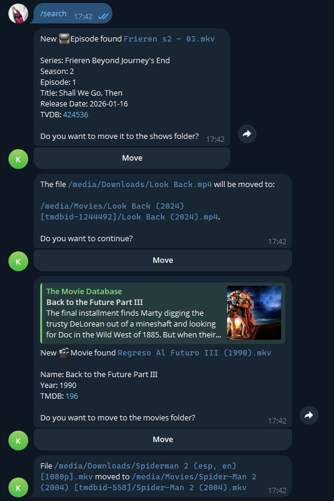

`mnamer-telegram` is a self-hosted Telegram bot for managing automatic renaming and moving of downloaded media into a Jellyfin library using `mnamer`.

Key features:

- File watcher detects new downloads and generates proposed filenames using `mnamer`.
- Bot sends a Telegram message with rename suggestions and external links for verification (TMDB / TheTVDB).
- Accept or correct suggestions via reply and control when media is moved to the target library.

The workflow is focused on converting manual `mnamer` CLI operations into a streamlined chat-driven pipeline on mobile devices.

